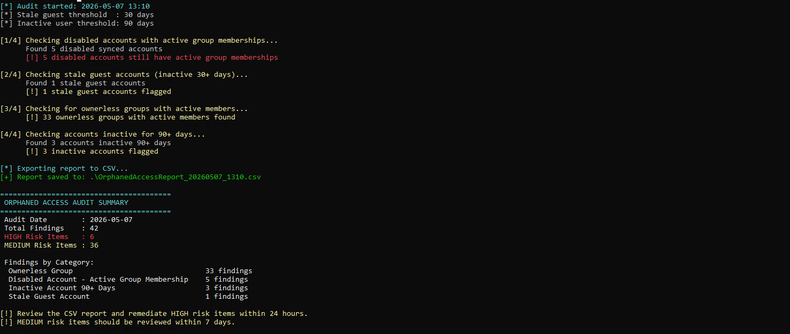
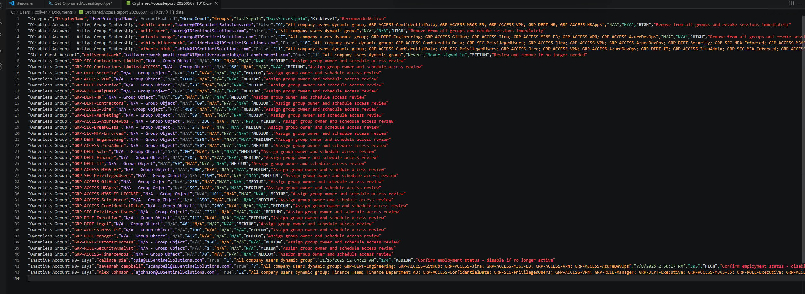
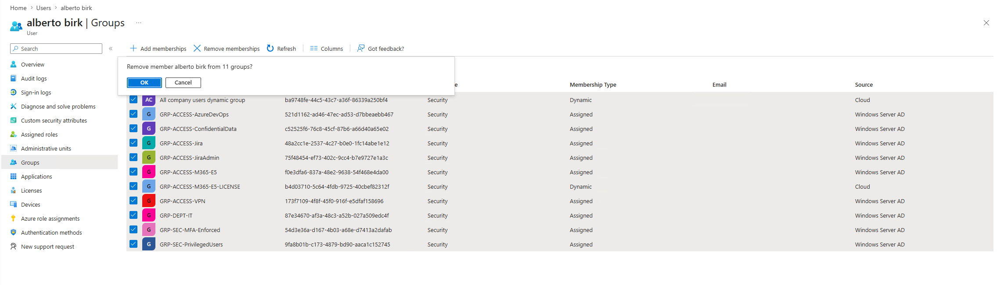
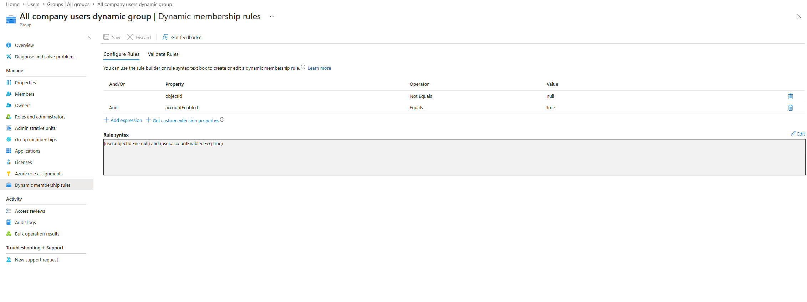
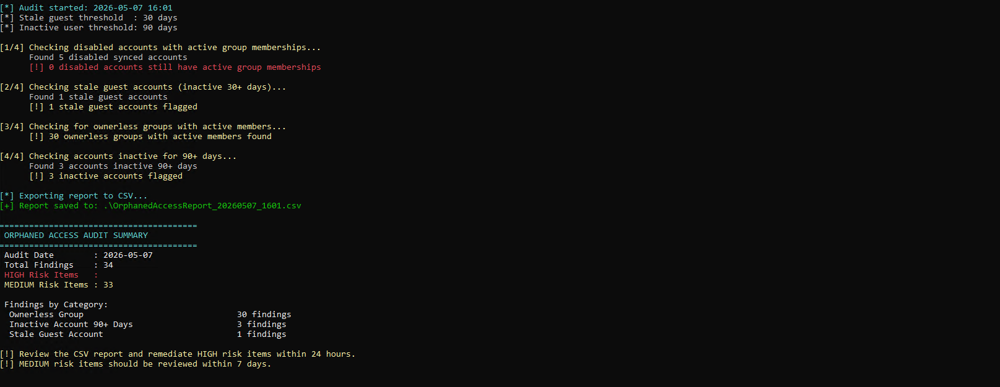

# Scenario 03 — Orphaned Access Audit

## 🏢 Business Problem

IDSentinel Solutions' annual SOC 2 Type II audit flagged a critical 
finding: terminated employees and contractors were retaining access to 
company systems and applications after their offboarding date. A sample 
review of 50 accounts revealed that 12 former employees still had active 
Entra ID accounts with valid group memberships and application 
assignments — some dating back over 90 days post-termination.

Additionally, the audit identified a large number of guest (B2B) 
accounts that had been invited for project work but never cleaned up, 
and several groups with no designated owner — meaning no one was 
accountable for reviewing or approving access.

---

## ⚠️ Risk

- Former employees retaining access to sensitive systems post-offboarding
- Stale guest accounts with no expiration or review process
- Ownerless groups creating ungoverned access assignments
- Direct SOC 2 Type II audit finding requiring remediation
- Potential data exfiltration risk from orphaned privileged accounts

---

## 🎯 Scope

- All Entra ID user accounts synced from Active Directory
- All cloud-only guest (B2B) accounts
- All security groups with no designated owner
- Accounts inactive for 30+ days with active group memberships

---

## 🔧 Solution Design

A PowerShell script using Microsoft Graph API will automate the 
detection of four categories of orphaned access:

1. **Disabled AD accounts** still synced to Entra with active group memberships
2. **Stale guest accounts** not seen in 30+ days with active assignments
3. **Ownerless groups** with active members but no designated owner
4. **Accounts with no sign-in activity** in 90+ days

The script exports a full CSV report for compliance documentation and 
produces a remediation priority list for the IAM team.

### ⚠️ Hybrid Identity Consideration

Group ownership for AD-synced groups cannot be set directly in Entra ID 
or via Microsoft Graph API. This is a known Entra Connect limitation — 
the AD `managedBy` attribute does not sync to the Entra owner property. 

Ownership governance for hybrid groups is enforced at the AD layer via 
the `managedBy` attribute, which was set on all GRP- groups via 
PowerShell. For full Entra-native ownership and access review 
capabilities, security groups should be created as cloud-only objects 
in Entra rather than synced from AD.

Dynamic group membership cannot be manually modified — membership is governed by attribute-based rules. Terminated user removal from dynamic groups requires clearing the matching attributes in AD (Department, Title, Company) prior to or during offboarding. This has been incorporated into the offboarding runbook

This finding has been documented as a recommendation for future 
group architecture improvements.

---

## 🛠️ Implementation

### Step 1 — Run Orphaned Access Audit Script

### Step 2 — Review CSV Export

### Step 3 — Remediate Disabled Accounts
Disabled accounts were removed from all AD group memberships via 
PowerShell. Dynamic group rules were updated to exclude disabled 
accounts using `user.accountEnabled -eq true` condition.

### Step 4 — Update Dynamic Group Rules
Dynamic membership rules updated to explicitly exclude disabled 
accounts, preventing future orphaned access from terminated employees.

### Step 5 — Post-Remediation Audit

---

## ✅ Outcome

- Audit script detected 42 findings across 4 categories on initial run
- 5 disabled accounts removed from all AD group memberships via 
  PowerShell and synced to Entra via delta sync
- Dynamic group rules updated to exclude disabled accounts using 
  accountEnabled condition — preventing future orphaned access 
  from terminated employees automatically
- Investigation into 33 ownerless groups revealed a known Entra Connect 
  limitation: group ownership cannot be set on AD-synced objects via 
  Entra or Graph API. Ownership managed at the AD layer via managedBy 
  attribute set on all GRP- groups via PowerShell
- 3 inactive accounts flagged for manager confirmation
- 1 stale guest account flagged for review
- Post-remediation audit confirmed HIGH risk findings reduced to zero
- Total findings reduced from 42 to 34 — 19% reduction
- Finding documented: migrate security groups to cloud-only to enable 
  Entra-native ownership and access reviews

## 📊 Audit Results

### Pre-Remediation
| Category | Findings | Risk Level |
|----------|----------|------------|
| Ownerless Groups | 33 | MEDIUM |
| Disabled Accounts with Active Group Membership | 5 | HIGH |
| Inactive Accounts 90+ Days | 3 | HIGH |
| Stale Guest Accounts | 1 | MEDIUM |
| **Total** | **42** | |

### Post-Remediation
| Category | Findings | Risk Level | Notes |
|----------|----------|------------|-------|
| Ownerless Groups | 30 | MEDIUM | AD-synced groups — ownership managed via AD managedBy attribute |
| Disabled Accounts with Active Group Membership | 0 | ✅ RESOLVED | Removed from AD groups + dynamic rules updated |
| Inactive Accounts 90+ Days | 3 | MEDIUM | Flagged for manager confirmation |
| Stale Guest Accounts | 1 | MEDIUM | Under review |
| **Total** | **34** | | **19% reduction — HIGH risk items fully resolved** |

---

## 📁 Files

| File | Description |
|------|-------------|
| `scripts/Get-OrphanedAccessReport.ps1` | Main audit script — detects all orphaned access categories |
| `diagrams/orphaned-access-flow.png` | Audit and remediation workflow diagram |
| `screenshots/` | Evidence of findings and remediation |

---

## 🔗 References

- [Microsoft: Access reviews in Entra ID](https://learn.microsoft.com/en-us/entra/id-governance/access-reviews-overview)
- [Microsoft: Manage stale guest accounts](https://learn.microsoft.com/en-us/entra/identity/users/clean-up-stale-guest-accounts)