# Scenario 04 — Zero Trust Rollout

## 🏢 Business Problem

Following a security assessment, IDSentinel Solutions' executive 
leadership issued a mandate to implement a Zero Trust access model 
across the organization. The assessment identified three critical gaps:

1. **No least-privilege enforcement** — administrators held permanent 
   privileged roles with no time limits or approval requirements
2. **No device compliance requirements** — any device including personal 
   and unmanaged devices could access corporate resources
3. **No location-based access controls** — access was permitted from 
   any geographic location with no risk-based evaluation

The CISO tasked the IAM team with designing and implementing a Zero 
Trust architecture to address all three gaps within 30 days.

---

## ⚠️ Risk

- Permanent admin access creates insider threat and credential theft risk
- Unmanaged devices accessing sensitive data violates Zero Trust principles
- No location controls means compromised credentials work from anywhere
- Non-compliant with IDSentinel's cyber insurance requirements
- Fails SOC 2 Type II access control requirements

---

## 🎯 Zero Trust Principles Applied

| Principle | Implementation |
|-----------|---------------|
| Verify explicitly | MFA + device compliance required for all access |
| Use least privilege | PIM Just-in-Time admin access replaces permanent roles |
| Assume breach | Named locations + sign-in risk policies limit blast radius |

---

## 🔧 Solution Design

The Zero Trust rollout is implemented across three workstreams:

**Workstream 1 — Just-in-Time Admin Access (PIM)**
All privileged roles converted from permanent to eligible assignments.
Admins must request and justify access with time-limited activation.

**Workstream 2 — Conditional Access Policy Suite**
Four CA policies deployed to enforce device compliance, block risky 
sign-ins, restrict admin portal access, and require MFA for all users.

**Workstream 3 — Infrastructure as Code (Terraform)**
Conditional Access policies defined as Terraform code for repeatable, 
auditable, version-controlled deployment.

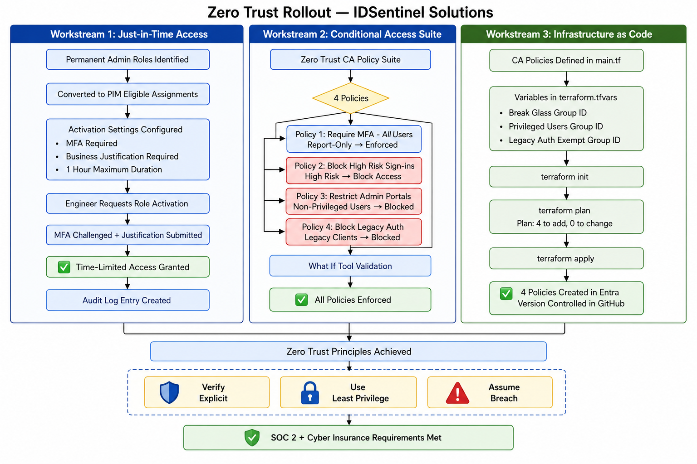

---

## 🛠️ Implementation

### Workstream 1 — PIM Just-in-Time Access

#### Step 1 — Convert Permanent Roles to Eligible
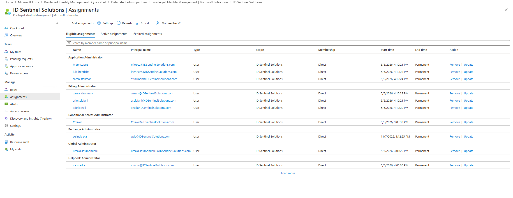

#### Step 2 — Configure Activation Requirements
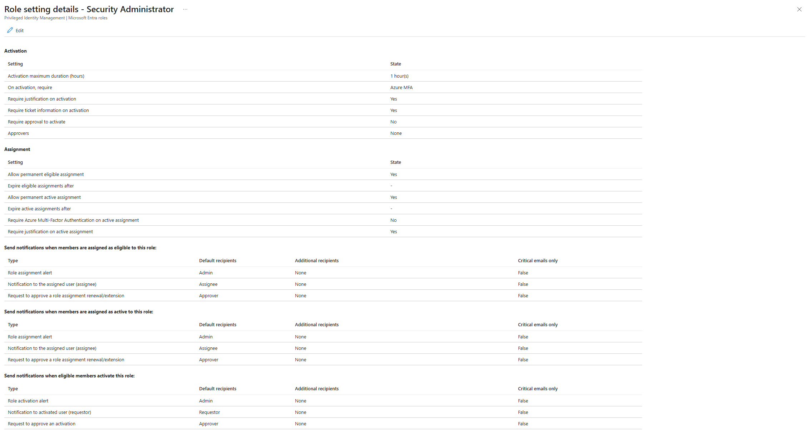

#### Step 3 — Test JIT Access Request (End User Perspective)

Security department IAM Engineer (wking) activates Security Administrator 
via PIM with MFA verification and business justification required.

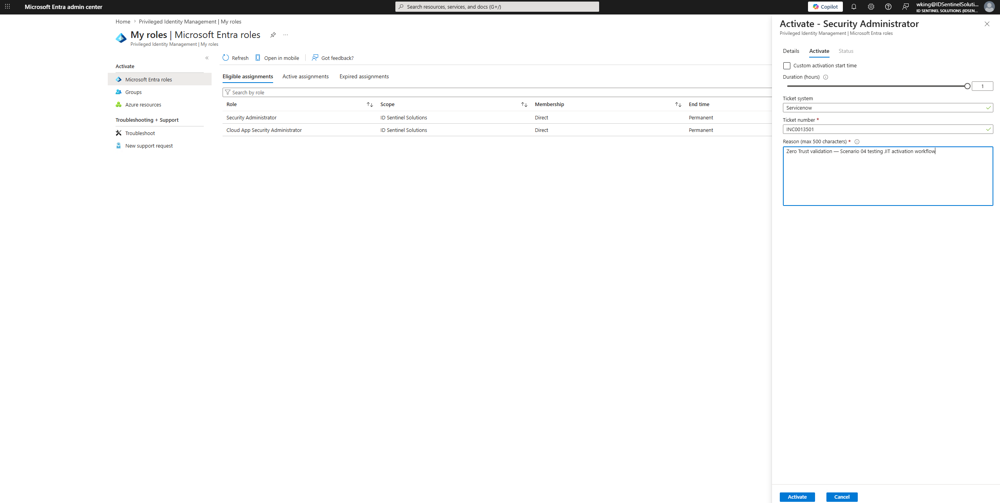
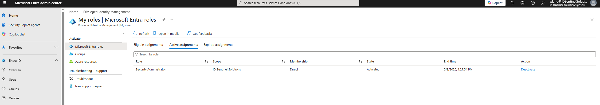

---

### Workstream 2 — Conditional Access Policy Suite

#### Policy 1 — Require MFA for All Users
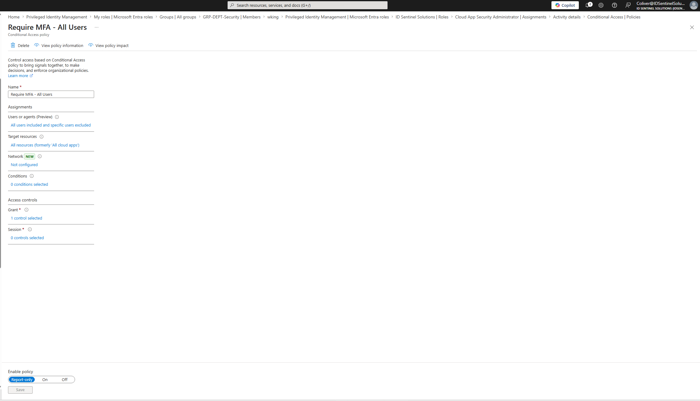

#### Policy 2 — Block High Risk Sign-ins
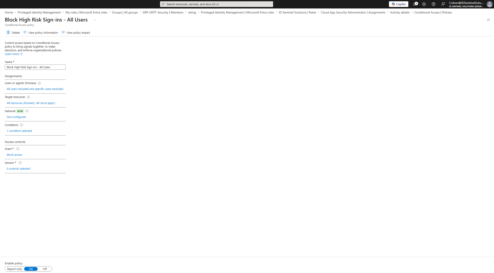

#### Policy 3 — Restrict Admin Portal Access
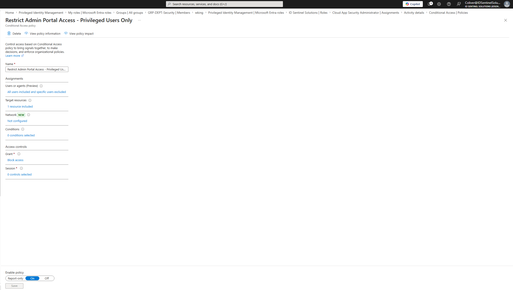

#### Policy Suite Overview
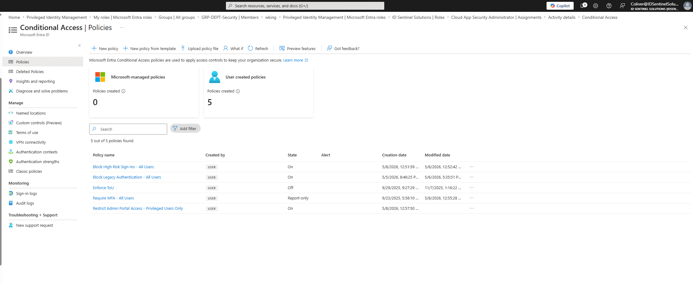

---

### Workstream 3 — Terraform as Code

#### Step 1 — Configure Terraform Entra Provider
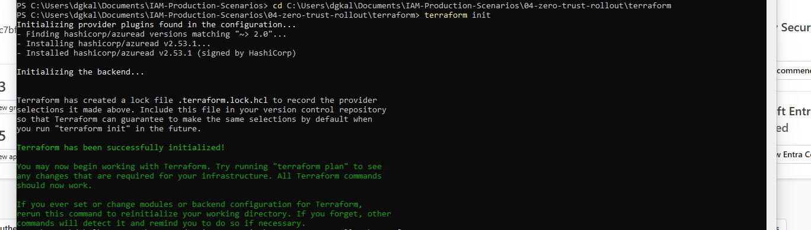

#### Step 2 — Define CA Policies as Code
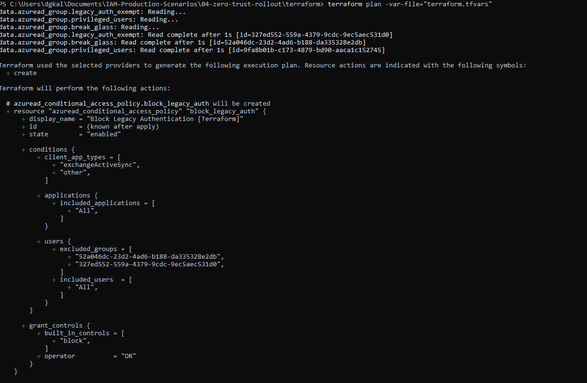
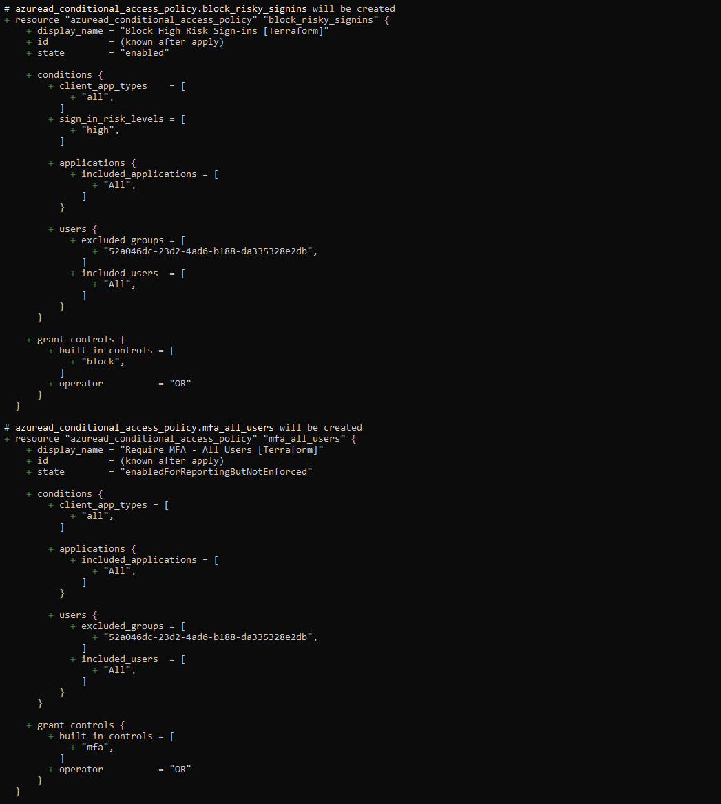
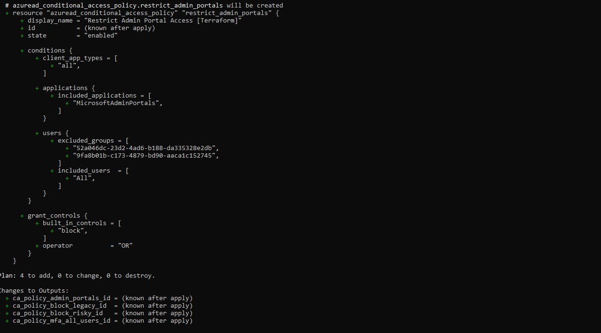

#### Step 3 — Apply Infrastructure
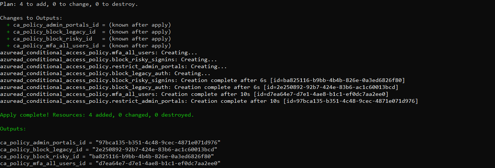
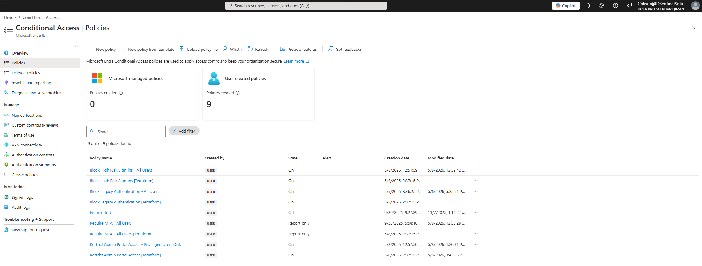

---

## ✅ Outcome

- All privileged roles converted to PIM eligible — zero permanent admin assignments outside of break-glass accounts
- PIM activation requires MFA, business justification, and is limited to 1-hour windows with full audit logging
- 4 Conditional Access policies deployed covering MFA enforcement, risk-based sign-in blocking, admin portal access restriction, and legacy authentication blocking
- CA policies defined as Terraform code — fully version controlled and repeatable
- Zero Trust posture validated — all four CA policies confirmed active 
  and enforced in Entra admin center

---

## 📁 Files

| File | Description |
|------|-------------|
| `terraform/main.tf` | Terraform configuration for CA policies |
| `terraform/variables.tf` | Variable definitions |
| `terraform/outputs.tf` | Output values |
| `diagrams/zero-trust-architecture.png` | Zero Trust architecture diagram |
| `screenshots/` | Evidence of implementation |

---

## 🔗 References

- [Microsoft: Zero Trust with Entra ID](https://learn.microsoft.com/en-us/entra/fundamentals/zero-trust)
- [Microsoft: PIM configuration](https://learn.microsoft.com/en-us/entra/id-governance/privileged-identity-management/pim-configure)
- [Terraform: AzureAD Provider](https://registry.terraform.io/providers/hashicorp/azuread/latest/docs)