# Scenario 05 — Okta Workflows JML (Joiner / Mover / Leaver Automation)

## 🏢 Business Problem

Following the M&A app migration completed in Scenario 02, the acquired
workforce was fully onboarded into Okta — provisioned from Active Directory
via the Okta AD Agent and authenticated through Okta SAML SSO. The migration
eliminated the technical debt of the legacy IdP. It did not eliminate the
operational debt of manual access management.

Every lifecycle event — a new hire joining the HR team, an analyst
transferring to Security, a departing employee whose account needed to be
cleaned up — required an IAM administrator to log into Okta, locate the
user, and manually modify app assignments. There were no guardrails and no
audit trail proving the change had been made within any defined SLA. Delays
in provisioning were impacting Day 1 readiness. Delays in deprovisioning
created lingering access that would fail a SOC 2 audit.

The IAM team was tasked with eliminating the manual lifecycle loop inside
Okta using Okta Workflows — the native no-code automation layer included in
the Okta Developer Edition plan. Three flows were required: one for joiners
entering a role-aligned group, one for movers changing roles, and one for
leavers being deactivated.

---

## 🏗️ Environment

| Component | Detail |
|---|---|
| Identity Platform | Okta (Developer Edition / Integrator plan) |
| Automation Layer | Okta Workflows |
| AD-Synced Groups | `GRP-ACCESS-HRApps`, `GRP-ACCESS-SecurityApps` |
| Okta-Native Trigger Groups | `GRP-WORKFLOWS-HRApps` (Joiner trigger) |
| App Targets | IDSentinel HR Portal (SAML), Security Tools (Bookmark) |
| User Population | 9 pilot users provisioned from AD via Okta AD Agent |
| Compliance Targets | SOC 2 CC6.2, CC6.3 |

---

## 🔧 Solution Design

The JML automation is implemented across three Okta Workflows, each
responding to a discrete identity lifecycle event and executing app
assignment logic without manual administrator intervention.

**Workflow 1 — Joiner: HR Portal Provisioning**
Triggers on `User Added to Group` scoped via Continue If gate to
`GRP-WORKFLOWS-HRApps` — an Okta-native group used as the Workflow
trigger source. On trigger, IDSentinel HR Portal is assigned to the
user and the provisioning event is logged via Compose. Okta-native
groups are required as trigger sources in this environment because
AD-synced group changes arrive via the AD Agent import process and
do not fire native Okta Workflow events.

**Workflow 2 — Mover: HR to Security Role Transfer**
Triggers on `User Added to Group` scoped via Continue If gate to
`GRP-ACCESS-SecurityApps`. On trigger, IDSentinel HR Portal is removed,
Security Tools is assigned, and a timestamped row is written to the
JML Mover Audit Log Workflows table. A single trigger was used rather
than dual triggers — Okta Workflows does not support joined conditions
across two independent trigger events, so Security group addition was
chosen as the authoritative role-change signal.

**Workflow 3 — Leaver: Deactivation Offboarding Log**
Triggers on `User Deactivated` for any user. On trigger, the offboarding
event is logged via Compose capturing the user login and confirmation
text. Explicit app removal and account suspension were removed after
implementation: Okta clears AppUser records as part of the deactivation
event (Remove App returns 404), and Suspend User is not applicable to
an already-deactivated account (returns 400). Deactivation is the
terminal access removal event in Okta's lifecycle model.

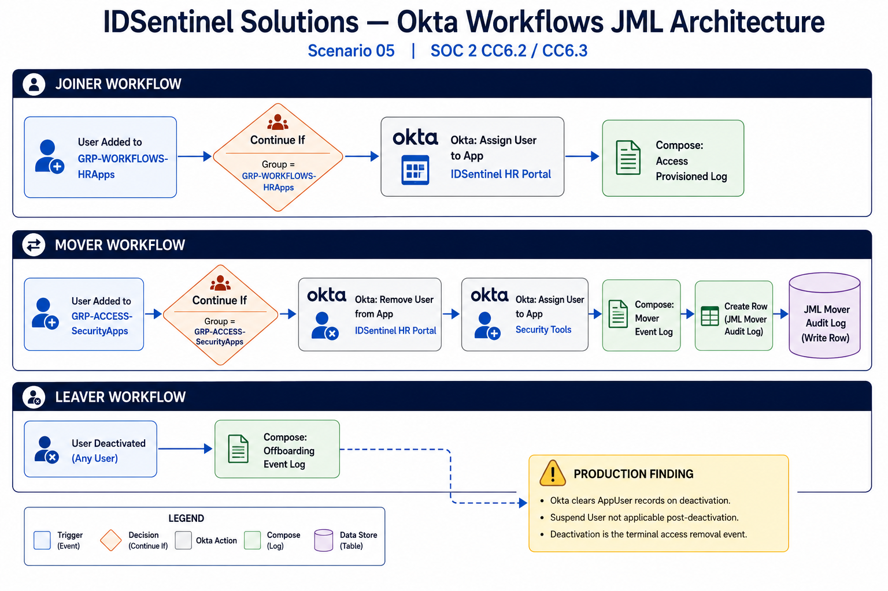

---

## ⚙️ Implementation

### Workflow 1 — Joiner Flow

The Joiner Flow was triggered by `User Added to Group` scoped via a Continue
If gate to `GRP-WORKFLOWS-HRApps` — an Okta-native group used as the
Workflow trigger source. On trigger, the flow assigned IDSentinel HR Portal
to the user and logged the provisioning event via a Compose card. The flow
was validated by adding a pilot user to `GRP-WORKFLOWS-HRApps` directly in
Okta and confirming HR Portal appeared in their application list without
manual admin intervention.

The Joiner flow trigger uses an Okta-native group rather than the AD-synced
`GRP-ACCESS-HRApps` because AD Agent import operations do not fire native
Okta Workflow events.

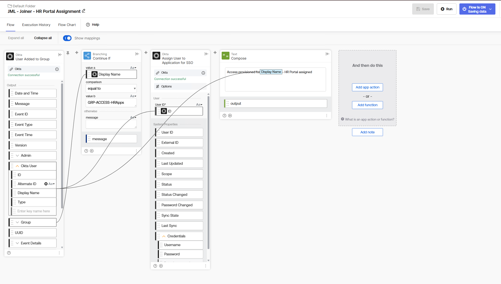

---

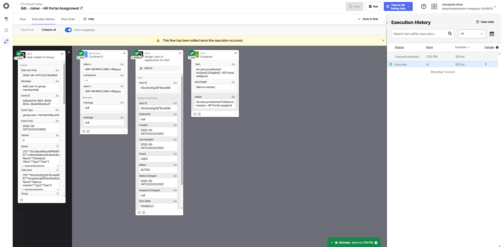

---

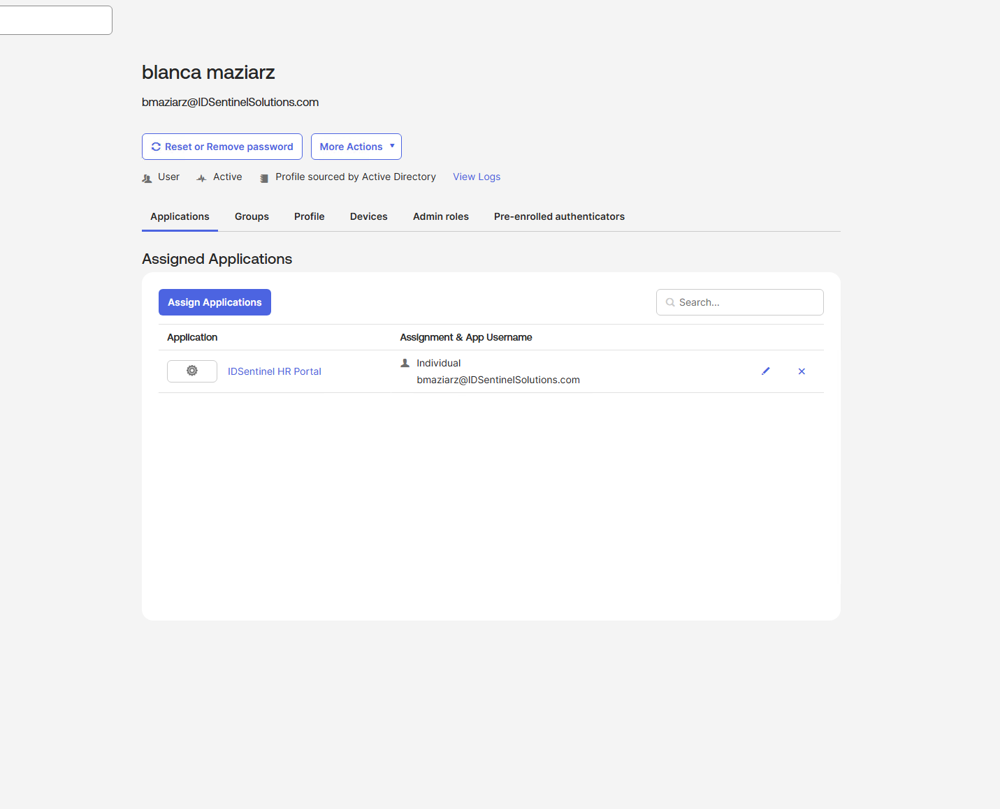

### Workflow 2 — Mover Flow

The Mover Flow handled a department transfer from HR to Security. The flow
was triggered by `User Added to Group` on `GRP-ACCESS-SecurityApps` with a
Continue If gate scoping execution to that group only. On trigger, the flow
removed IDSentinel HR Portal from the user, assigned Security Tools, logged
the mover event via Compose, and wrote a timestamped row to the
`JML Mover Audit Log` Workflows table capturing the user login, previous
app, new app, and timestamp.

The flow was validated by adding a pilot user to `GRP-ACCESS-SecurityApps`
directly in Okta. HR Portal was removed from the user's application list
and Security Tools appeared in its place. The audit log table confirmed a
timestamped row for the event.

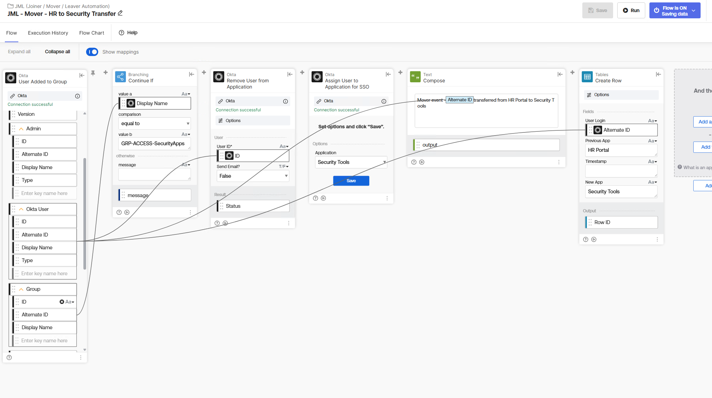

---

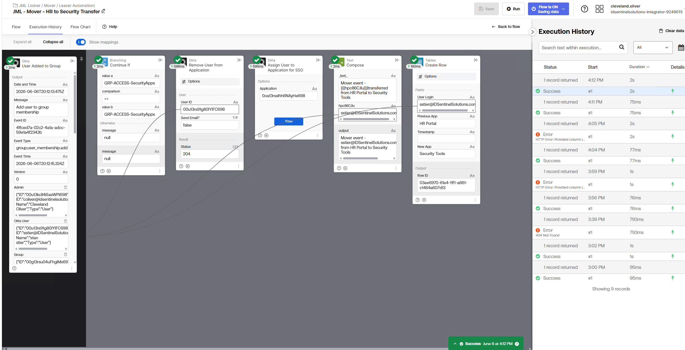

---

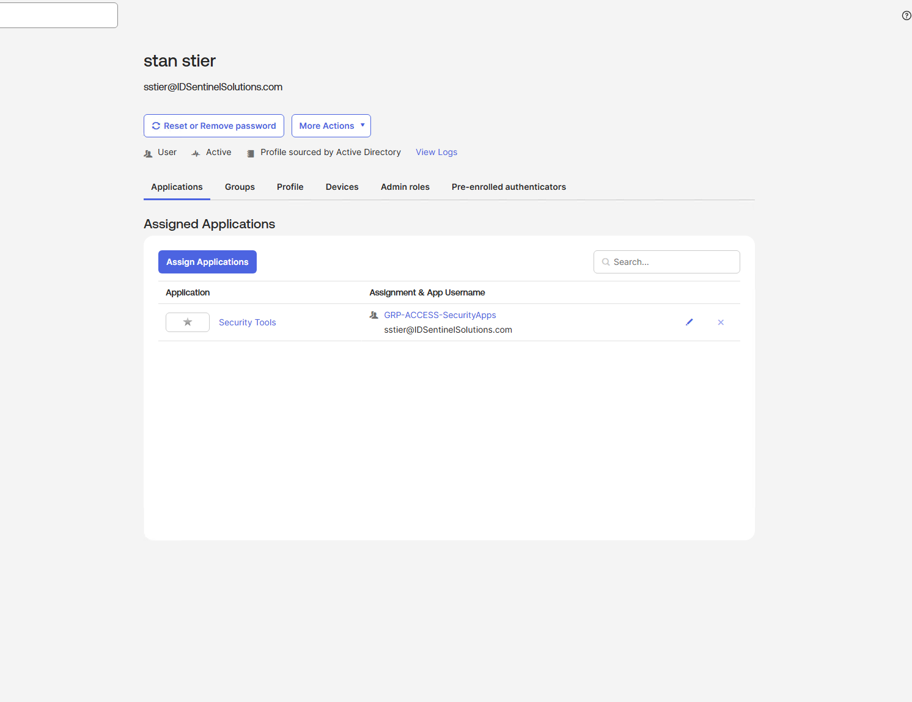

---

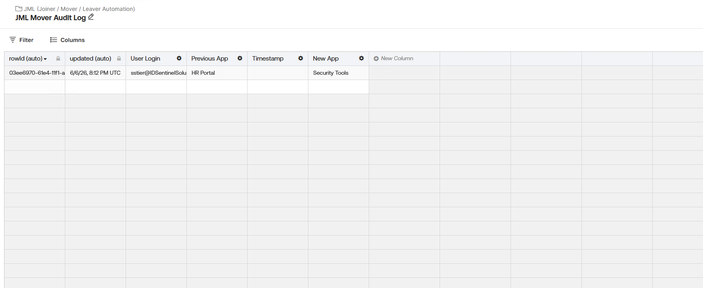

### Workflow 3 — Leaver Flow

The Leaver Flow was triggered by `User Deactivated`. On trigger, the flow
logged the offboarding event via a Compose card capturing the user's login
and a confirmation message. The flow was validated by deactivating a pilot
user and confirming a successful execution in Workflow history.

Two design constraints were encountered and documented during implementation.
First, Okta clears AppUser records as part of the deactivation event — the
Remove User from Application action returned 404 because the records no
longer existed by the time the Workflow ran. Second, Okta returns 400 when
attempting to suspend an already-deactivated account. Both constraints are
consistent with Okta's user lifecycle model: deactivation is the terminal
access removal event, and suspension is not applicable post-deactivation.
The deactivated account cannot authenticate regardless of residual group
membership records.

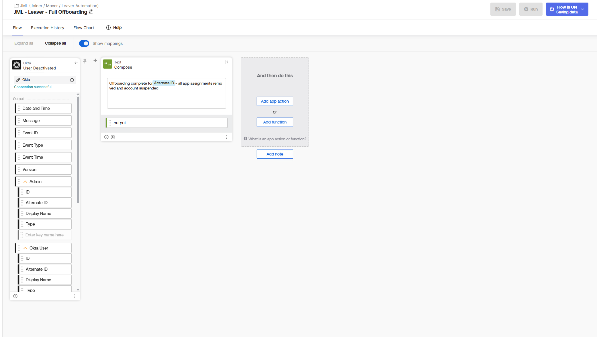

---

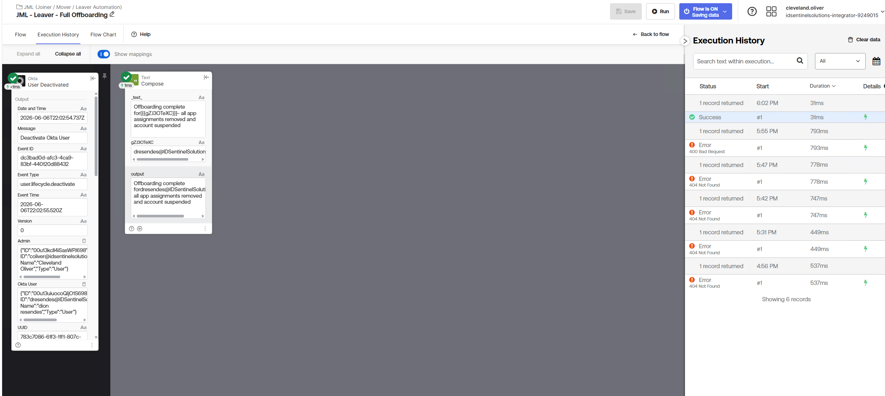

---

---

## Break/Fix — Mover Flow Firing on Wrong Group

During testing, the Continue If gate on the Mover Flow was temporarily
modified to scope to `GRP-WORKFLOWS-HRApps` instead of
`GRP-ACCESS-SecurityApps`. This caused the flow to fire when a user was
added to the HR group rather than the Security group — incorrectly removing
HR Portal and assigning Security Tools to a user with no Security role.

The root cause was an incorrect value b on the Continue If card. The fix
restored value b to `GRP-ACCESS-SecurityApps`, ensuring the flow only
executes on Security group additions. The corrected flow was validated by
adding a user to `GRP-WORKFLOWS-HRApps` and confirming the flow did not
fire.

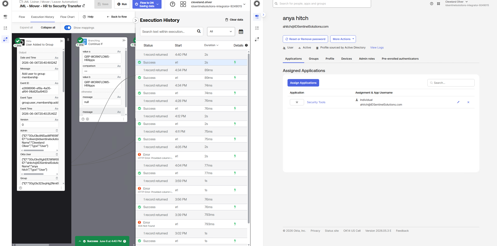

---

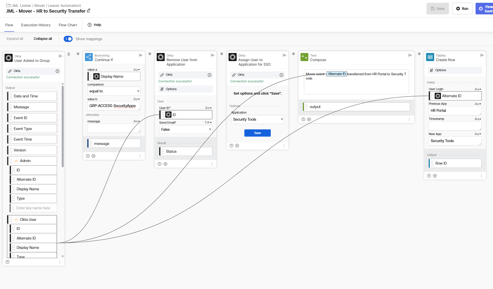

---

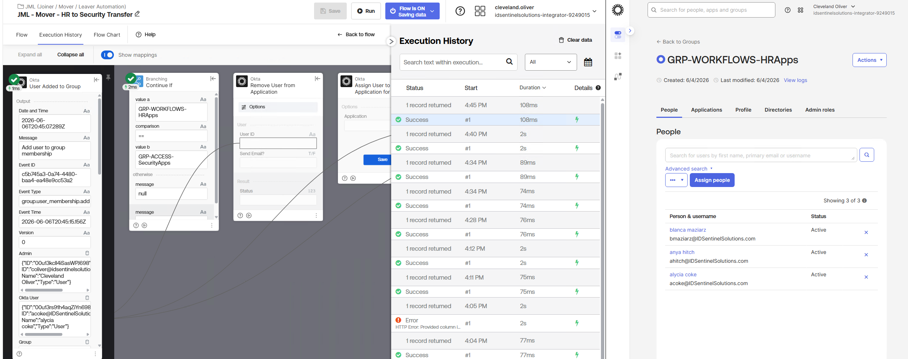

---

## 📊 Outcome

- Three Okta Workflows deployed covering the full Joiner / Mover / Leaver lifecycle
- Joiner flow validated: HR Portal assigned automatically on group addition with no manual intervention
- Mover flow validated: HR Portal removed, Security Tools assigned, audit log table row written
- Leaver flow validated: deactivation event logged via Compose; Okta lifecycle constraints documented
- Break/fix documented: Continue If gate misconfiguration caused incorrect app assignment; corrected and validated
- Okta-native trigger group pattern documented as production-relevant design decision for hybrid AD environments

---

## 🔒 Compliance Mapping

| Control | Framework | How This Scenario Addresses It |
|---|---|---|
| CC6.2 | SOC 2 | Access provisioning tied directly to role-aligned group membership — Joiner flow execution log proves no manual provisioning path |
| CC6.3 | SOC 2 | Deactivation event triggers Leaver flow — execution log provides timestamped audit evidence of offboarding |

---

## 🗂️ Differentiation from Scenario 13

Scenario 13 proved SCIM-driven JML into an external target system — Entra ID
provisioning users into AWS IAM Identity Center via the SCIM 2.0 protocol,
with lifecycle events reflected automatically in the downstream system. That
scenario demonstrated cross-platform provisioning at the protocol level.

This scenario operates entirely within the Okta layer. The lifecycle signal
is Okta group membership. The enforcement action is Okta app assignment. The
audit trail is the Okta Workflows execution log and the JML Mover Audit Log
table. The two scenarios together cover both dimensions of JML that come up
in senior IAM interviews: automated provisioning into external systems via
SCIM, and Okta-native workflow automation responding to identity lifecycle
events without leaving the platform.

---

## 📁 Files

| File | Description |
|---|---|
| `screenshots/` | Execution evidence for all three flows and the break/fix scenario |
| `diagrams/jml-workflow-architecture.png` | Flow diagram — trigger, logic, and action for all three workflows |
| `evidence/soc2-cc6.2-cc6.3-mapping.md` | SOC 2 control mapping with screenshot references |
| `runbooks/jml-runbook.md` | Operational runbook — how to validate, modify, or disable each workflow |

---

## 🔗 References

- [Okta Workflows Documentation](https://help.okta.com/wf/en-us/content/topics/workflows/workflows-main.htm)
- [Okta Workflows — User Lifecycle Events](https://help.okta.com/wf/en-us/content/topics/workflows/connector-reference/okta/events/overview.htm)
- [Okta Workflows — App Assignment Actions](https://help.okta.com/wf/en-us/content/topics/workflows/connector-reference/okta/actions/assignapptouser.htm)
- [SOC 2 CC6.2 — Logical Access Controls](https://www.aicpa-cima.com/resources/download/2017-trust-services-criteria)
- [SOC 2 CC6.3 — Access Removal](https://www.aicpa-cima.com/resources/download/2017-trust-services-criteria)