# Scenario 06 — OAuth2 API Integration

## 🏢 Business Problem

IDSentinel Solutions' security team needed automated, scheduled reporting 
on the organization's identity risk posture. Manual reviews of Entra ID 
sign-in logs, MFA registration status, and guest account inventory were 
taking 4-6 hours per week and producing inconsistent results depending 
on who ran them.

The IAM team was tasked with building a programmatic solution using the 
Microsoft Graph API to automate identity risk reporting — replacing manual 
portal reviews with scheduled, consistent, exportable reports.

---

## ⚠️ Risk

- Manual reporting creates inconsistency and human error
- No audit trail for when reports were run or who reviewed them
- 4-6 hours per week of analyst time wasted on repeatable tasks
- Delayed detection of MFA gaps and stale guest accounts
- No programmatic access to identity data for downstream SIEM integration

---

## 🎯 Scope

Three automated reports built using Microsoft Graph API:

1. **MFA Registration Report** — users without MFA registered
2. **Guest Account Inventory** — all guest accounts with last sign-in
3. **Sign-in Risk Report** — users with risky sign-in events in last 7 days

---

## 🔧 Solution Design

Authentication uses the **OAuth2 Client Credentials flow** — a service 
principal authenticates directly to Entra ID without user interaction, 
making it suitable for automated/scheduled execution.

**Auth Flow:**
1. App registration created in Entra ID with least-privilege API permissions
2. Client credentials (Client ID + Secret) used to obtain access token
3. Token passed as Bearer in all Graph API requests
4. Reports exported as CSV for downstream consumption

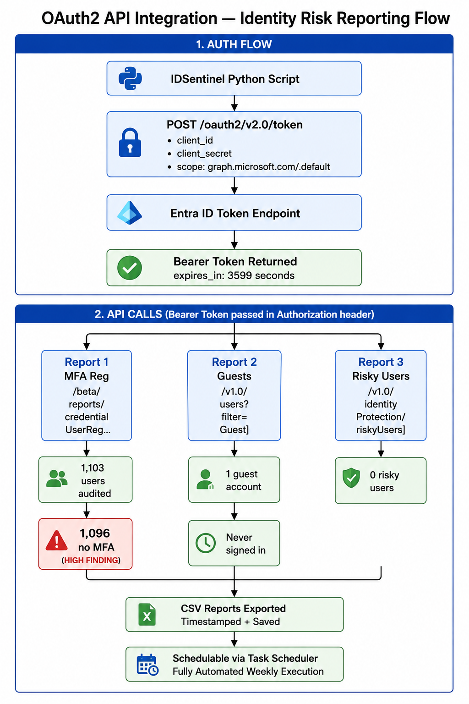

---

## 🛠️ Implementation

### Step 1 — Create App Registration in Entra ID
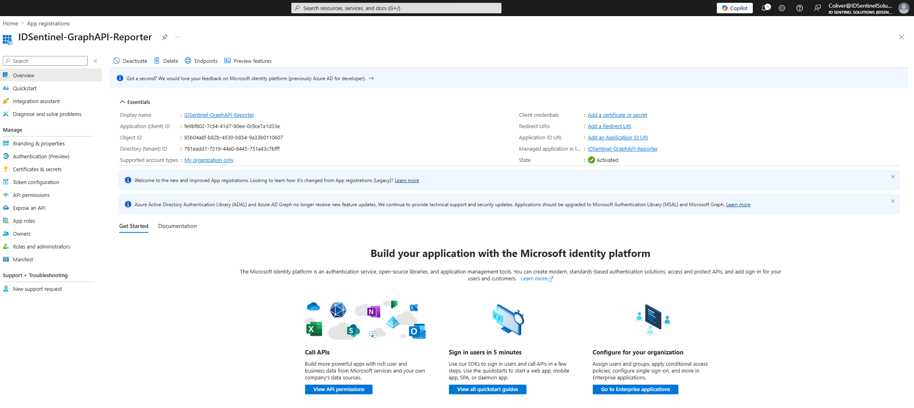

---

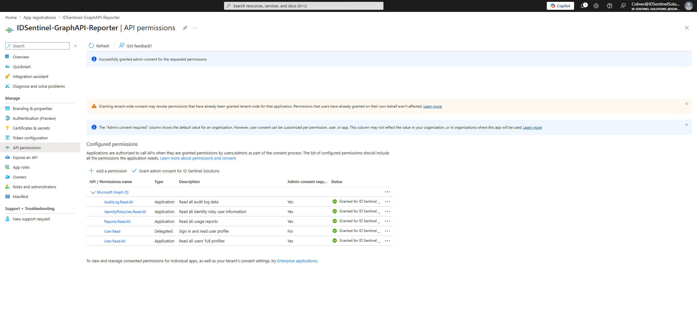

---

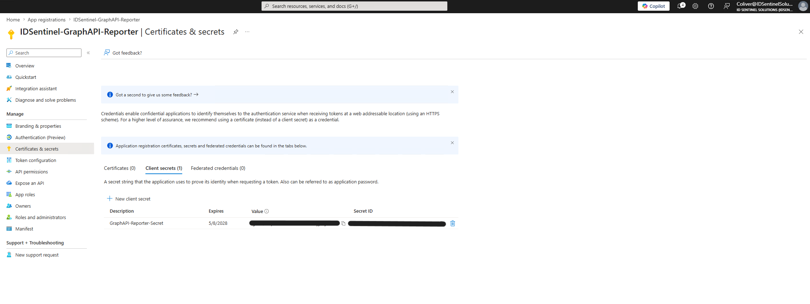

---

### Step 2 — Test OAuth2 Token Request in Postman
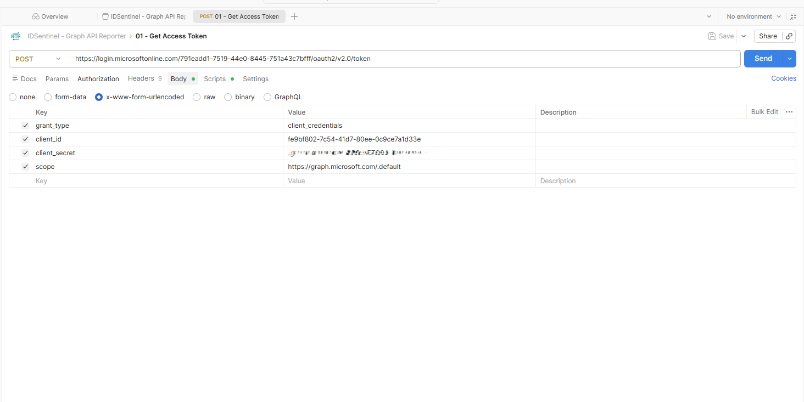

---

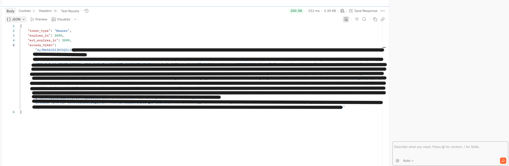

---

### Step 3 — Call Graph API Endpoints in Postman

#### Request 2 — MFA Registration Report
Endpoint: `GET https://graph.microsoft.com/beta/reports/credentialUserRegistrationDetails`

Returns all users with their MFA registration status — identifying accounts 
without MFA registered for remediation.

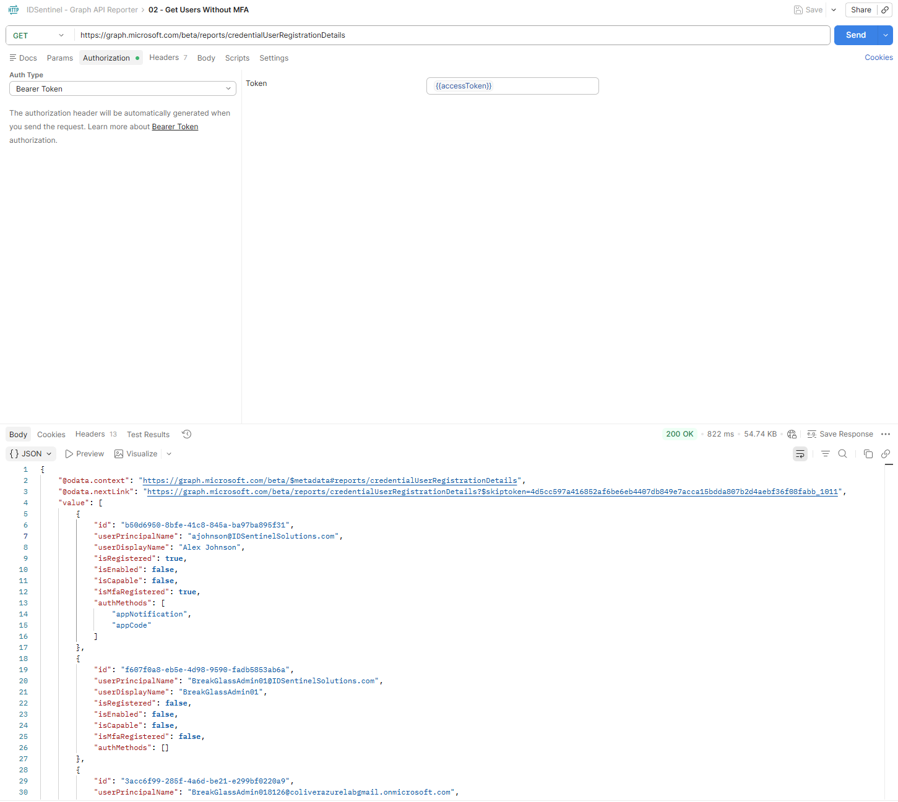

---

#### Request 3 — Guest Account Inventory
Endpoint: `GET https://graph.microsoft.com/v1.0/users?$filter=userType eq 'Guest'`

Returns all guest accounts with creation date and last sign-in activity 
for stale account identification.

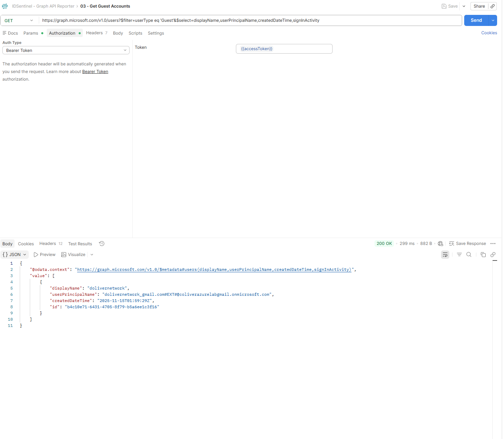

---

#### Request 4 — Risky Users Report
Endpoint: `GET https://graph.microsoft.com/v1.0/identityProtection/riskyUsers`

Returns users flagged by Entra Identity Protection. Empty array confirms 
API connectivity and permissions are correctly configured.

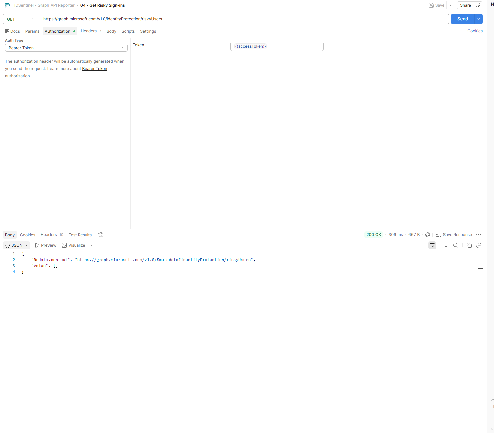

---

### Step 4 — Python Automation Script
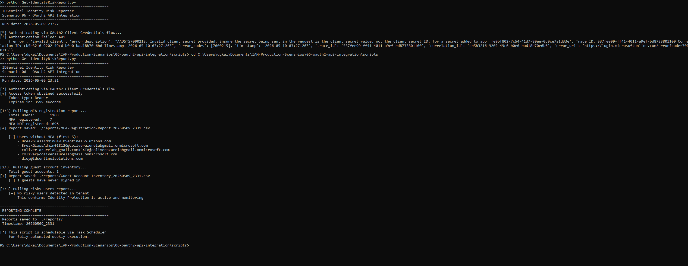
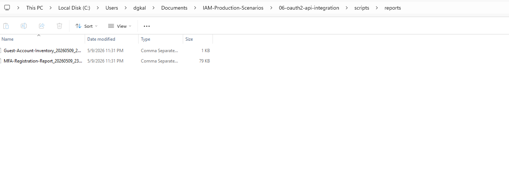

---

## ✅ Outcome

- App registration created with least-privilege API permissions
- OAuth2 client credentials flow validated end-to-end in Postman
- Three identity risk reports automated via Python
- Reports exported as timestamped CSV files for compliance documentation
- Manual reporting time reduced from 4-6 hours to under 5 minutes
- Solution is schedulable via Task Scheduler for fully automated execution

---

## 📁 Files

| File | Description |
|------|-------------|
| `scripts/Get-IdentityRiskReport.py` | Python script — OAuth2 auth + all three reports |
| `postman/IDSentinel-GraphAPI.postman_collection.json` | Postman collection with 4 API requests |
| `diagrams/oauth2-flow.png` | OAuth2 client credentials flow diagram |
| `screenshots/` | Evidence of implementation |

---

## 🔗 References

- [Microsoft Graph API Overview](https://learn.microsoft.com/en-us/graph/overview)
- [OAuth2 Client Credentials Flow](https://learn.microsoft.com/en-us/entra/identity-platform/v2-oauth2-client-creds-grant-flow)
- [Microsoft Graph Explorer](https://developer.microsoft.com/en-us/graph/graph-explorer)