# Scenario 07 — Identity Risk Response Playbook

## 🏢 Business Problem

IDSentinel Solutions' Security Operations team had no standardized process
for responding to identity-based alerts surfaced by Entra Identity Protection.
When risky sign-in events fired, analysts were triaging them manually through
the Entra portal — no documented runbook, no consistent remediation steps,
and no audit trail proving the event was investigated and closed.

A P1 incident involving a compromised contractor account exposed the gap:
the analyst who responded documented nothing, the remediation actions were
inconsistent with what policy required, and the post-incident review had
no evidence to work from.

The IAM team was tasked with building a repeatable Identity Risk Response
Playbook — a SOC runbook covering detection, investigation, containment,
remediation, and post-incident documentation — backed by Graph API automation
to accelerate response time.

---

## ⚠️ Risk

- No documented runbook means inconsistent response quality depending on who is on-call
- Manual triage through the Entra portal adds 20-40 minutes to MTTR per incident
- No RCA template means repeat incidents cannot be tracked or trended
- Missing audit trail fails SOC 2 CC7.2 (incident response) and CC7.3 (incident documentation) controls
- Risky sign-in events left unactioned allow attackers to maintain persistence while analysts debate next steps

---

## 🎯 Scope

One complete Identity Risk Response Playbook covering:

1. **Detection** — Risky sign-in simulated via Tor exit node, detected by Entra Identity Protection
2. **Investigation** — Graph API queries to pull user risk detail, detection events, and sign-in log correlation
3. **Containment** — Account disable and session revocation via Graph API
4. **Remediation** — Password reset, account re-enable, and risk dismissal via Graph API
5. **Post-Incident** — RCA completed and SOC 2 evidence package documented

---

## 🔧 Solution Design

The playbook follows a five-phase IR structure mapped to NIST SP 800-61:

| Phase | NIST Equivalent | Actions |
|-------|-----------------|---------|
| Detection | Detect | Identity Protection alert fires on anonymized IP |
| Investigation | Analyze | Graph API pulls risk detail, detection events, sign-in logs |
| Containment | Contain | Account disabled, all sessions revoked |
| Remediation | Eradicate | Password reset, account re-enabled, risk dismissed |
| Post-Incident | Recover + Document | RCA completed, SOC 2 evidence packaged |

Authentication uses the existing **OAuth2 client credentials app registration**
from Scenario 06 — no new app registration required. Additional permissions
added: `IdentityRiskyUser.ReadWrite.All`, `IdentityRiskEvent.Read.All`.

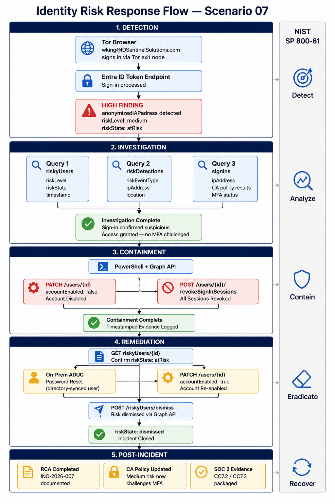

---

## 🛠️ Implementation

### Step 1 — Simulate Risky Sign-In and Confirm Detection

Tor Browser was used to authenticate as test user `wking@IDSentinelSolutions.com`
through a Tor exit node. Entra Identity Protection classifies this as an
**anonymizedIPAddress** risk event.

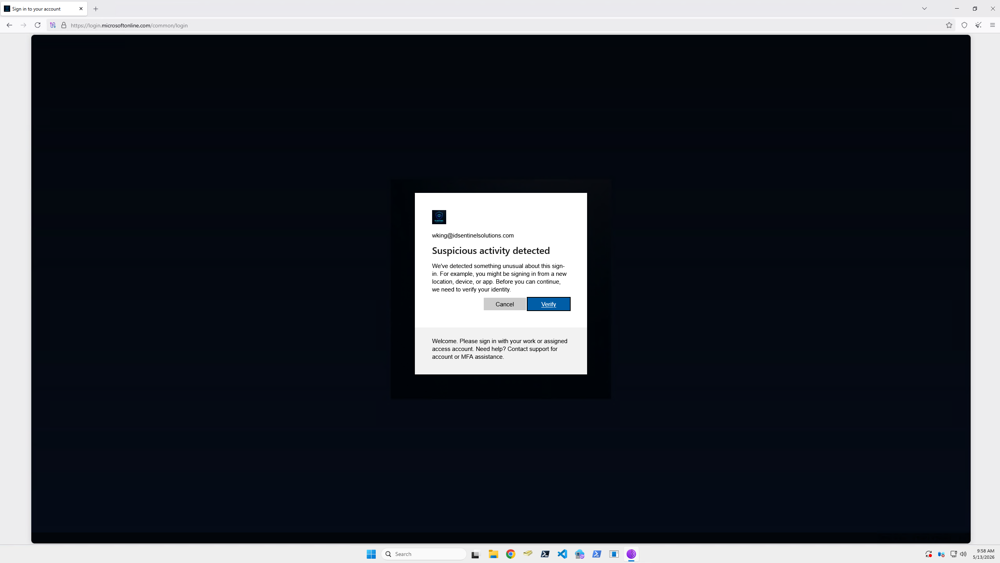

---

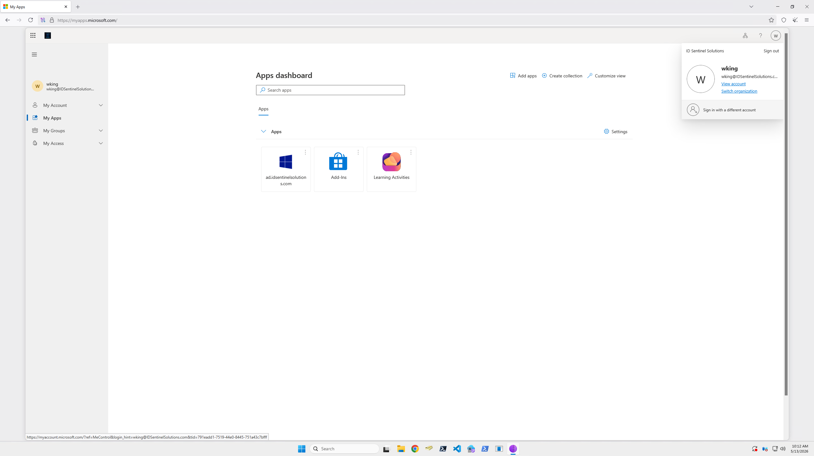

---

Identity Protection detected the event and flagged the user as at-risk.

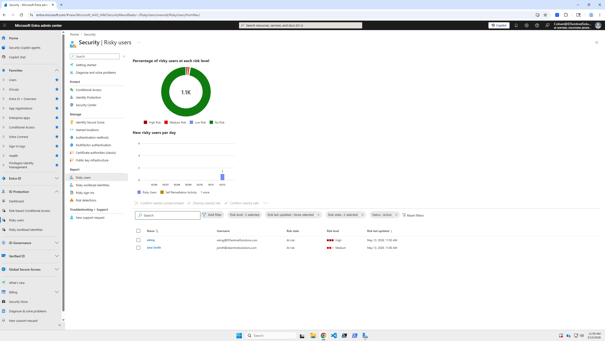

---

### Step 2 — Update App Registration Permissions

Existing app registration updated with additional permissions required
for risk investigation and dismissal.

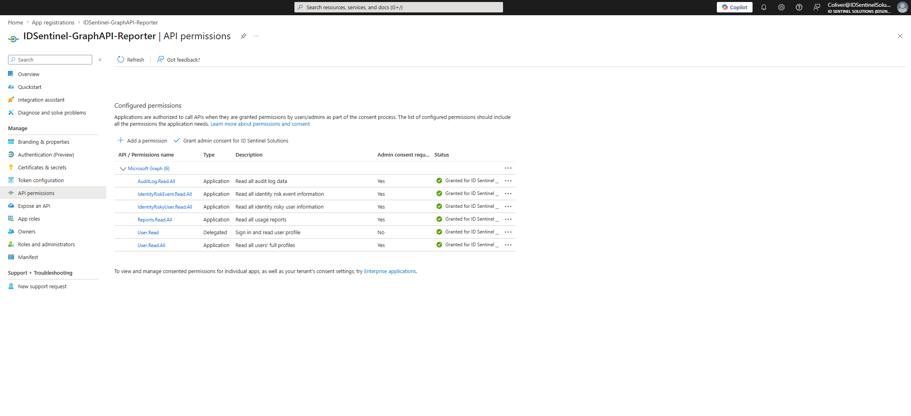

---

### Step 3 — Investigate via Graph API (Postman)

All investigation performed programmatically via Graph API rather than
manual portal triage — producing a documented, reproducible evidence trail.

**Query 1 — Risky User Detail**

```
GET https://graph.microsoft.com/v1.0/identityProtection/riskyUsers
    ?$filter=userDisplayName eq 'wking'
    &$select=id,userDisplayName,userPrincipalName,riskLevel,riskState,riskLastUpdatedDateTime
```

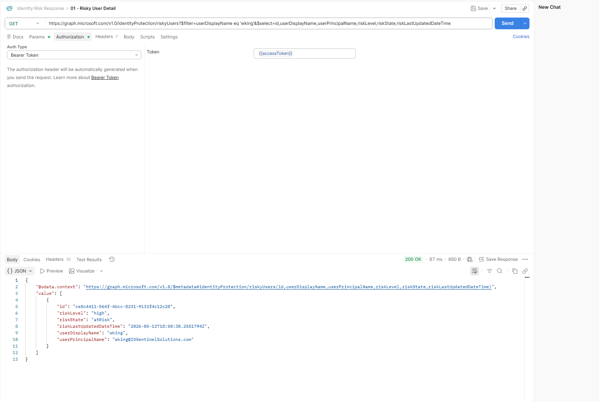

---

**Query 2 — Risk Detection Events**

```
GET https://graph.microsoft.com/v1.0/identityProtection/riskDetections
    ?$filter=userDisplayName eq 'wking'
    &$select=id,riskEventType,riskLevel,detectedDateTime,ipAddress,location,additionalInfo
```

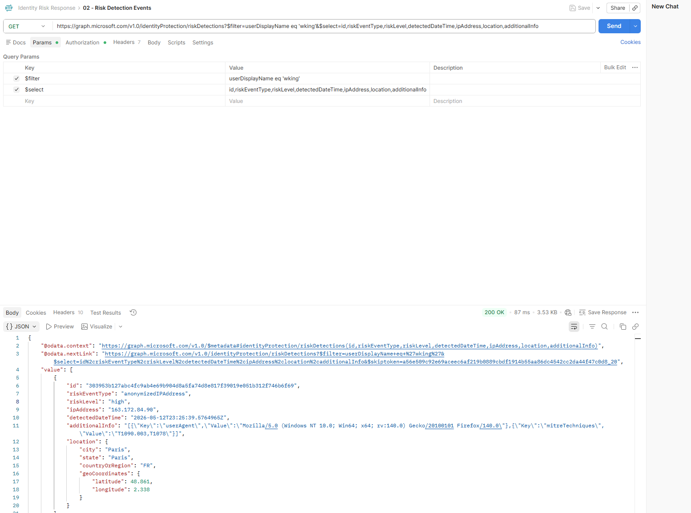

---

**Query 3 — Sign-In Log Correlation**

```
GET https://graph.microsoft.com/v1.0/auditLogs/signIns
    ?$filter=userPrincipalName eq 'wking@IDSentinelSolutions.com'
             and createdDateTime ge 2026-05-13T00:00:00Z
    &$select=createdDateTime,ipAddress,location,deviceDetail,
             status,riskLevelAggregated,conditionalAccessStatus
```

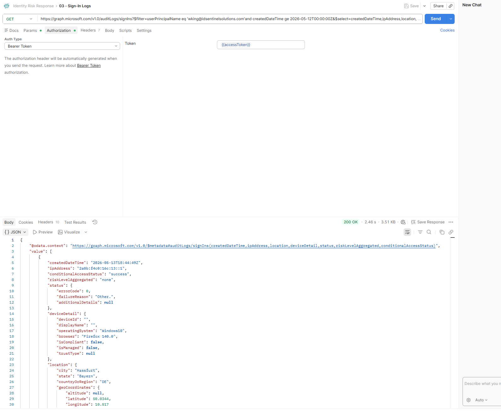

---

### Step 4 — Containment (PowerShell + Graph API)

Account disabled and all active sessions revoked immediately following
investigation confirmation.

```powershell
# Disable account
$body = @{ accountEnabled = $false } | ConvertTo-Json
Invoke-MgGraphRequest -Method PATCH `
    -Uri "https://graph.microsoft.com/v1.0/users/$userId" `
    -Body $body -ContentType "application/json"

# Revoke all active sessions
Invoke-MgGraphRequest -Method POST `
    -Uri "https://graph.microsoft.com/v1.0/users/$userId/revokeSignInSessions"
```

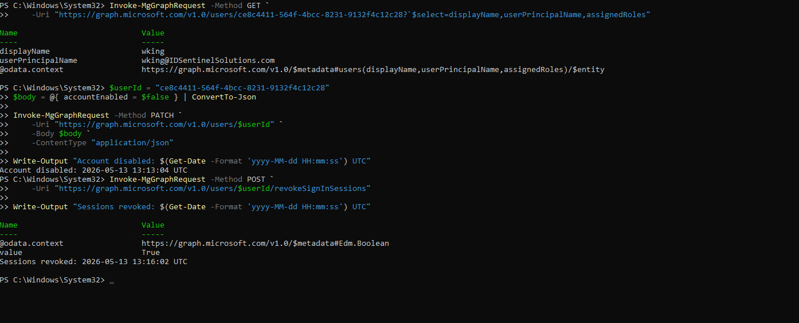

---

### Step 5 — Remediation (Postman + Active Directory)

**Confirm risk state before remediating:**

```
GET https://graph.microsoft.com/v1.0/identityProtection/riskyUsers/{id}
```

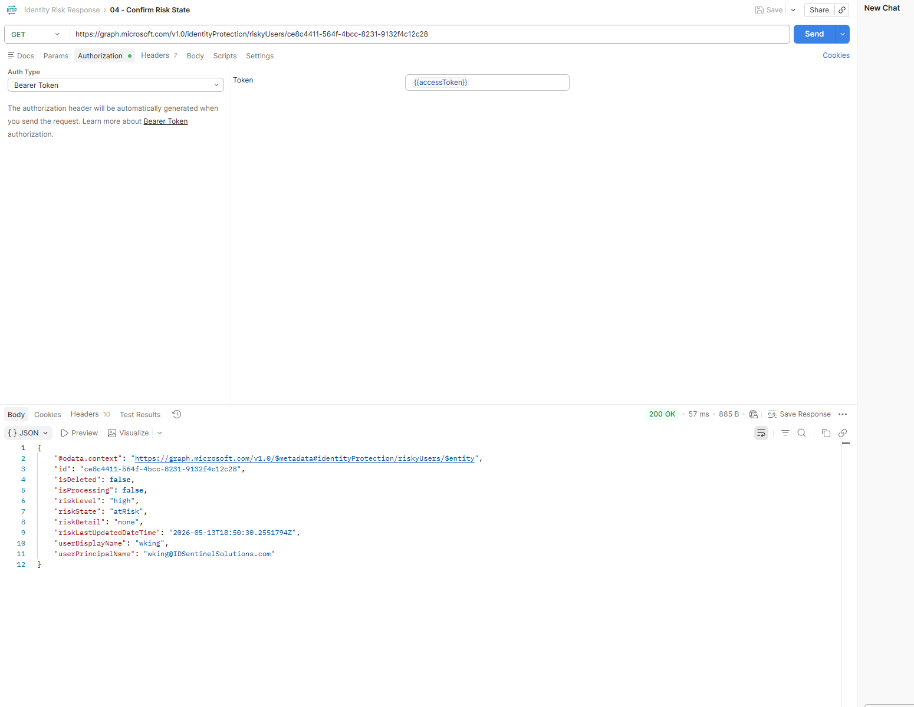

---

**Password reset performed via Active Directory on-premises** — wking is a
directory-synced user. Passwords are mastered on-prem and cannot be reset
via Graph API directly. Reset performed in ADUC on the domain controller;
Entra reflects the change after the next sync cycle.

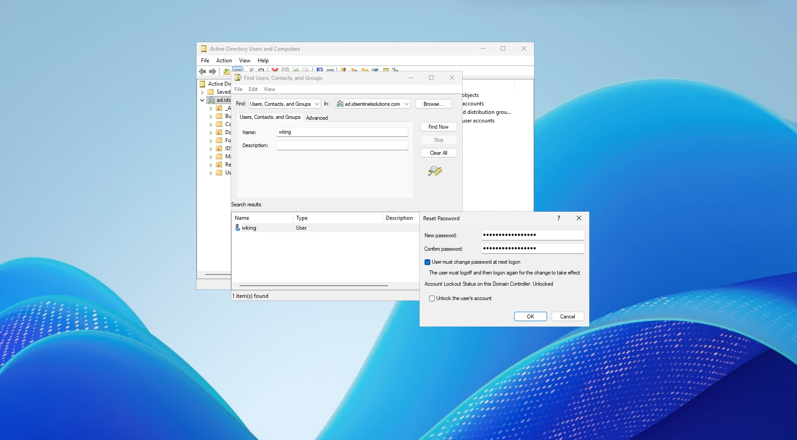

---

**Account re-enabled via Graph API:**

```powershell
$body = @{ accountEnabled = $true } | ConvertTo-Json
Invoke-MgGraphRequest -Method PATCH `
    -Uri "https://graph.microsoft.com/v1.0/users/$userId" `
    -Body $body -ContentType "application/json"
```

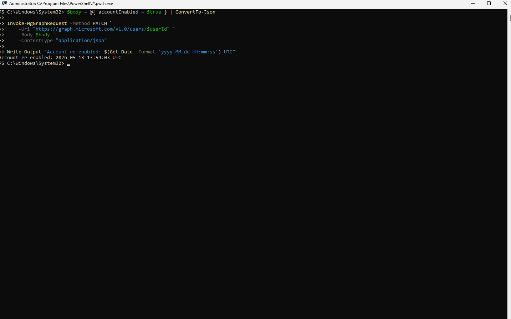

---

**Risk dismissed via Graph API:**

```
POST https://graph.microsoft.com/v1.0/identityProtection/riskyUsers/dismiss
Body: { "userIds": ["ce8c4411-564f-4bcc-8231-9132f4c12c28"] }
```

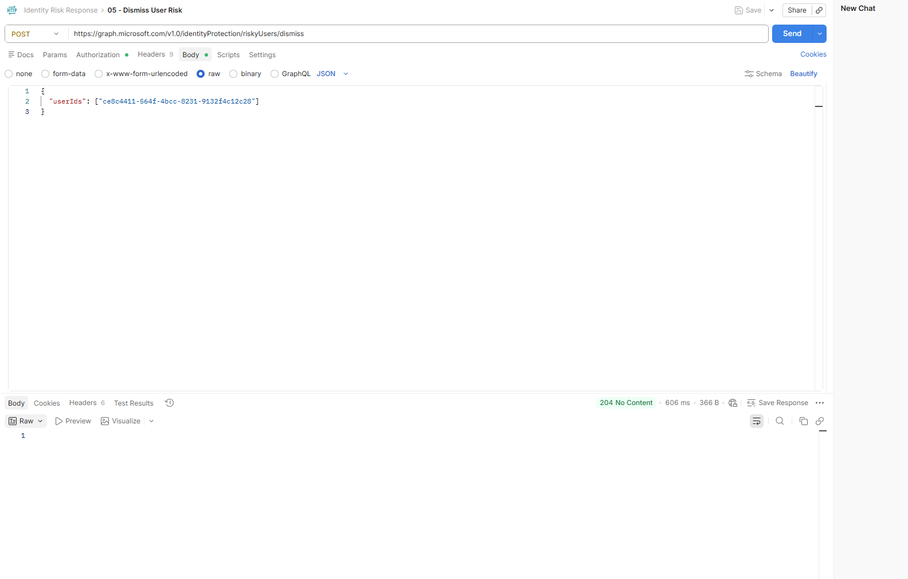

---

**Risk state confirmed clean:**

riskState returned `dismissed` — risk manually dismissed by admin via Graph API
following password reset and session revocation. Incident closed.

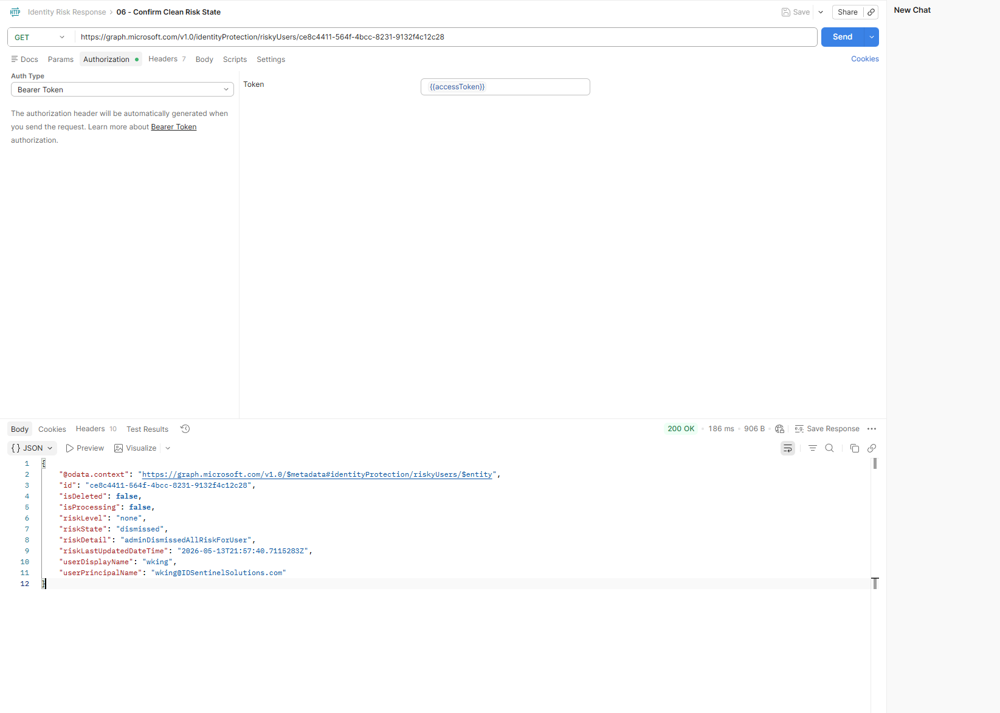

---

### Step 6 — Post-Incident Documentation

#### Incident Summary

| Field | Value |
|-------|-------|
| Incident ID | INC-2026-007 |
| Severity | P2 — Medium Risk |
| Affected User | wking@IDSentinelSolutions.com |
| Detection Source | Entra Identity Protection |
| Risk Event Type | anonymizedIPAddress (Tor exit node) |
| Detection Time | 2026-05-13 UTC |
| MTTR | See RCA document |
| SOC 2 Controls | CC7.2, CC7.3 |

#### Root Cause

Risk-based Conditional Access policy was scoped to High risk only.
Medium risk sign-ins were logged but not challenged or blocked —
allowing the Tor-sourced authentication to succeed without MFA step-up.

#### Corrective Actions

1. CA policy updated to challenge sign-ins at Medium risk (not just High)
2. Playbook added to SOC runbook library as INC-TYPE-001

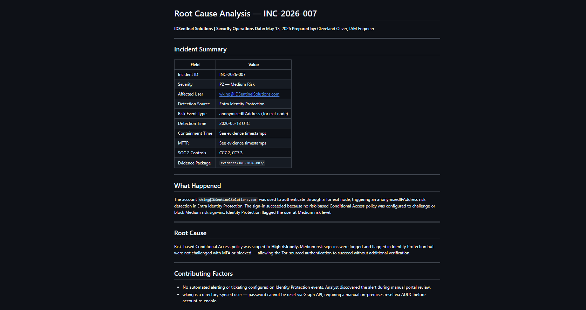

---

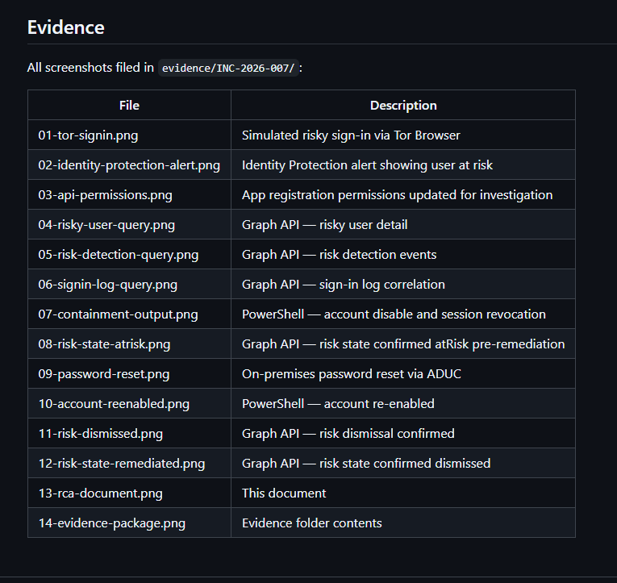

---

## ✅ Outcome

- End-to-end Identity Risk Response Playbook built and documented
- Risky sign-in simulated, detected, investigated, contained, and remediated in a single controlled exercise
- Graph API automation replaces manual portal triage — containment executable in under 5 minutes following the runbook
- On-premises password sync behavior identified and documented — hybrid identity architecture handled correctly
- Risk state confirmed dismissed via Graph API following all remediation steps
- CA policy gap identified during RCA — Medium risk sign-ins now challenge with MFA
- RCA completed and filed as SOC 2 CC7.2 / CC7.3 evidence

---

## 📁 Files

| File | Description |
|------|-------------|
| `scripts/Invoke-IdentityRiskContainment.ps1` | PowerShell — account disable and session revocation |
| `runbooks/INC-TYPE-001-Identity-Risk-Response.md` | SOC runbook — full 5-phase playbook |
| `templates/RCA-Template.md` | Root cause analysis template |
| `evidence/INC-2026-007/` | Complete evidence package for this incident |
| `diagrams/risk-response-flow.png` | NIST-mapped response flow diagram |
| `screenshots/` | Evidence of implementation |

---

## 🔗 References

- [Entra Identity Protection Overview](https://learn.microsoft.com/en-us/entra/id-protection/overview-identity-protection)
- [Microsoft Graph — riskyUsers API](https://learn.microsoft.com/en-us/graph/api/resources/riskyuser)
- [Microsoft Graph — riskDetections API](https://learn.microsoft.com/en-us/graph/api/resources/riskdetection)
- [Revoke Sign-In Sessions](https://learn.microsoft.com/en-us/graph/api/user-revokesigninsessions)
- [NIST SP 800-61 — Computer Security Incident Handling Guide](https://nvlpubs.nist.gov/nistpubs/specialpublications/nist.sp.800-61r2.pdf)
- [SOC 2 CC7.2 / CC7.3 — Incident Response Controls](https://www.aicpa.org/resources/article/trust-services-criteria)