# Scenario 08 — CIAM Login Platform with Auth0

## 🏢 Business Problem

IDSentinel Solutions is onboarding a new customer-facing SaaS application
that requires a secure, branded login experience for external customers.
Unlike the internal workforce identity stack (Entra ID), customer identity
has fundamentally different requirements: self-service registration, social
login options, and scalability to thousands of external users who should
never touch the corporate directory.

The Security and Product teams identified a critical gap — there was no
dedicated platform for managing customer identities. Without one, customer
accounts would need to be provisioned inside the corporate Entra ID tenant,
co-mingling external users with employees, violating data separation
principles, and creating an unscalable support burden for account management.

The IAM team was tasked with designing and deploying a Customer Identity
and Access Management (CIAM) platform using Auth0 (Okta Customer Identity
Cloud) — a dedicated external identity tenant fully isolated from the
corporate Entra ID environment.

---

## ⚠️ Risk

- Customer identities co-mingled with employee accounts in Entra ID — violates
  least-privilege and data separation principles
- No self-service registration or password reset — support desk handles all
  customer access requests, unscalable at volume
- Username/password only authentication — no MFA path for customer accounts
  creates credential stuffing exposure
- No token-based API protection — customer-facing API endpoints unauthenticated
  or relying on insecure API key patterns
- No customer authentication audit trail — compliance exposure under SOC 2 Type II

---

## 🎯 Scope

- **Platform:** Auth0 tenant (Okta Customer Identity Cloud — dedicated CIAM)
- **Users:** External customers — not employees or contractors
- **Application:** Customer-facing SaaS web application (simulated)
- **Auth flows:** Universal Login — sign-up, sign-in, password reset
- **Federation:** Google as external social identity provider (OIDC)
- **MFA:** Email OTP enforced as step-up authentication
- **API protection:** OAuth2 access token issuance for protected API endpoints

---

## 🔧 Solution Design

The CIAM platform was built on Auth0 across four workstreams:

**Workstream 1 — Auth0 Tenant and Application Registration**
A dedicated Auth0 tenant was provisioned as an isolated CIAM directory —
completely separate from the corporate Entra ID environment. A web
application and a protected API were registered to model the customer-facing
SaaS app and its backend services.

**Workstream 2 — Universal Login and Custom Branding**
Auth0 Universal Login was configured as the hosted authentication endpoint
for all customer-facing flows. Custom branding — IDSentinel logo, primary
color, background — was applied to deliver a consistent customer experience.
Self-service sign-up and password reset were enabled and validated end-to-end.

**Workstream 3 — Google Social Identity Federation**
Google was configured as an external OIDC identity provider using OAuth2
credentials from Google Cloud Console. Auth0 maps Google claims (email,
given name, family name) to the local customer profile and creates a linked
`google-oauth2` identity on first login — customers are not dependent on
Google remaining their identity provider.

**Workstream 4 — API Protection with OAuth2**
A protected API was registered in Auth0 with a custom permission scope
(`read:data`). The client credentials flow was used to issue a scoped
access token, which was validated against a protected endpoint using the
Bearer token pattern. JWT claims were decoded and audited to confirm correct
audience, scope, and expiry issuance.

**Key Design Decisions:**
- Auth0 tenant fully isolated from corporate Entra ID — customer data
  never enters the workforce directory
- Universal Login over embedded login — Auth0 recommended security pattern,
  prevents credential interception at the application layer
- Social login creates a linked local Auth0 identity — federation is
  transparent to downstream applications
- JWT access tokens scoped to a specific API audience (`https://api.idsentinel.com`)
  — tokens cannot be replayed against other services
- Email OTP MFA enforced via Always policy — all customers prompted on sign-in

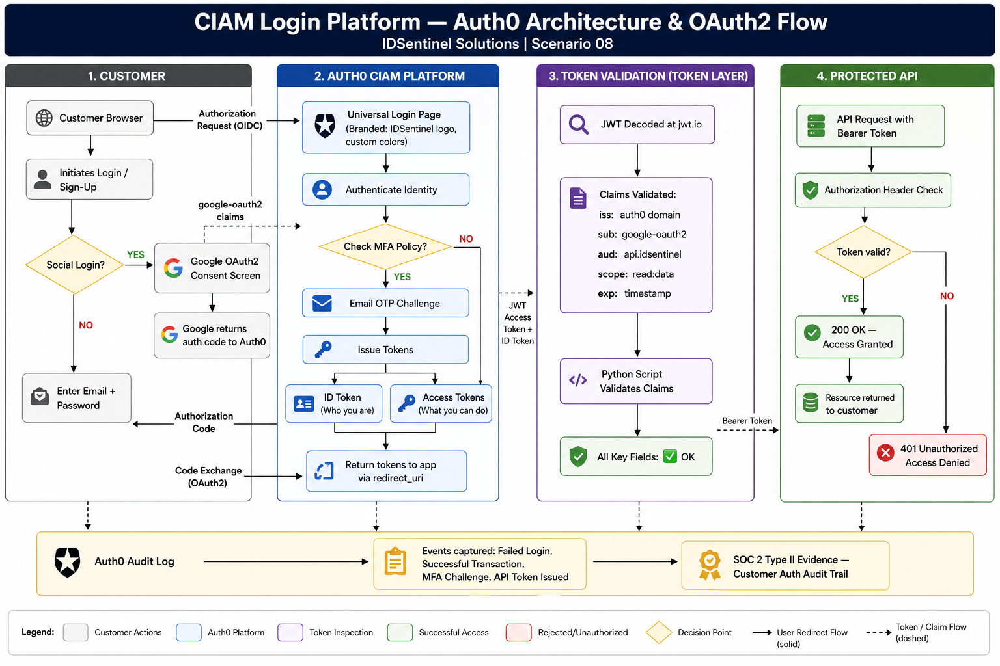

---

## 🛠️ Implementation

### Workstream 1 — Tenant Setup and Application Registration

#### Auth0 Tenant Provisioned
A dedicated Auth0 tenant was created — acting as the CIAM directory for
all customer identities. No employee accounts, no Conditional Access
policies, no group memberships — customer-only identity space.

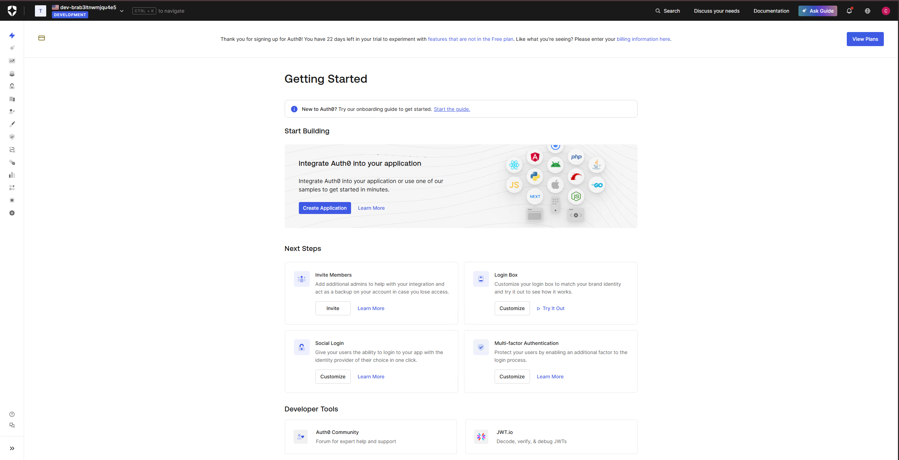

#### Web Application Registered
`IDSentinel-CustomerApp` registered as a Regular Web Application in Auth0.
Allowed callback URLs, logout URLs, and web origins configured to
`https://jwt.io` for lab validation.

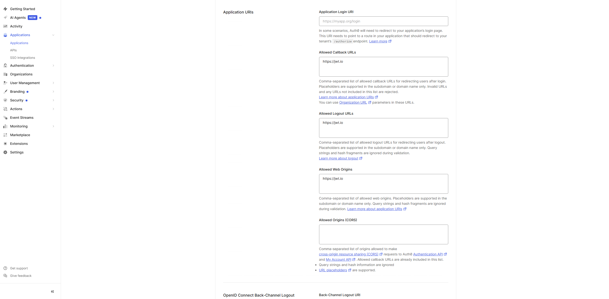

#### Protected API Registered
`IDSentinel-CustomerAPI` registered with identifier `https://api.idsentinel.com`.
Custom permission scope `read:data` defined to represent access to customer
data endpoints.

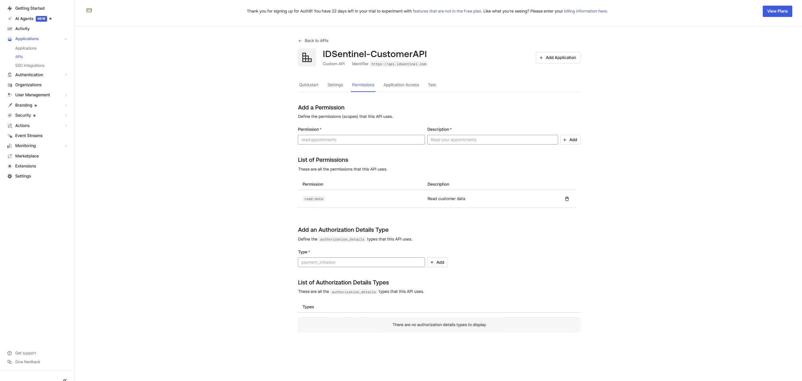

---

### Workstream 2 — Universal Login and Branding

#### Universal Login Configured
New Universal Login experience enabled — Auth0's recommended hosted login
pattern. All customer authentication flows route through the Universal Login
page rather than an embedded application form.

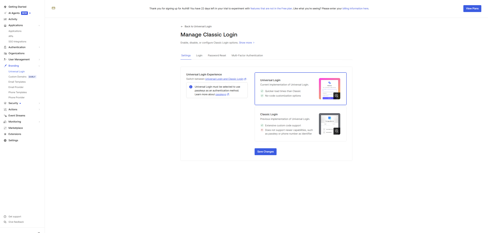

#### Custom Branding Applied
IDSentinel branding applied via Branding Settings — logo uploaded, primary
color and background set. The hosted login page now presents a consistent
IDSentinel customer experience.

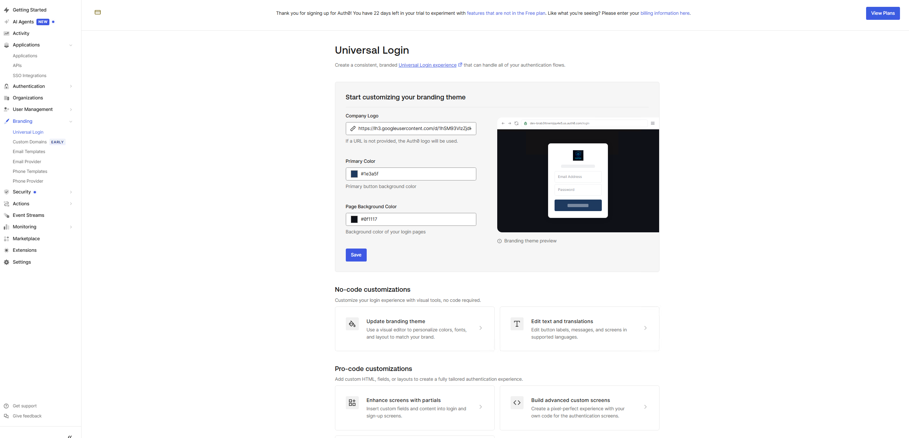

#### Sign-Up and Sign-In Flow Validated
End-to-end customer registration tested via authorization URL. New customer
account created through self-service sign-up — email, password set, account
confirmed.

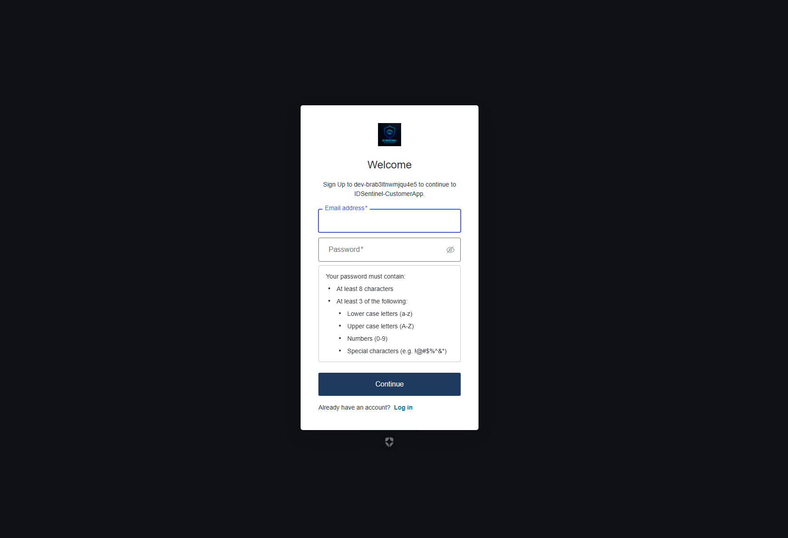

#### Customer Account Confirmed in Auth0 User Store
Test customer account visible in User Management with identity provider
listed as `auth0` — confirming the account was created in the local
database connection, not federated.

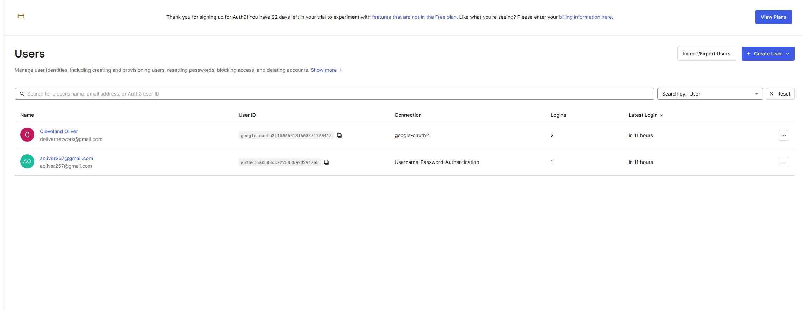

---

### Workstream 3 — Google Social Identity Federation

#### Google OAuth2 Credentials Configured
Google Cloud project created with OAuth2 consent screen configured for
external users. OAuth2 Client ID created with Auth0 callback URL registered
as an authorized redirect URI.

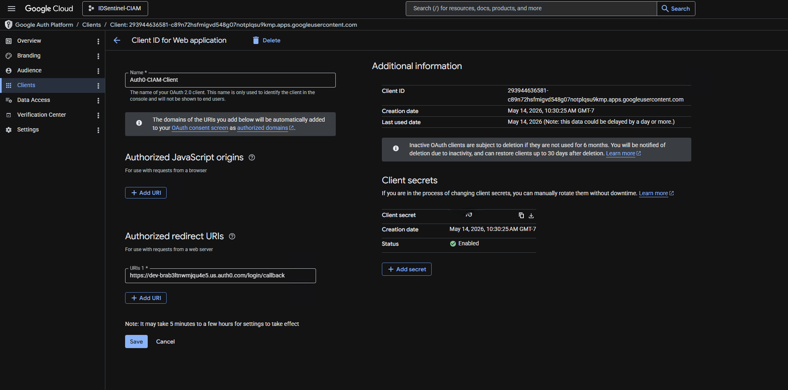

#### Google Social Connection Enabled in Auth0
Google configured as a social identity provider under Authentication →
Social using Google Client ID and Secret. Connection enabled on
`IDSentinel-CustomerApp`.

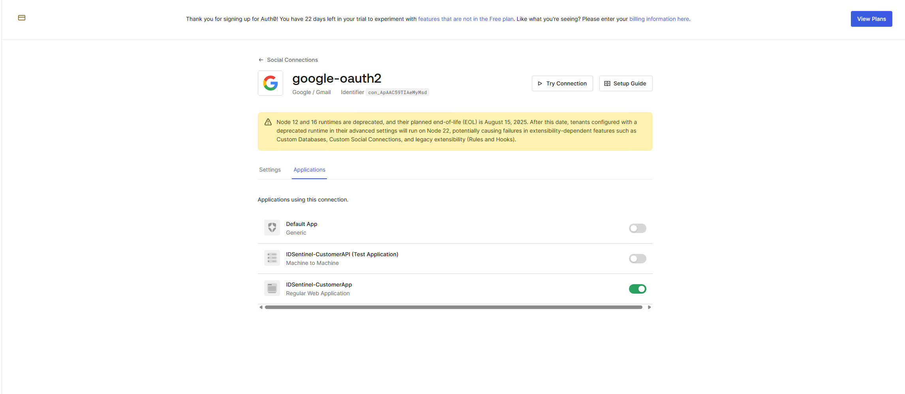

#### Google Social Login Validated End-to-End
Login flow tested via the Google social connection. Auth0 initiated the
OAuth2 handshake, Google consent screen presented, and the resulting
user profile returned with `google-oauth2` as the identity provider —
confirming claim mapping and linked identity creation.

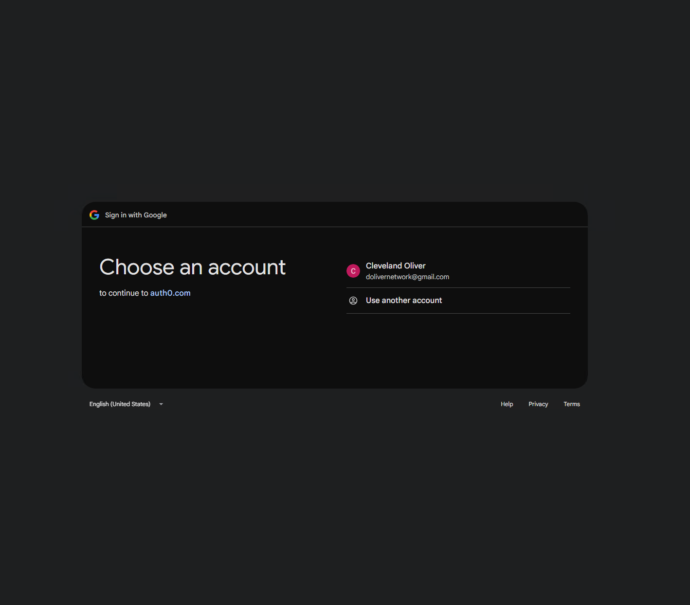

---

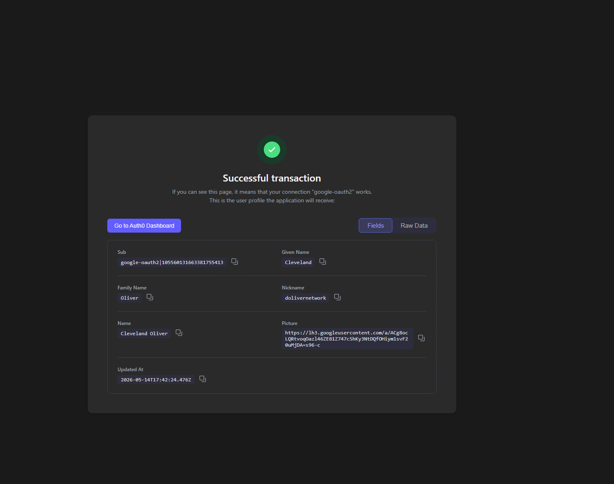

---

### Workstream 4 — API Protection with OAuth2

#### Access Token Obtained via Client Credentials Flow
OAuth2 client credentials flow executed via Postman against the Auth0
token endpoint. Access token issued scoped to `https://api.idsentinel.com`
with `read:data` permission.

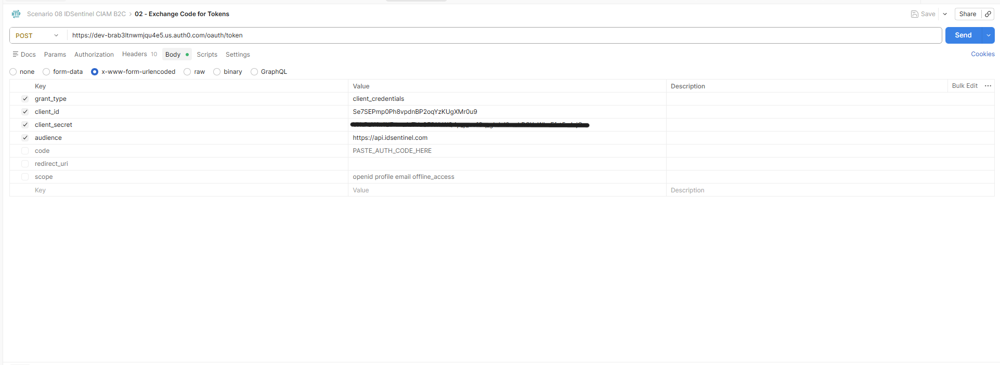

---

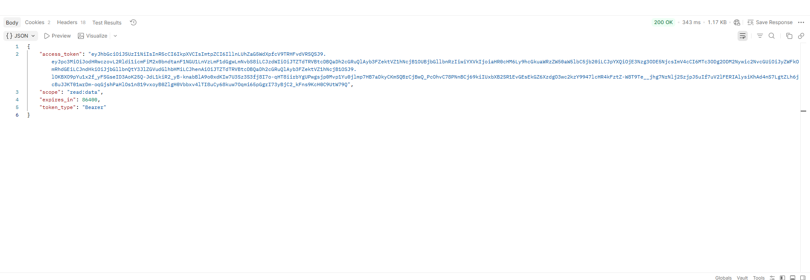

#### JWT Claims Decoded and Validated
Access token decoded at jwt.io. Key claims inspected and validated:

| Claim | Value |
|-------|-------|
| `iss` | `https://dev-brab3ltnwmjqu4e5.us.auth0.com/` |
| `sub` | Client ID + `@clients` |
| `aud` | `https://api.idsentinel.com` |
| `scope` | `read:data` |
| `exp` | Token expiry timestamp |

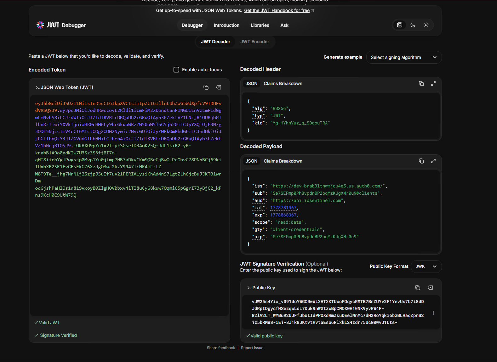

#### Protected API Called with Bearer Token
Access token passed as a Bearer token to `https://httpbin.org/bearer`.
Response confirmed `"authenticated": true` — end-to-end Bearer token
authentication validated. Request without token returned `401 Unauthorized`,
confirming API enforcement is active.

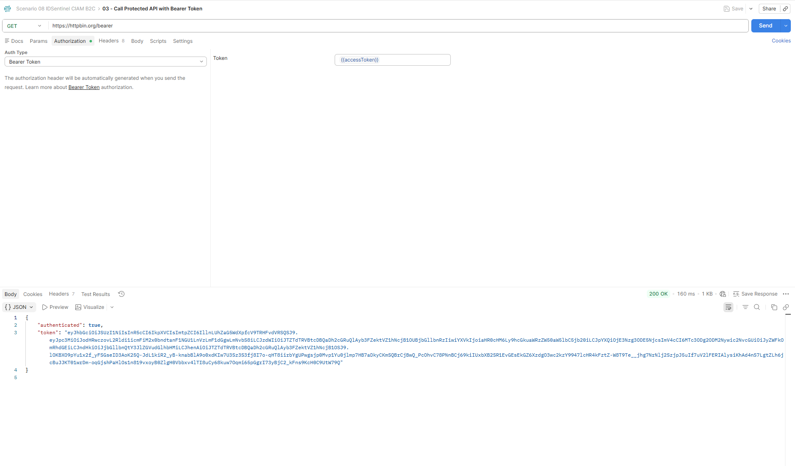

---

### MFA — Email OTP Step-Up Authentication

Email OTP factor enabled under Security → Multifactor Auth. MFA policy
set to **Always** — all customers prompted for email OTP verification
on every sign-in.

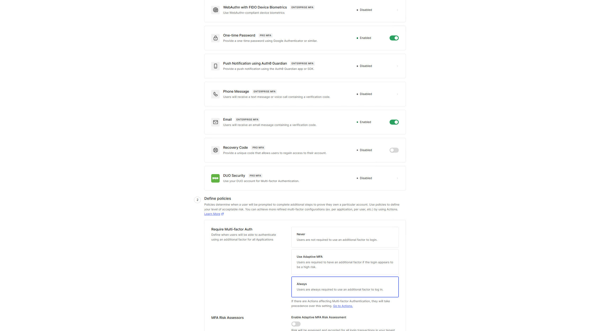

---

### Python Token Validation Script

`Get-Auth0TokenReport.py` executed against the issued access token.
Script decodes JWT payload without signature verification and outputs
all claims with field-level validation status — producing an
audit-ready token inspection report.

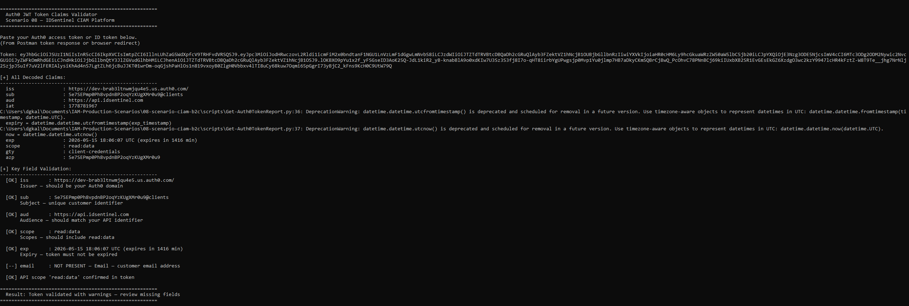

---

## ✅ Outcome

- Auth0 tenant provisioned as a dedicated CIAM platform — fully isolated
  from the corporate Entra ID environment, zero cross-tenant identity exposure
- Web application and protected API registered with correct callback URLs,
  audience identifiers, and permission scopes
- Universal Login configured with custom IDSentinel branding — consistent
  customer-facing login experience delivered
- Self-service sign-up validated end-to-end — customer account created and
  confirmed in Auth0 user store with correct identity provider assignment
- Google federated as external OIDC social identity provider — social login
  validated end-to-end, `google-oauth2` linked identity confirmed in user store
- OAuth2 client credentials flow validated in Postman — scoped access token
  issued with correct audience and permission claims
- JWT decoded and validated — `iss`, `sub`, `aud`, `scope`, `exp` all
  confirmed correctly scoped to the registered API
- Protected API called successfully with Bearer access token —
  `401 Unauthorized` confirmed on unauthenticated requests
- Email OTP MFA enabled and tested — step-up authentication enforced
  on all customer sign-ins via Always policy
- Python script automates JWT claim decoding and field-level validation
  for audit and integration testing workflows

---

## 📊 Platform Summary

| Component | Configuration | Status |
|-----------|--------------|--------|
| Auth0 Tenant | Isolated external CIAM directory | ✅ Provisioned |
| Web App Registration | Callback URLs, origins configured | ✅ Configured |
| API Registration | Audience + `read:data` scope defined | ✅ Configured |
| Universal Login | New experience, custom branding applied | ✅ Active |
| Self-Service Sign-Up | Email registration, password reset | ✅ Tested |
| Google Federation | OIDC, `google-oauth2` linked identity confirmed | ✅ Active |
| OAuth2 Token Flow | Client credentials, scoped access token | ✅ Validated |
| JWT Claims | iss, sub, aud, scope, exp verified | ✅ Decoded |
| API Protection | Bearer token enforcement, 401 on unauth | ✅ Enforced |
| MFA | Email OTP, Always policy | ✅ Active |

---

## 🔑 CIAM vs. Workforce IAM — Key Differences Demonstrated

| Dimension | Workforce IAM (Scenarios 01-07) | CIAM (Scenario 08) |
|-----------|--------------------------------|---------------------|
| Identity population | Employees and contractors | External customers |
| Directory | Corporate Entra ID tenant | Dedicated Auth0 tenant |
| Platform | Microsoft Entra ID | Auth0 (Okta Customer Identity Cloud) |
| Registration | IT-provisioned accounts | Self-service sign-up |
| Authentication | CA policies, PIM, MFA enforced | Universal Login, social login, OTP |
| Scale model | ~1,000 employees | Designed for millions of customers |
| UX priority | Security-first | Frictionless customer experience |
| Token consumer | Internal apps and APIs | Customer-facing apps and APIs |

---

## 📁 Files

| File | Description |
|------|-------------|
| `scripts/Get-Auth0TokenReport.py` | Python script — JWT decode and claims validation |
| `postman/CIAM-Auth0.postman_collection.json` | Postman collection — token request, API call |
| `diagrams/ciam-auth0-architecture.png` | CIAM platform architecture diagram |
| `screenshots/` | Evidence of implementation at each stage |

---

## 🔗 References

- [Auth0 Documentation](https://auth0.com/docs)
- [Auth0: Regular Web Application Quickstart](https://auth0.com/docs/quickstart/webapp)
- [Auth0: Add Social Login with Google](https://auth0.com/docs/authenticate/identity-providers/social-identity-providers/google)
- [Auth0: API Authorization](https://auth0.com/docs/get-started/architecture-scenarios/server-application-api)
- [Auth0: OAuth2 Authorization Code Flow](https://auth0.com/docs/get-started/authentication-and-authorization-flow/authorization-code-flow)
- [Auth0: Enable Multi-Factor Authentication](https://auth0.com/docs/secure/multi-factor-authentication)
- [jwt.io — JWT Decoder](https://jwt.io)