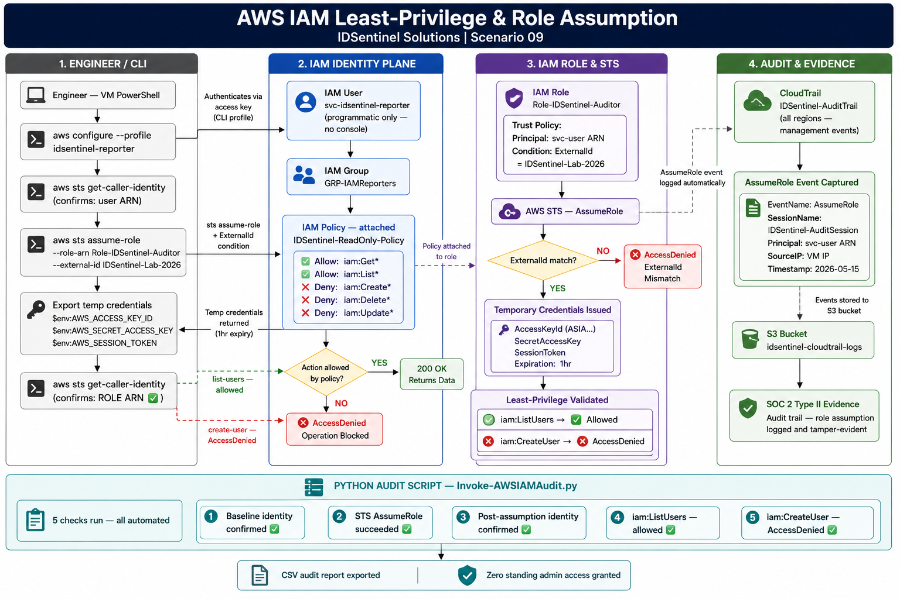
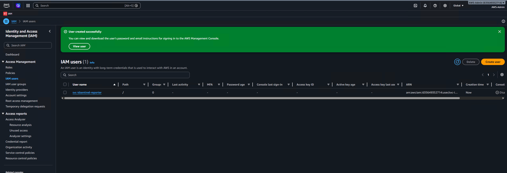
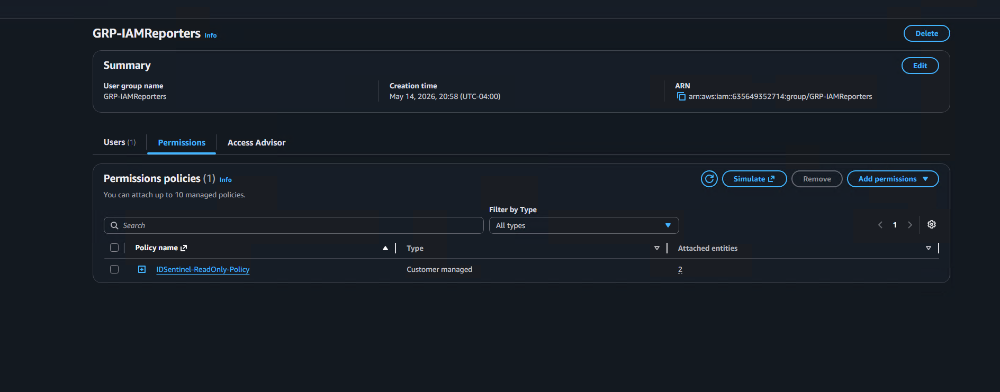
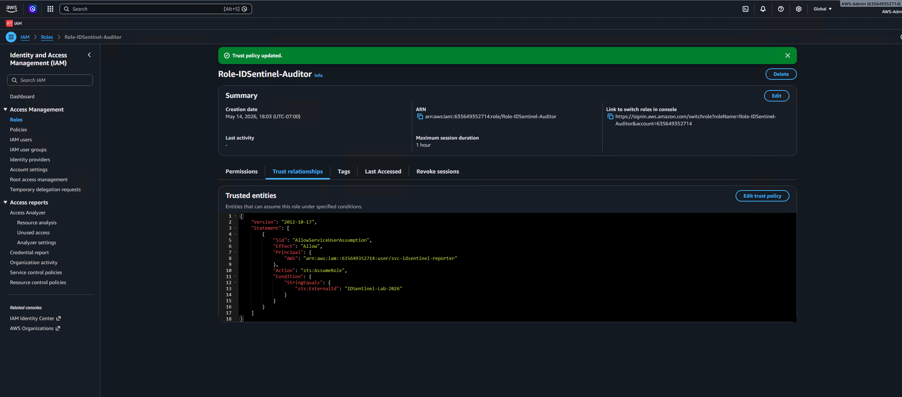
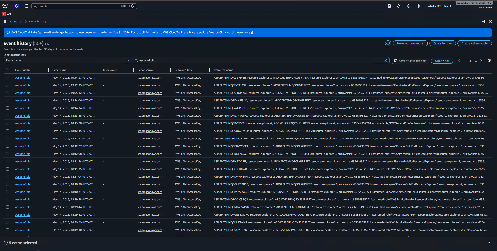
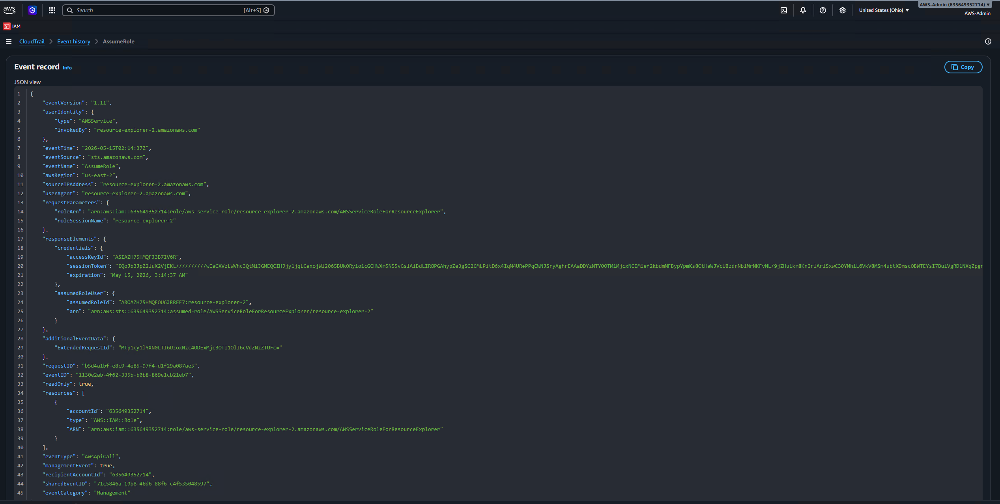

# Scenario 09 — AWS IAM Least-Privilege & Role Assumption

## 🏢 Business Problem

IDSentinel Solutions' cloud expansion into AWS required establishing a
baseline identity architecture before any workloads were deployed. The
Security team mandated that no human or service identity operate with
standing administrative access — all access must follow least-privilege
principles, and any privilege elevation must occur through time-bound
role assumption with a full audit trail captured via CloudTrail.

An internal review confirmed that without enforced role assumption
boundaries, a compromised service credential would grant unrestricted
access to IAM and other AWS services. This is a direct violation of
IDSentinel's Zero Trust initiative and creates unacceptable risk of
privilege escalation and lateral movement within the AWS environment.

---

## ⚠️ Risk

- Service identities with standing admin access create permanent blast radius
- No audit trail for privilege elevation without CloudTrail enforcement
- Compromised long-lived credentials grant unrestricted AWS access
- Non-compliant with IDSentinel's Zero Trust and least-privilege mandate
- Potential compliance exposure under SOC 2 Type II CC6.3 controls

---

## 🎯 Scope

- **Affected identities:** Service accounts and programmatic users in AWS
- **Target:** Zero standing admin access — all elevation via role assumption
- **Controls implemented:** Least-privilege IAM policy, scoped trust policy with ExternalId condition, CloudTrail audit trail
- **Validation:** CLI-based role assumption test with deny enforcement confirmation

---

## 🔧 Solution Design

A least-privilege IAM architecture was implemented across four workstreams:

**Workstream 1 — IAM Identities**
Service user created with programmatic-only access and no inline permissions.
All permissions assigned via group membership to enforce consistent policy application.

**Workstream 2 — Least-Privilege Policy**
Custom IAM policy created with explicit ReadOnly grants and explicit Deny
on all IAM write actions — ensuring even a policy misconfiguration cannot
grant write access to the identity plane.

**Workstream 3 — Role Assumption with Trust Boundary**
IAM role created with a scoped trust policy restricting assumption to a
single principal with an ExternalId condition — preventing confused deputy
attacks and unauthorized cross-account assumption.

**Workstream 4 — CloudTrail Audit**
CloudTrail trail enabled across all regions to capture AssumeRole events,
providing a tamper-evident audit log for compliance and incident response.



---

## 🛠️ Implementation

### Prerequisites
- AWS account with IAM administrative access
- AWS CLI installed and configured
- CloudTrail enabled (configured in Step 3)

---

### Step 1 — Create IAM Identities

Created service user `svc-idsentinel-reporter` with programmatic-only
access (no console login). User added to group `GRP-IAMReporters` to
enforce policy assignment via group membership rather than inline policies.




---

### Step 2 — Deploy Least-Privilege Policy

Custom policy `IDSentinel-ReadOnly-Policy` created with explicit Allow
on IAM read actions and explicit Deny on all IAM write actions.
Attached to `GRP-IAMReporters` — inherited by all group members.

**Policy:** `policies/IDSentinel-ReadOnly-Policy.json`



---

### Step 3 — Create IAM Role with Scoped Trust Policy

Role `Role-IDSentinel-Auditor` created with trust policy restricting
assumption to `svc-idsentinel-reporter` only, enforced by an ExternalId
condition to prevent confused deputy attacks.




---

### Step 4 — Enable CloudTrail

Trail `IDSentinel-AuditTrail` created across all regions with management
events (Read + Write) logged to S3 bucket `idsentinel-cloudtrail-logs`.


---

### Step 5 — Assume Role via AWS CLI

Role assumption performed via CLI using `sts assume-role` with the
ExternalId condition. Temporary credentials issued with a fixed expiration
window — no long-lived credentials at any point in the workflow.

```bash
# Verify baseline identity (user, not role)
aws sts get-caller-identity --profile idsentinel-reporter

# Assume the role
aws sts assume-role \
  --role-arn "arn:aws:iam::ACCOUNT_ID:role/Role-IDSentinel-Auditor" \
  --role-session-name "IDSentinel-AuditSession-01" \
  --external-id "IDSentinel-Lab-2026" \
  --profile idsentinel-reporter

# Export temporary credentials
export AWS_ACCESS_KEY_ID=<AccessKeyId>
export AWS_SECRET_ACCESS_KEY=<SecretAccessKey>
export AWS_SESSION_TOKEN=<SessionToken>

# Confirm identity is now the ROLE, not the user
aws sts get-caller-identity
```


---

### Step 6 — Validate Least-Privilege Enforcement

Read action confirmed allowed. Write action confirmed blocked by explicit
Deny — AccessDenied response received as expected.

```bash
# Should SUCCEED — allowed by ReadOnly grant
aws iam list-users

# Should FAIL — blocked by explicit Deny
aws iam create-user --user-name test-deny-check
```


---

### Step 7 — CloudTrail Audit Evidence

AssumeRole event captured in CloudTrail Event History with full session
metadata — principal ARN, session name, ExternalId, source IP, and
timestamp — providing a complete audit trail for compliance documentation.




---

## ✅ Outcome

- IAM service user created with programmatic-only access and no standing permissions
- Least-privilege policy deployed with explicit Deny on all IAM write actions — deny enforcement confirmed via CLI (AccessDenied on iam:CreateUser)
- IAM role configured with scoped trust policy restricting assumption to a single principal with ExternalId condition — confused deputy attack vector closed
- Role assumption performed via STS — temporary credentials issued with expiration, zero long-lived credentials used at any point
- CloudTrail trail enabled across all regions — AssumeRole event captured with full session metadata as SOC 2 audit evidence
- Zero standing administrative access granted at any stage of implementation

## 📊 Implementation Results

| Metric | Value |
|--------|-------|
| IAM users created | 1 (programmatic only — no console access) |
| IAM groups created | 1 (GRP-IAMReporters) |
| IAM roles created | 1 (Role-IDSentinel-Auditor) |
| Trust policy scope | Single principal + ExternalId condition |
| Policy type | Custom least-privilege — explicit Allow + explicit Deny |
| Least-privilege violations tested | 1 (iam:CreateUser → AccessDenied confirmed) |
| Credential type used | Temporary STS credentials (time-bound) |
| Long-lived credentials used | 0 |
| CloudTrail events captured | AssumeRole event with full session metadata |
| Permanent admin access granted | 0 |

## 📁 Files

| File | Description |
|------|-------------|
| `policies/IDSentinel-ReadOnly-Policy.json` | Least-privilege IAM policy — ReadOnly grant + explicit Deny on write |
| `diagrams/aws-iam-flow.png` | Architecture and role assumption flow diagram |
| `screenshots/` | Evidence of implementation at each stage |

---

## 🔗 References

- [AWS: IAM best practices](https://docs.aws.amazon.com/IAM/latest/UserGuide/best-practices.html)
- [AWS: Using IAM roles](https://docs.aws.amazon.com/IAM/latest/UserGuide/id_roles_use.html)
- [AWS: Confused deputy problem](https://docs.aws.amazon.com/IAM/latest/UserGuide/confused-deputy.html)
- [AWS: Logging IAM events with CloudTrail](https://docs.aws.amazon.com/IAM/latest/UserGuide/cloudtrail-integration.html)