# Scenario 10 — Identity Threat Detection Pipeline (Entra ID → Splunk)

## 🏢 Business Problem

IDSentinel Solutions' SOC had no centralized visibility into identity-based
threats. Sign-in risk events, MFA failures, legacy auth attempts, and
privileged role activations were siloed across five separate Entra ID portal
blades — analysts were checking them manually with no correlation, no
alerting, and no audit trail proving events were reviewed.

A tabletop exercise surfaced the gap: when a simulated MFA fatigue attack
was run against a test account, the analyst on duty did not detect it for
over four hours. The push denial events were buried in the Entra sign-in
logs with no alert, no dashboard, and no escalation path.

The IAM team was tasked with building an Identity Threat Detection Pipeline —
streaming Entra ID sign-in logs and audit logs into Splunk Enterprise and
implementing four production-grade detections covering the highest-priority
identity attack patterns.

---

## ⚠️ Risk

- MFA fatigue attacks go undetected — no alerting on push denial volume
- Impossible travel sign-ins create an undetected account compromise window
- Privileged role activations at 2am are invisible without SIEM correlation
- Legacy auth spike post-block-policy has no automated detection or alerting
- No centralized identity threat dashboard — SOC visibility is portal-dependent
- Manual log review creates 2-4 hour detection gaps with no audit trail
- Non-compliant with SOC 2 Type II CC7.1 (threat monitoring) and CC7.2 (incident detection)

---

## 🎯 Scope

Four identity threat detections deployed in Splunk Enterprise, fed by Entra
ID sign-in and audit logs streamed via Microsoft Graph API:

| Detection | Attack Pattern | Severity |
|-----------|----------------|----------|
| D-01: MFA Fatigue | Push denial storm — more than 5 denials per user in 60 minutes | HIGH |
| D-02: Impossible Travel | Two successful sign-ins from locations 500+ miles apart within 2 hours | HIGH |
| D-03: After-Hours PIM Activation | Privileged role activated via PIM between 10pm and 6am | MEDIUM |
| D-04: Legacy Auth Spike | More than 10 legacy auth attempts per source IP in 60 minutes post-block-policy | HIGH |

---

## 🔧 Solution Design

Two ingestion methods were implemented to demonstrate both the
enterprise-grade approach and a fully scripted alternative:

**Method A — Splunk Add-on for Microsoft Security**
The official Microsoft add-on installed in Splunk Enterprise and configured
with app registration credentials. Chosen as the documented enterprise path —
persistent, GUI-configurable, and maintained by Microsoft. The add-on's
available input types in this version did not include native Entra sign-in
log ingestion, so Method B was used as the primary ingestion path while
Method A documents the credential configuration.

**Method B — Custom Python Ingestor (HEC)**
A Python script authenticating to Graph API via OAuth2 client credentials,
pulling sign-in and audit log events, and forwarding them to Splunk via HTTP
Event Collector. State tracking via `last_run.json` prevents duplicate events
between runs. Scheduled via Windows Task Scheduler at 5-minute intervals for
fully automated operation. This is the primary ingestion method for this
deployment.

**Key Design Decisions:**
- Reused the existing Scenario 06 app registration (`IDSentinel-GraphAPI-Reporter`)
  rather than creating a new one — added `IdentityRiskEvent.Read.All` and
  `RoleManagement.Read.All` permissions to the existing registration
- Dedicated Splunk index (`idsentinel_identity`) isolates identity logs from
  other data sources, simplifying search and RBAC
- All four detections built as scheduled alerts with defined throttle windows
  to prevent alert fatigue on sustained attacks
- Each detection maps to INC-TYPE-001 from Scenario 07 — no new runbook
  required, the existing IR playbook covers all four alert types
- `Test-DetectionData.py` generates synthetic events shaped exactly like
  real Graph API events — all four detections validated against test data
  before being promoted to production schedules

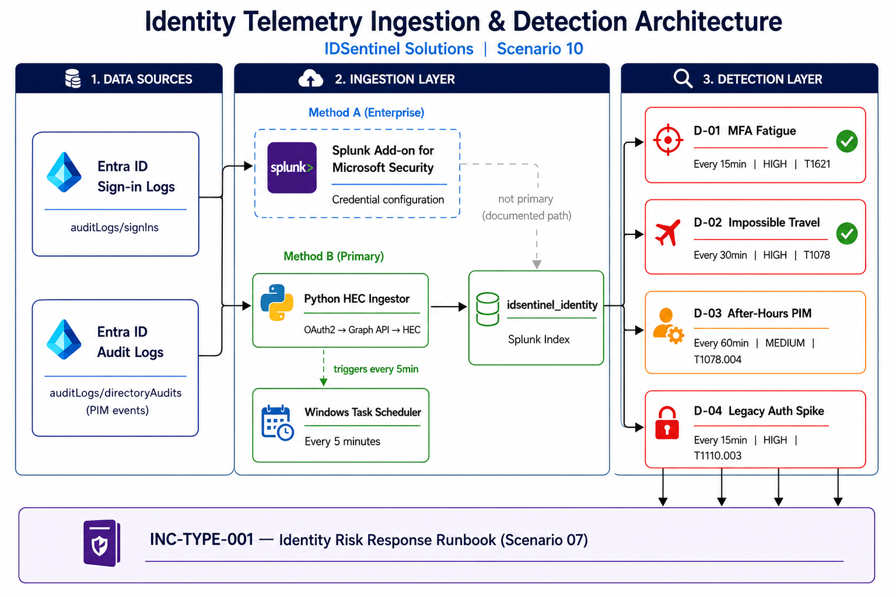

---

## 🛠️ Implementation

### Ingestion — Method A (Splunk Add-on)

The Splunk Add-on for Microsoft Security was installed in Splunk Enterprise
and configured with the `IDSentinel-EntraID` account using the existing app
registration credentials. The add-on is available as the enterprise ingestion
path and documents the credential configuration for future native input support.

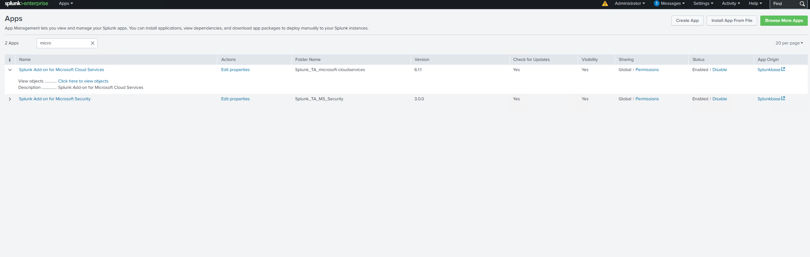
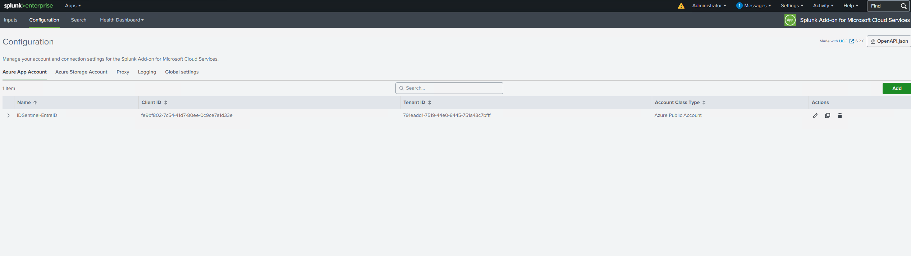

---

### Ingestion — Method B (Python HEC)

An HEC token was created in Splunk and used to configure the Python ingestor.
The script authenticates to Graph API via OAuth2 client credentials, pulls
sign-in and audit logs since its last run, and forwards all events to the
HEC endpoint in batch format with accurate timestamps preserved from the
original Graph API events. Scheduled via Windows Task Scheduler at 5-minute
intervals.

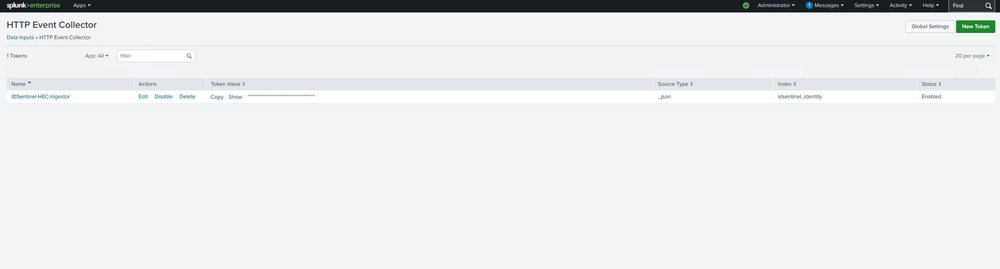
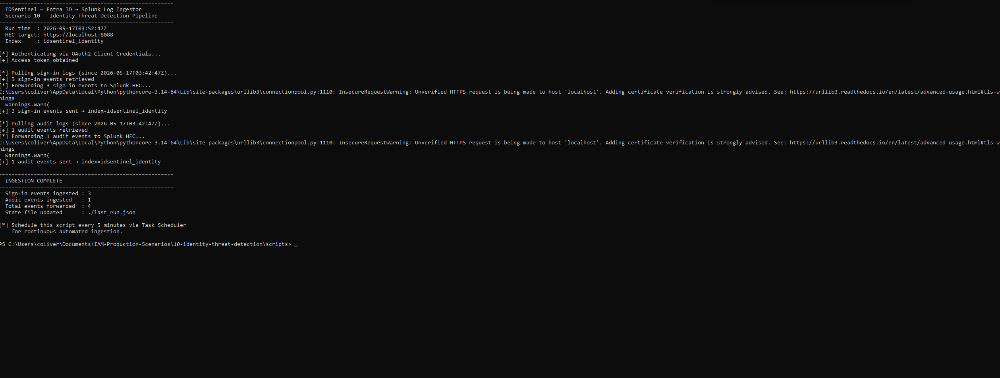
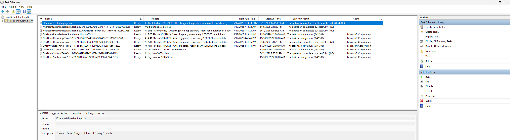

Ingestion confirmed — sign-in events from `idsentinel_identity` index
returning real user and application data in Splunk Search:

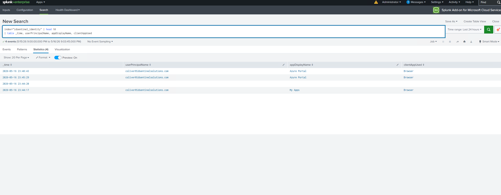

---

### Detection D-01 — MFA Fatigue

**Attack pattern:** Adversary spams MFA push notifications hoping the
user approves out of frustration or distraction (MITRE T1621).

The SPL query filters for sign-ins matching known MFA failure error codes
(500121, 500082) and aggregates per user over a 60-minute rolling window.
Alert fires when a single user exceeds 5 push denials. Throttled to once
per user per hour to prevent flooding if an attacker sustains the spray.

Alert fired against test data — confirmed in Triggered Alerts with High
severity badge and result rows populated.

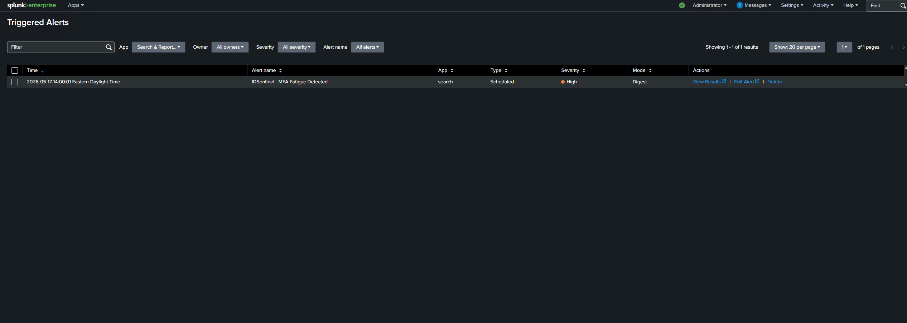
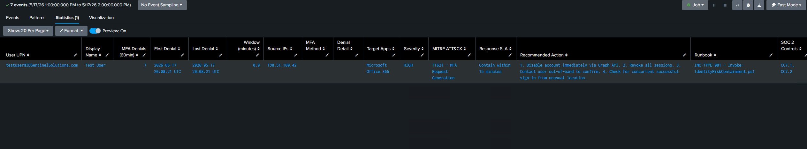

---

### Detection D-02 — Impossible Travel

**Attack pattern:** A credential is used from two geographically distant
locations within a window too short for legitimate travel (MITRE T1078).

The SPL query uses `streamstats` to compare consecutive successful sign-ins
per user, then applies the Haversine formula to calculate great-circle
distance between sign-in coordinates. Alert fires when two sign-ins exceed
500 miles of separation within a 120-minute window. Known corporate VPN
egress IPs are excluded to suppress the most common false positive source.

Alert fired against test data — New York (`72.229.28.185`) to Seattle
(`73.181.147.22`), **2,402 miles** apart, 25-minute gap. Result set
confirmed all output fields: locations, IPs, distance, MITRE technique,
response SLA, and runbook reference.

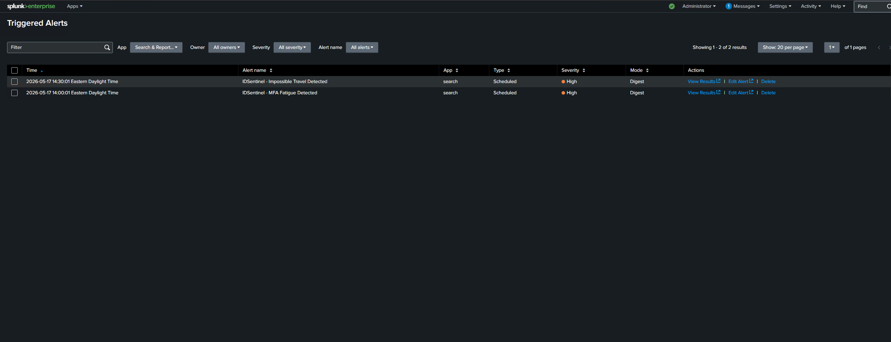
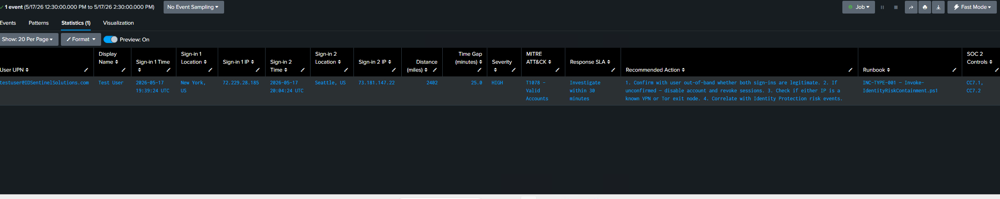

---

### Detection D-03 — After-Hours PIM Activation

**Attack pattern:** A compromised admin credential or insider threat actor
activates a privileged role outside of SOC coverage hours (MITRE T1078.004).

The SPL query filters Entra audit logs for PIM activation events
(`loggedByService = PIM`, `result = success`), converts the UTC timestamp
to local time, and flags activations between 22:00 and 06:00. The UTC
offset is configurable in the query for any timezone. Throttled at 4 hours
per activating user.

Alert configured and enabled — scheduled every 60 minutes. The dashboard
D-03 panel confirms PIM activation events are flowing from the audit log
ingestion pipeline.

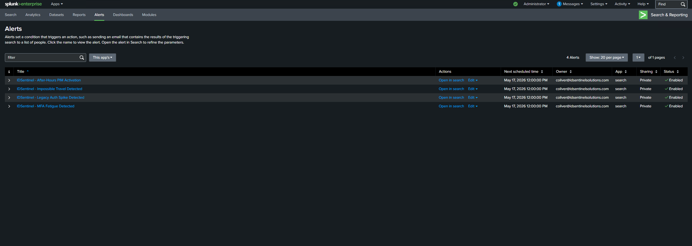

---

### Detection D-04 — Legacy Auth Spike

**Attack pattern:** After the Scenario 01 CA policy blocked legacy auth
org-wide, any spike in legacy attempts indicates either a misconfigured
client or an active password spray attack targeting SMTP, IMAP, or MAPI
endpoints that bypass MFA (MITRE T1110.003).

The SPL query filters for the full set of legacy `clientAppUsed` values,
aggregates by source IP over a 60-minute window, and alerts when any IP
exceeds 10 attempts. The result set includes a risk assessment field —
CRITICAL if any attempt succeeded without a CA block — so the SOC can
triage immediately without pivoting to a second search.

Alert configured and enabled — scheduled every 15 minutes. The dashboard
Top Source IPs panel confirmed 36 legacy auth attempts from `185.220.101.55`
(NL) across Exchange ActiveSync, IMAP, SMTP, POP3, and Legacy Authentication
Clients — exactly the pattern D-04 is designed to detect.

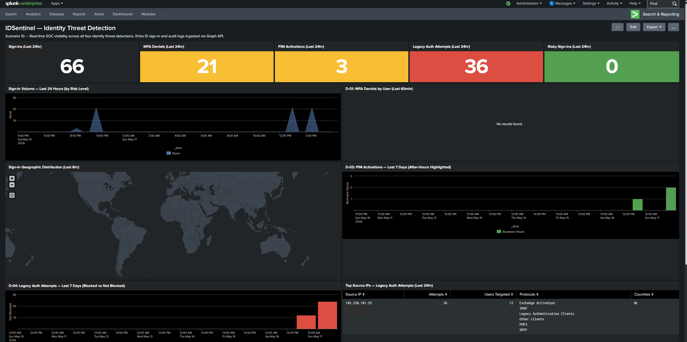

---

### Identity Threat Dashboard

A Splunk dashboard was built to give the SOC single-pane visibility across
all four detection categories without requiring a portal pivot for each.

Panels: sign-in volume timeline colored by risk level, MFA denial bar
chart by user, geographic sign-in map, PIM activation timeline with
after-hours highlighted, legacy auth trend with blocked vs not-blocked
comparison, top source IPs table for legacy auth, and a live high-risk
sign-in feed requiring immediate review.

Dashboard deployed with live data — 66 sign-ins, 21 MFA denials, 3 PIM
activations, and 36 legacy auth attempts visible across panels on deployment.

---

## ✅ Outcome

- Entra ID sign-in and audit logs streaming into Splunk Enterprise via
  the custom Python HEC ingestor — confirmed by event count and sourcetype
  verification in Splunk Search, scheduled via Windows Task Scheduler at
  5-minute intervals
- Four identity threat detections deployed as scheduled Splunk alerts —
  D-01 and D-02 validated end-to-end with synthetic test events confirming
  alert firing and result set accuracy; D-03 and D-04 confirmed via dashboard
  data showing events flowing through the pipeline
- D-02 Impossible Travel detection confirmed 2,402-mile gap between New York
  and Seattle sign-ins within a 25-minute window — Haversine calculation,
  MITRE attribution, response SLA, and IR runbook reference all populated
  correctly in the result set
- Detection library maps directly to INC-TYPE-001 from Scenario 07 —
  every alert carries the runbook reference and response SLA in the result set
- Identity Threat Dashboard deployed — SOC achieves full identity threat
  visibility without a single Entra portal login
- Manual log review time reduced from 2-4 hours to zero — all detection
  is automated and alert-driven
- SOC 2 CC7.1 and CC7.2 coverage documented with alert firing evidence

## 📊 Detection Coverage Summary

| Detection | Threshold | Schedule | Severity | MITRE | SOC 2 | Validated |
|-----------|-----------|----------|----------|-------|-------|-----------|
| D-01 MFA Fatigue | >5 denials / user / 60min | 15min | HIGH | T1621 | CC7.1, CC7.2 | ✅ Alert fired |
| D-02 Impossible Travel | 500mi+ apart / 2hr window | 30min | HIGH | T1078 | CC7.1, CC7.2 | ✅ Alert fired — 2,402mi confirmed |
| D-03 After-Hours PIM | Any activation 10pm–6am | 60min | MEDIUM | T1078.004 | CC7.1 | ✅ Configured — dashboard data confirmed |
| D-04 Legacy Auth Spike | >10 attempts / IP / 60min | 15min | HIGH | T1110.003 | CC7.1, CC7.2 | ✅ Configured — 36 attempts confirmed in dashboard |

---

## 📁 Files

| File | Description |
|------|-------------|
| `scripts/Invoke-EntraLogIngestor.py` | Python HEC ingestor — OAuth2 auth + Splunk forwarding |
| `scripts/Test-DetectionData.py` | Generates synthetic test events to validate all four alert searches |
| `splunk/searches/D-01-MFA-Fatigue.spl` | SPL query — MFA fatigue detection |
| `splunk/searches/D-02-Impossible-Travel.spl` | SPL query — impossible travel detection |
| `splunk/searches/D-03-After-Hours-PIM.spl` | SPL query — after-hours PIM activation |
| `splunk/searches/D-04-Legacy-Auth-Spike.spl` | SPL query — legacy auth spike |
| `splunk/searches/Identity-Threat-Dashboard.xml` | Splunk dashboard XML — SOC single-pane view |
| `splunk/alerts/alert-configs.md` | Alert schedule, throttle, and severity configuration reference |
| `docs/detection-tuning-guide.md` | Threshold tuning, false positive suppression, quarterly review checklist |
| `diagrams/pipeline-architecture.png` | End-to-end pipeline architecture diagram |
| `screenshots/` | Evidence of implementation at each stage |

---

## 🔗 References

- [Splunk Add-on for Microsoft Security](https://splunkbase.splunk.com/app/6207)
- [Microsoft Graph API — Sign-in Logs](https://learn.microsoft.com/en-us/graph/api/signin-list)
- [Microsoft Graph API — Audit Logs](https://learn.microsoft.com/en-us/graph/api/directoryaudit-list)
- [Splunk HTTP Event Collector](https://docs.splunk.com/Documentation/Splunk/latest/Data/UsetheHTTPEventCollector)
- [Splunk SPL Reference](https://docs.splunk.com/Documentation/Splunk/latest/SearchReference/WhatsInThisManual)
- [MITRE ATT&CK — MFA Request Generation (T1621)](https://attack.mitre.org/techniques/T1621/)
- [MITRE ATT&CK — Valid Accounts (T1078)](https://attack.mitre.org/techniques/T1078/)
- [MITRE ATT&CK — Password Spraying (T1110.003)](https://attack.mitre.org/techniques/T1110/003/)
- [SOC 2 CC7.1 / CC7.2 — Threat Monitoring Controls](https://www.aicpa.org/resources/article/trust-services-criteria)