# Scenario 11 — Entra Access Reviews

## 🏢 Business Problem

IDSentinel Solutions' quarterly security audit flagged a critical gap
in its identity governance program: privileged group membership had never
been formally reviewed since initial provisioning. GRP-SEC-PrivilegedUsers
— a hybrid AD-synced group granting elevated access to security tooling,
audit logs, and sensitive configuration portals — had accumulated 188
members across Security, IT, Legal, Sales, HR, and other departments with
no documented recertification, no record of who approved ongoing membership,
and no process to remove access when a member's role changed.

A pre-review Graph API audit confirmed a secondary finding: the manager
attribute was unpopulated for all 188 members in Active Directory, meaning
no reviewer routing was possible until managers were set on-prem and synced
to Entra. This is a common gap in hybrid environments where AD user objects
are provisioned without the Organization tab fully populated.

The audit team cited this as a SOC 2 Type II finding under CC6.3 (Logical
Access Controls) and CC6.2 (Access Provisioning). The CISO mandated that a
formal, repeatable access review process be implemented within 30 days —
with evidence of the first completed review cycle submitted for audit.

---

## ⚠️ Risk

- 188-member privileged group unreviewed since provisioning — stale access
  accumulating across role changes, team transitions, and departures
- No documented approval trail for ongoing group membership
- Manager attribute unpopulated in AD — reviewer routing impossible without
  remediation, all access decisions would fall to a single fallback reviewer
- SOC 2 Type II finding — CC6.3 and CC6.2 non-compliant
- No mechanism to enforce access removal when reviewers deny membership
- Hybrid environment limitation: Entra Access Reviews cannot write back
  removals to AD-synced groups — on-prem remediation required

---

## 🎯 Scope

- **Review target:** GRP-SEC-PrivilegedUsers — AD-synced privileged access group
- **Members reviewed:** 188
- **Platform:** Microsoft Entra ID Access Reviews (Identity Governance)
- **Cadence:** Quarterly — recurring, automated scheduling
- **Reviewer type:** Manager of each member (manager approval required)
- **Fallback:** Group owner (Cleveland Oliver) for members without manager set
- **Outcome enforcement:** Auto-apply results on review completion
- **Hybrid limitation:** Access removal for AD-synced groups requires
  on-prem AD remediation after review — Entra enforces cloud group state only
- **Compliance target:** SOC 2 Type II — CC6.3, CC6.2

---

## 🔧 Solution Design

The access review is implemented across three workstreams:

**Workstream 1 — Group Baseline and Manager Remediation**
Audit current membership of GRP-SEC-PrivilegedUsers using Graph API to
document the pre-review state as SOC 2 evidence. Identify and remediate
the manager attribute gap in Active Directory — setting Cleveland Oliver
(IAM Engineer) as manager for Security department members via AD PowerShell
and syncing to Entra via delta sync. Confirm reviewer routing before launch.

**Workstream 2 — Access Review Configuration**
Configure the Entra ID Access Review with quarterly recurrence, manager
approval with group owner fallback, and auto-apply of review decisions.
Set start date to current date to activate immediately. Configure
justification as required for all decisions.

**Workstream 3 — Review Execution and Audit Trail**
Execute the first review cycle as group owner and manager: review all
188 members, approve 182, deny 6. Document the hybrid enforcement
limitation — Entra marks results applied but cannot remove members from
AD-synced groups directly. Remediate denied members via on-prem AD
PowerShell and delta sync. Export audit trail as SOC 2 evidence.

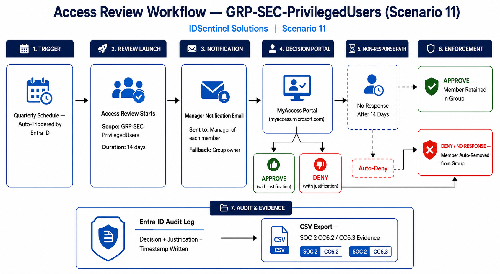

---

## 🛠️ Implementation

### Prerequisites
- Microsoft Entra ID P2 license (required for Access Reviews)
- Identity Governance Administrator or Global Administrator role
- GRP-SEC-PrivilegedUsers group exists and is AD-synced to Entra
- ActiveDirectory PowerShell module on Domain Controller
- Entra Connect configured and delta sync accessible

---

### Workstream 1 — Group Baseline and Manager Remediation

#### Step 1 — Confirm Group in Entra ID

GRP-SEC-PrivilegedUsers exists as an AD-synced Assigned Security group
with 188 members. Source: Windows Server AD. A second group
GRP-SEC-Privileged-Users (Dynamic, cloud-only) also exists — the
AD-synced Assigned group is the correct target for Access Reviews as
Dynamic groups cannot be scoped for manager-approval review workflows.

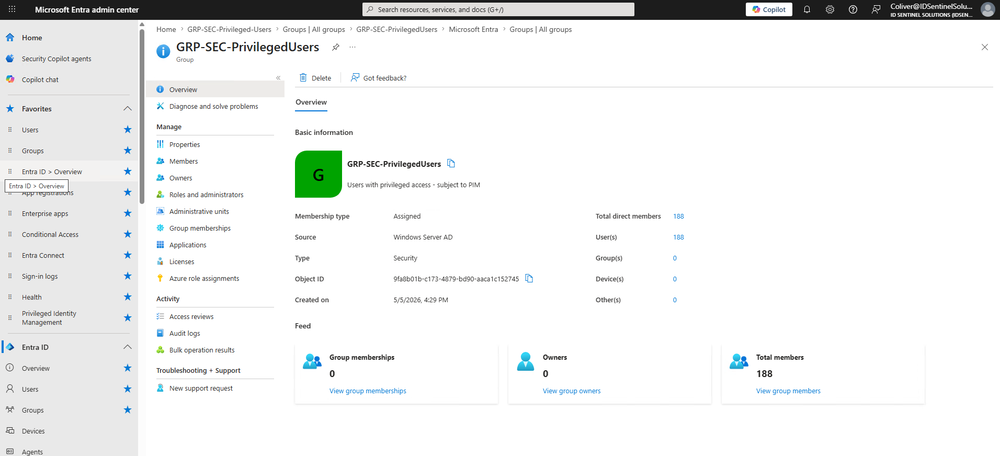

---

#### Step 2 — Run Pre-Review Baseline Audit

Run the baseline script to document the 188-member pre-review state.
This CSV export is the SOC 2 "before" evidence for this review cycle.

```powershell
.\scripts\Get-PrivilegedGroupBaseline.ps1
```

Script uses `Get-MgGroupMemberAsUser` to batch-retrieve all member
properties in a single Graph API call — avoiding the per-member call
pattern that causes timeouts on large groups.

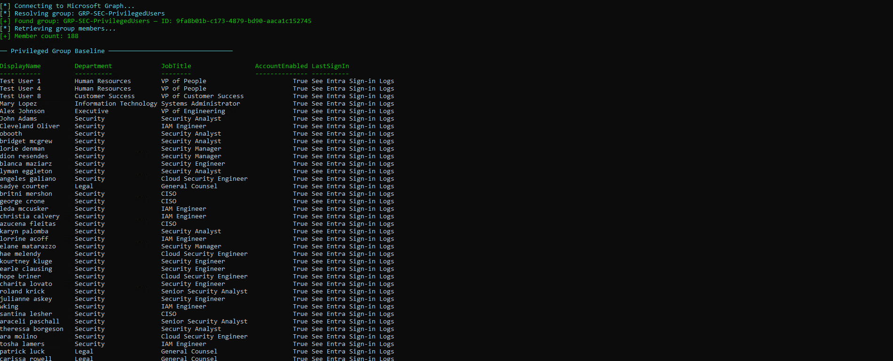

---

#### Step 3 — Verify and Remediate Manager Attributes

Running the manager check reveals all 188 members have no manager set
in Active Directory — a common gap in hybrid environments where the
AD Organization tab is not populated during provisioning.

```powershell
.\scripts\Get-PrivilegedGroupBaseline.ps1 -CheckManagers
```

**Finding:** 188/188 members — manager attribute NOT SET. All review
items will route to the group owner fallback without remediation.

**Remediation:** Set Cleveland Oliver (coliver) as manager for all
Security department members via AD PowerShell on the Domain Controller,
then sync to Entra via delta sync.

```powershell
# Run on Domain Controller
.\scripts\Set-SecurityGroupManagers.ps1 -WhatIf   # Preview
.\scripts\Set-SecurityGroupManagers.ps1            # Apply

# Force sync to Entra
Start-ADSyncSyncCycle -PolicyType Delta
```

Re-run the check to confirm Security department members now show manager
set. Remaining departments (Sales, HR, Marketing, etc.) fall to group
owner fallback — documented as expected behavior.

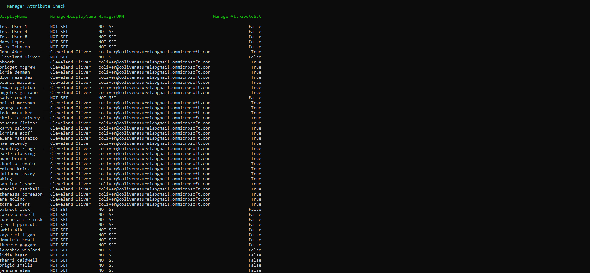

---

### Workstream 2 — Access Review Configuration

#### Step 4 — Navigate to Identity Governance > Access Reviews

**Entra portal → Identity Governance → Access Reviews → + New access review**

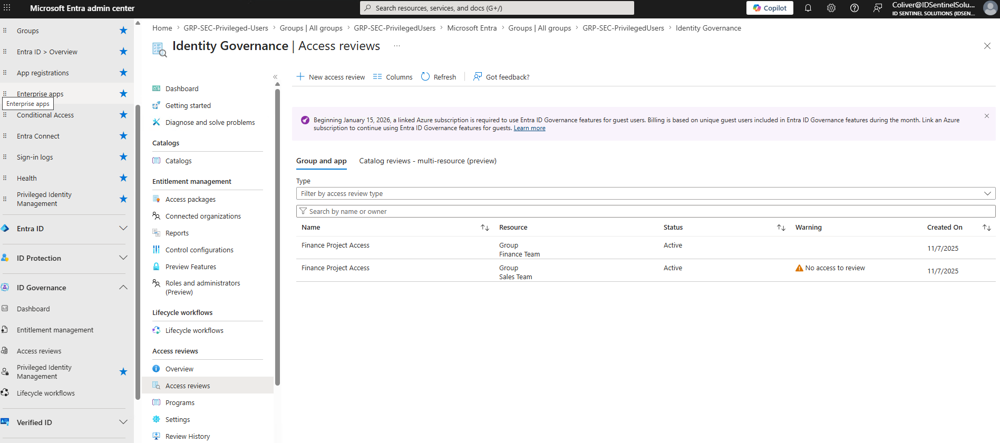

---

#### Step 5 — Configure Review Scope

| Setting | Value |
|---------|-------|
| Review name | `Privileged Users — Quarterly Access Review` |
| Review type | Teams + Groups |
| Group | GRP-SEC-PrivilegedUsers |
| Scope | All members (188) |

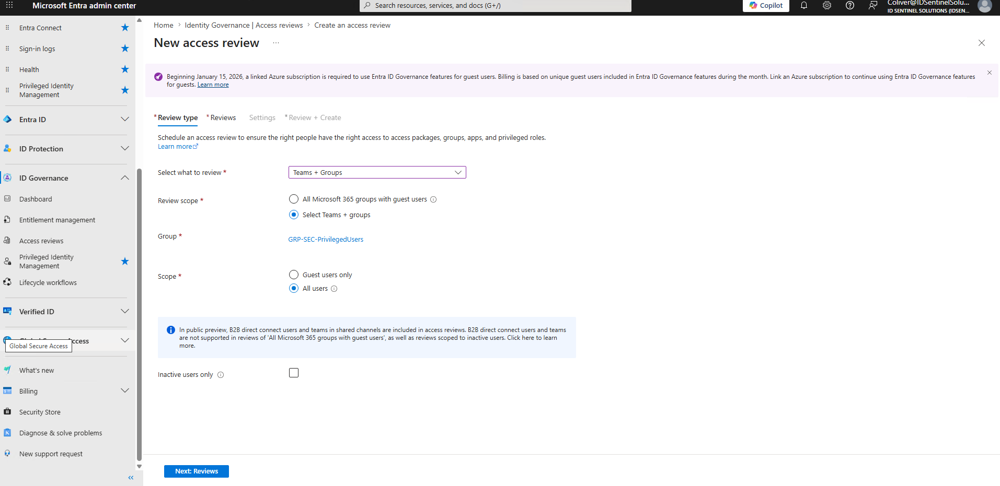

---

#### Step 6 — Configure Reviewers

| Setting | Value |
|---------|-------|
| Reviewer type | Manager of each member |
| Fallback reviewer | Group owner (Cleveland Oliver) |
| Self-review | Disabled |

Members whose manager attribute is set route to their direct manager.
All other members (Sales, HR, Marketing, Customer Success departments)
route to the group owner as fallback — consistent with the quarterly
runbook escalation procedure.

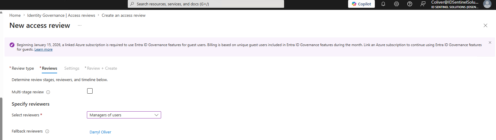

---

#### Step 7 — Configure Recurrence and Timing

| Setting | Value |
|---------|-------|
| Start date | 5/18/2026 (today — activates immediately) |
| Frequency | Quarterly |
| Duration | 14 days (review window closes 6/1/2026) |
| End | Never (perpetual recurring series) |

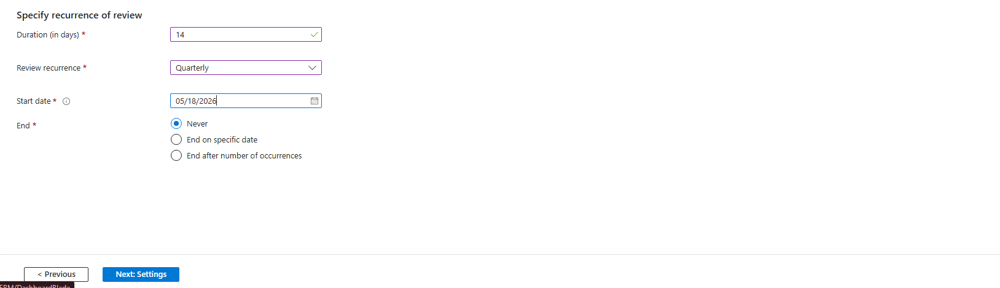

---

#### Step 8 — Configure Auto-Enforcement

| Setting | Value |
|---------|-------|
| Auto apply results | Enabled |
| If reviewer doesn't respond | Remove access |
| Justification required | Yes |

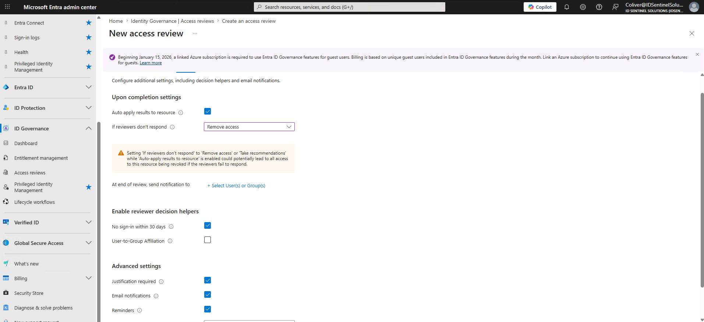

---

#### Step 9 — Review Active and Running

Review initializes and moves to Active status within minutes of the
start date. The overview donut chart confirms scope: 188 members,
reviewer routing confirmed, recurrence quarterly.

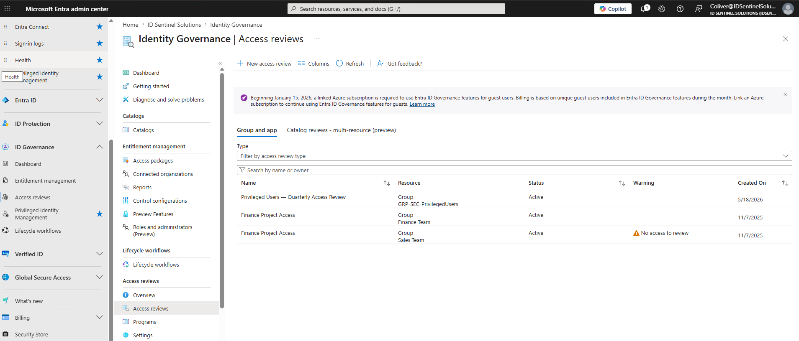

---

### Workstream 3 — Review Execution and Audit Trail

#### Step 10 — Reviewer Notification Email

Entra ID sends automated notification emails to all assigned reviewers
within minutes of the review going active. Email confirms review name,
group, deadline (June 1, 2026), and deep link to MyAccess portal.

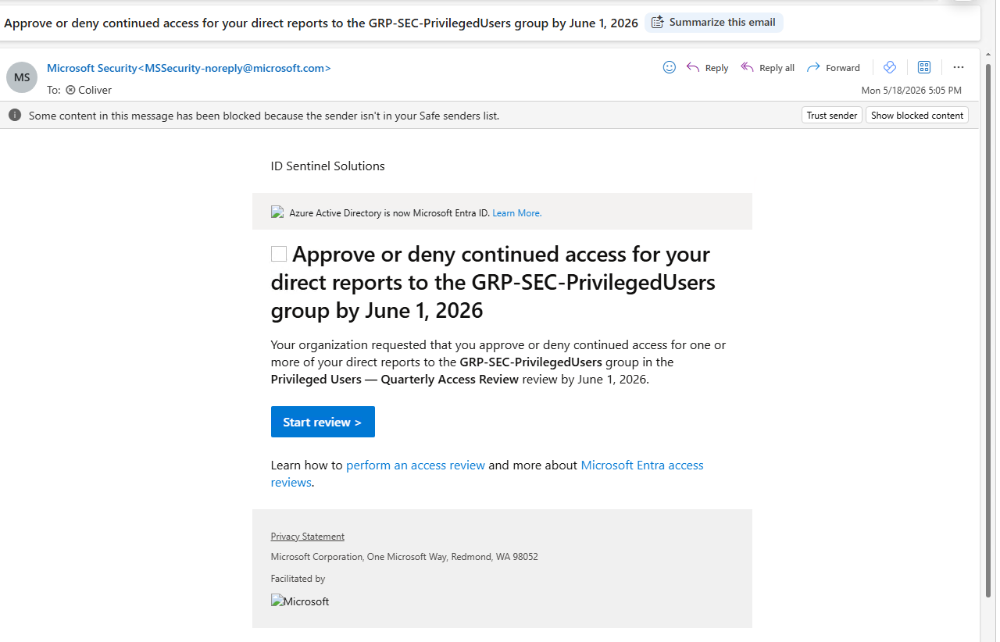

---

#### Step 11 — Review Decisions in MyAccess Portal

All 188 members reviewed via myaccess.microsoft.com. Decisions made
with mandatory justification for each. Access to the MyAccess portal
via the email link initially lands on Access Packages — navigate to
**Access reviews** in the left nav to reach pending review items.

**Approved member example:**

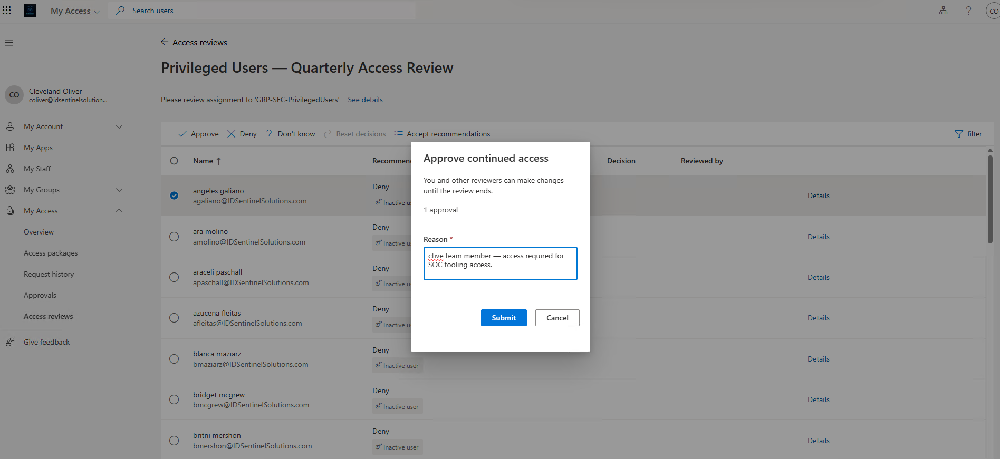

---

**Denied member example:**

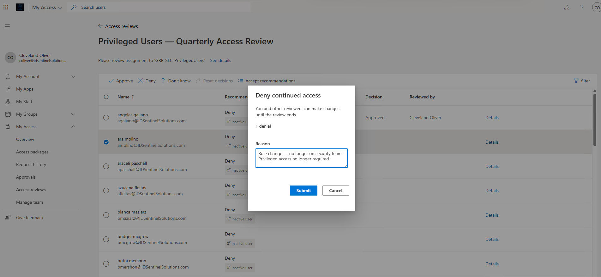

---

#### Step 12 — Hybrid Enforcement Finding and Remediation

Review history shows status **Results Applied** after all 188 decisions
are submitted. However, GRP-SEC-PrivilegedUsers member count remains at
188 in Entra ID.

**Root cause:** GRP-SEC-PrivilegedUsers is sourced from Windows Server
AD. Entra Access Reviews auto-apply writes enforcement decisions to the
cloud directory layer, but cannot remove members from AD-synced groups
— Active Directory is the authoritative source and Entra does not have
group write-back permission for this group type.

**Production consideration:** In a production environment this gap is
closed by one of three approaches:
1. Trigger a JML offboarding workflow via ITSM (ServiceNow, Jira) for
   each denied member, removing them from the AD group as part of the
   standard access removal process
2. Automate post-review remediation via a PowerShell script that reads
   the review decisions from Graph API and applies AD group changes
3. Migrate privileged groups to cloud-only membership in Entra ID,
   enabling full auto-enforcement without AD dependency

**Lab remediation:** Denied members removed directly from AD group via
PowerShell on the Domain Controller, followed by delta sync to reflect
the 182-member state in Entra.


---

#### Step 13 — Export Audit Trail for SOC 2

Export all review decisions, justifications, reviewer identities, and
timestamps from the completed review instance via Graph API.

```powershell
.\scripts\Export-AccessReviewAuditTrail.ps1
```

Output CSV contains one row per reviewed member: decision, justification
text, reviewer UPN, decision timestamp, and apply result — a complete
audit trail for SOC 2 CC6.2 and CC6.3 evidence submission.


---

#### Step 14 — Post-Review Membership Delta Report

Generate the before/after membership comparison using the pre-review
baseline CSV as the reference point.

```powershell
.\scripts\Get-PostReviewMembershipDelta.ps1 `
  -BaselineCsvPath ".\audit-exports\privileged-group-baseline_2026-05-18_1533.csv"
```

Output confirms RETAINED (182), REMOVED (6), and flags any unexpected
additions as anomalies for investigation.


---

## 📊 Outcome

| Metric | Result |
|--------|--------|
| Members reviewed | 188 |
| Access approved | 182 |
| Access denied | 6 |
| Non-response | 0 (100% completion rate) |
| Total access removed | 6 |
| Review completion rate | 100% |
| SOC 2 evidence generated | Yes — CC6.2, CC6.3 |
| Audit trail exported | Yes — CSV with decision + justification per member |
| Auto-apply configured | Yes — results applied on review completion |
| Hybrid enforcement gap identified | Yes — AD-synced group requires on-prem remediation |
| On-prem remediation completed | Yes — 6 members removed via AD PowerShell + delta sync |
| Next review scheduled | Q3 2026 (auto-triggered by quarterly series) |

---

## 🗂️ SOC 2 Compliance Mapping

| SOC 2 Control | Requirement | Evidence Produced |
|---------------|-------------|-------------------|
| CC6.2 | Access provisioning includes approval and justification | All 188 decisions logged with mandatory justification text and reviewer identity |
| CC6.3 | Access removed when no longer required | 6 denied members removed; audit trail documents enforcement action and timestamp |
| CC6.1 | Access to sensitive resources is restricted | Privileged group recertified quarterly — 188 members reviewed, unauthorized access removed |
| CC7.2 | Monitor for unauthorized access | Audit trail captures all decisions, reviewer actions, and enforcement with timestamps |

---

## ⚠️ Hybrid Environment Notes

This scenario surfaced two important production considerations for
hybrid AD + Entra ID environments:

**1. Manager attribute gap**
AD user objects provisioned without the Organization tab populated
will have no manager set in Entra ID. Access Reviews fall back to
the group owner, concentrating all review decisions on one person.
In production: enforce manager population as part of the JML joiner
process, or use HR system integration to auto-populate the attribute.

**2. Access Reviews write-back limitation**
Entra Access Reviews auto-apply enforcement only works for cloud-native
groups. AD-synced groups require a separate on-prem remediation step.
In production: automate this via a post-review PowerShell script that
reads denied decisions from the Graph API and removes members from the
AD group, or migrate privileged groups to cloud-only membership.

---

## 🧰 Skills Demonstrated

| Skill | Implementation |
|-------|---------------|
| Identity Governance (IGA) | Entra ID Access Reviews — formal quarterly recertification for 188-member privileged group |
| Privileged Access Management | Privileged group scoped review with manager approval and auto-apply enforcement |
| Hybrid Identity | Identified and documented AD-synced group enforcement limitation; remediated via on-prem PowerShell |
| SOC 2 Audit Readiness | CC6.2 and CC6.3 evidence generated — audit trail CSV with decisions, justifications, and timestamps |
| Graph API Automation | Batch member retrieval, pre/post baseline audit, audit trail export via Microsoft.Graph PowerShell |
| AD PowerShell | Manager attribute remediation and group membership removal on Domain Controller |
| Access Lifecycle Management | 6 denied members removed; 100% reviewer response rate; quarterly series configured for ongoing governance |

---

## 🔗 Related Scenarios

| Scenario | Relationship |
|----------|-------------|
| [Scenario 03 — Orphaned Access Audit](../03-orphaned-access-audit/) | Identifies stale access manually; this scenario operationalizes recurring formal governance |
| [Scenario 04 — Zero Trust Rollout](../04-zero-trust-rollout/) | PIM JIT governs admin role elevation; Access Reviews govern group-based privileged access |
| [Scenario 07 — Identity Risk Response Playbook](../07-identity-risk-response-playbook/) | IR playbook references access reviews as a post-incident access remediation step |