# Scenario 12 — Entra ID + AWS SAML Federation

## 🏢 Business Problem

IDSentinel Solutions engineers required access to the AWS Management Console
to perform read-only infrastructure audits as part of the organization's
cloud expansion. Access was being granted via individual IAM user accounts
with long-lived access keys — a direct violation of the Zero Trust initiative
and a finding flagged on the most recent SOC 2 audit.

The Security team mandated that all AWS console access be federated through
Entra ID, the organization's authoritative identity provider. No IAM users,
no static credentials — role-based access issued as time-limited STS sessions
driven by Entra identity and SAML assertion.

The IAM team was additionally tasked with producing a reusable SSO
troubleshooting runbook. SAML federation failures had no documented diagnosis
path — every outage required ad hoc investigation with no consistent tooling
or resolution time target.

---

## ⚠️ Risk

- Long-lived IAM access keys create permanent blast radius if compromised
- No centralized identity control — AWS access exists outside the Entra ID lifecycle
- Offboarded employees retain AWS access until keys are manually revoked
- No audit trail linking AWS console sessions to Entra ID identities
- Non-compliant with IDSentinel's Zero Trust and least-privilege mandate
- Potential compliance exposure under SOC 2 Type II CC6.1 and CC6.3

---

## 🎯 Scope

- **Affected identities:** Engineers requiring AWS Management Console access
- **IdP:** Microsoft Entra ID (IDSentinelSolutions.com)
- **Service Provider:** AWS (SAML 2.0 federation via IAM Identity Provider)
- **Access model:** Federated role assumption — no IAM users, no static credentials
- **Controls implemented:** SAML trust policy with audience condition, least-privilege role, SAML Tracer assertion validation, break/fix lab with three documented failure modes

---

## 🔧 Solution Design

The federation was implemented across two workstreams:

**Workstream 1 — Entra ID + AWS SAML Federation**
Entra ID configured as the SAML 2.0 Identity Provider. An enterprise app
registered in Entra with SAML SSO, attribute mapping for the AWS Role and
RoleSessionName claims, and the federation metadata XML exported for upload
to AWS. An IAM Identity Provider and a federated IAM role created in AWS
with a scoped trust policy restricting assumption to Entra-issued SAML
assertions only. Federated login validated end-to-end with SAML Tracer
assertion capture confirming correct attribute delivery and least-privilege
enforcement.

**Workstream 2 — Break/Fix Lab and SSO Troubleshooting Runbook**
Three real SAML failure modes intentionally reproduced — wrong ACS URL
causing a destination mismatch, missing Role attribute causing a no-valid-role
error, and stale IdP metadata causing signature validation failure. Each break
diagnosed using SAML Tracer, resolved, and documented with root cause, fix
steps, and resolution time target. Findings compiled into a reusable SSO
troubleshooting runbook for production use.

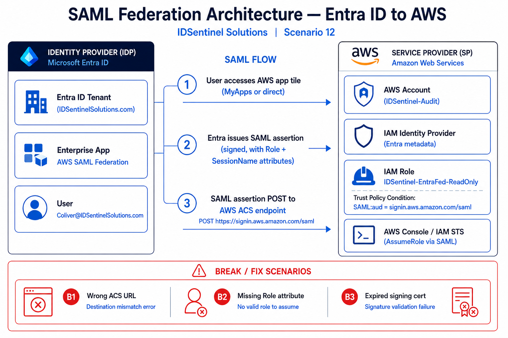

---

## 🛠️ Implementation

### Prerequisites
- Microsoft Entra ID with Global Administrator or Application Administrator role
- AWS account with IAM administrative access
- SAML Tracer Chrome extension installed
- AWS CLI installed and configured

---

### Workstream 1 — Entra ID + AWS SAML Federation

#### Step 1 — Entra Enterprise App Registration

AWS Single Account Access enterprise app created in Entra ID from the
gallery. SAML selected as the SSO method. Basic SAML Configuration populated
with the AWS entity ID (`urn:amazon:webservices`) and ACS URL
(`https://signin.aws.amazon.com/saml`). Federation Metadata XML downloaded
for upload to AWS IAM.

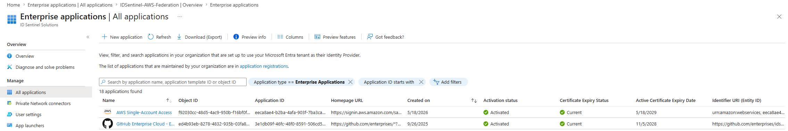

---

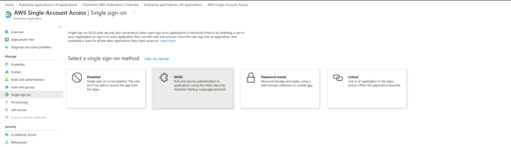

---

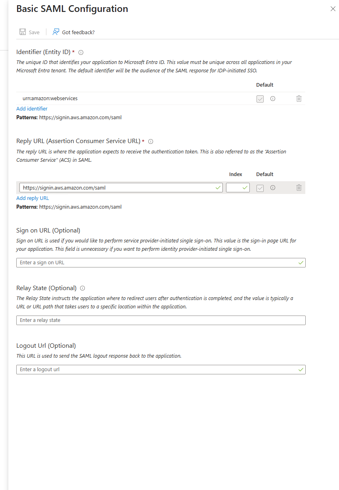

---

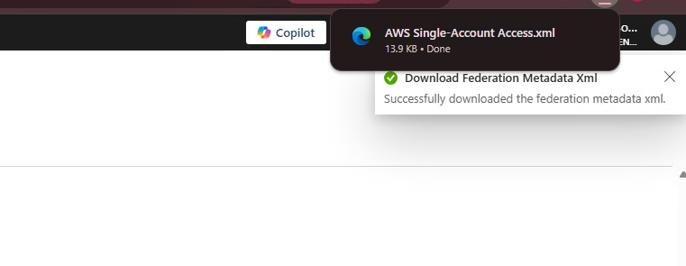

---

#### Step 2 — SAML Attribute Mapping

Two custom claims configured in Attributes & Claims to satisfy AWS federation
requirements. The Role claim carries both the IAM Role ARN and the IdP ARN
as a comma-separated value — the exact format AWS STS requires to map the
assertion to a role. The RoleSessionName claim maps to `user.userprincipalname`,
which surfaces the engineer's Entra identity as the session name in CloudTrail.
NameID set to `user.userprincipalname` with `emailAddress` format.

| Claim | Value |
|-------|-------|
| `https://aws.amazon.com/SAML/Attributes/Role` | `RoleARN,IdPARN` |
| `https://aws.amazon.com/SAML/Attributes/RoleSessionName` | `user.userprincipalname` |

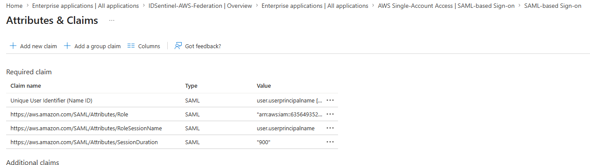

---

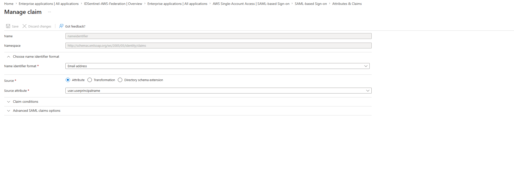

---

#### Step 3 — AWS Identity Provider Setup

IAM Identity Provider registered in AWS using the Entra federation metadata
XML. Provider named `IDSentinel-EntraIdP`. Provider ARN noted for use in
the role trust policy and the Entra attribute mapping.

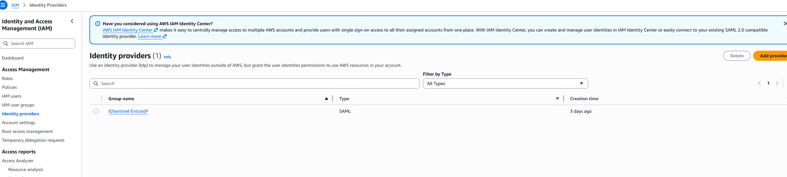

---

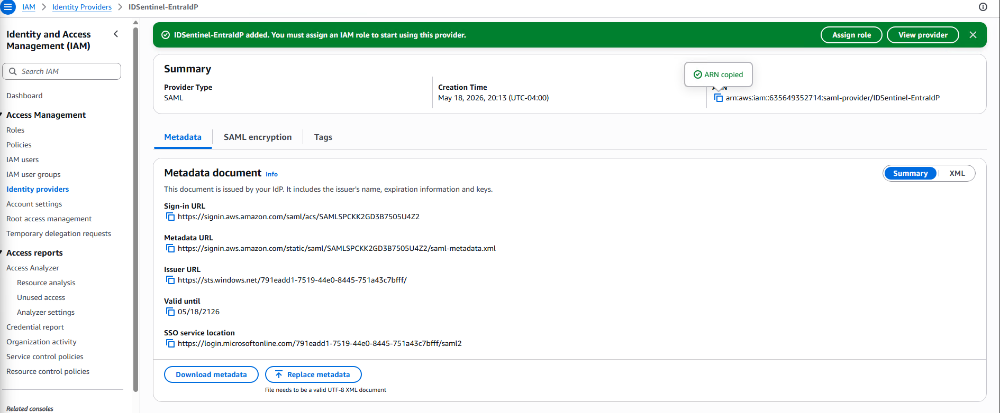

---

#### Step 4 — Federated IAM Role and Trust Policy

IAM role `IDSentinel-EntraFed-ReadOnly` created with SAML 2.0 federation
as the trusted entity. Trust policy scoped to the `IDSentinel-EntraIdP`
provider with a `SAML:aud` condition enforcing the correct ACS endpoint —
assertions issued to any other destination are rejected. `ReadOnlyAccess`
AWS managed policy attached. No write permissions granted at any scope.

```json
{
  "Version": "2012-10-17",
  "Statement": [
    {
      "Effect": "Allow",
      "Principal": {
        "Federated": "arn:aws:iam::635649352714:saml-provider/IDSentinel-EntraIdP"
      },
      "Action": "sts:AssumeRoleWithSAML",
      "Condition": {
        "StringEquals": {
          "SAML:aud": "https://signin.aws.amazon.com/saml"
        }
      }
    }
  ]
}
```

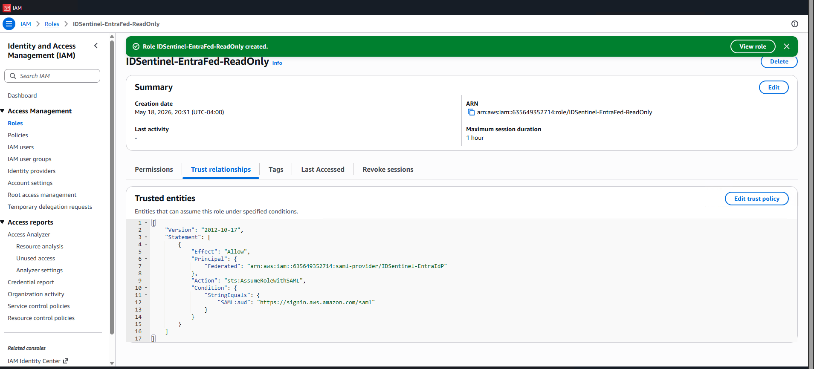

---

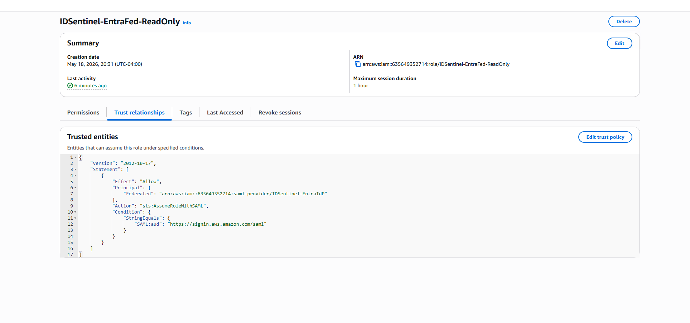

---

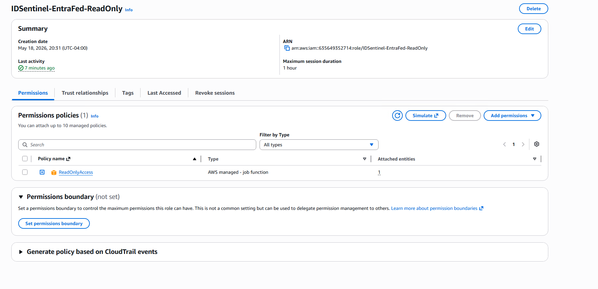

---

#### Step 5 — Federation Test and SAML Tracer Validation

Test user assigned to the enterprise app in Entra. Login initiated via
MyApps portal — AWS Management Console loaded via federated SAML session
with no password prompt and no IAM user credentials used at any point.
Assumed role confirmed in the AWS Console account menu showing
`IDSentinel-EntraFed-ReadOnly`.

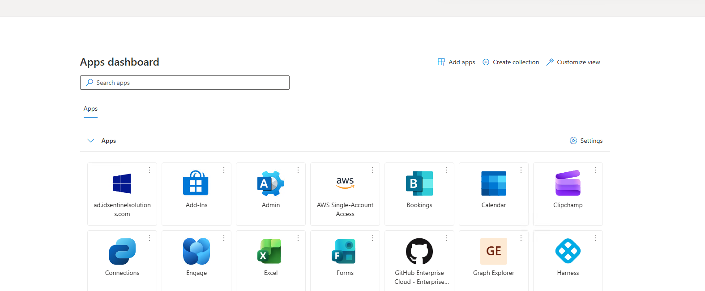

---

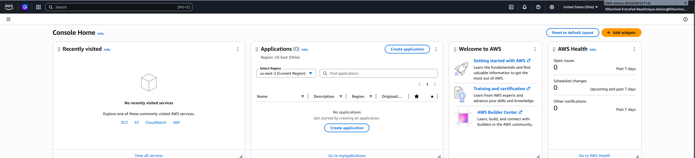

---

SAML Tracer captured the full assertion during login. Decoded assertion
confirmed NameID, Role attribute containing both ARNs in correct format,
and RoleSessionName present and mapped to the engineer's UPN.

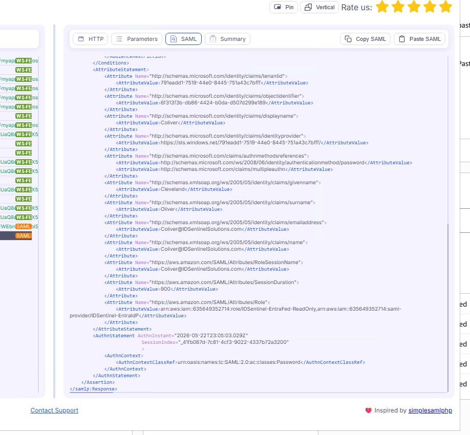

---

Least-privilege enforcement validated — read operations permitted, write
operations explicitly denied.

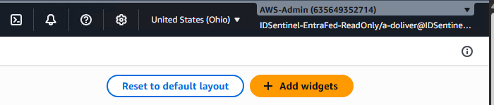

---

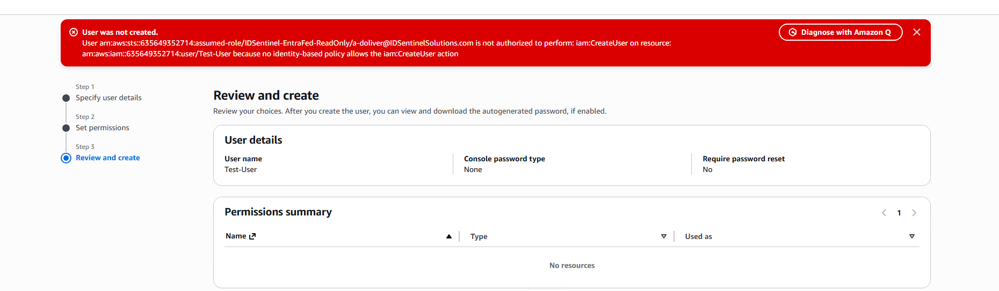

---

### Workstream 2 — Break/Fix Lab

Three SAML failure modes reproduced intentionally and resolved using SAML
Tracer as the primary diagnostic tool.

---

#### Break 1 — Wrong ACS URL (Destination Mismatch)

Reply URL changed in Entra Basic SAML Configuration to
`https://signin.aws.amazon.com/saml-broken`. Login fails at the Entra
layer before the assertion reaches AWS. SAML Tracer captures the
`Destination` field in the assertion containing the wrong URL — does not
match the ACS endpoint AWS expects. Reply URL restored to
`https://signin.aws.amazon.com/saml`. Login confirmed working.


---

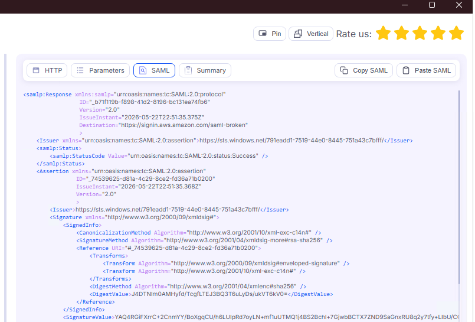

---

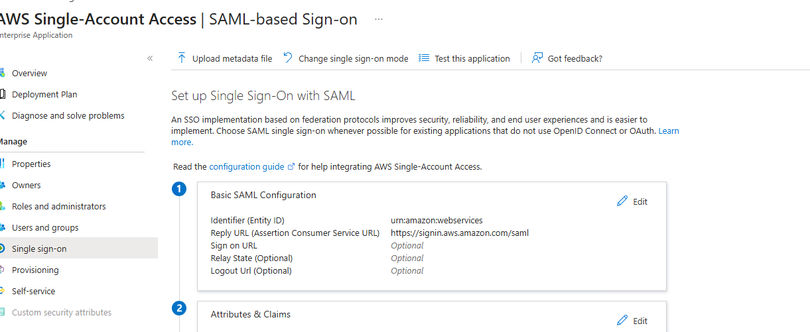

---

#### Break 2 — Missing Role Attribute (No Valid Role)

Role claim deleted from Attributes & Claims. Login fails at AWS after Entra
authentication succeeds — assertion reaches AWS but contains no Role
attribute, so STS has no role to map the session to. SAML Tracer confirms
the `https://aws.amazon.com/SAML/Attributes/Role` attribute is absent from
the decoded assertion. Role claim re-added with correct `RoleARN,IdPARN`
value. SAML Tracer confirms attribute present in clean assertion. Login
confirmed working.


---

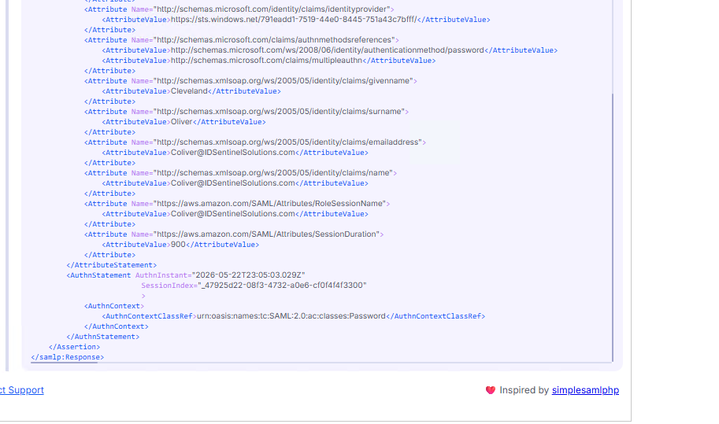

---

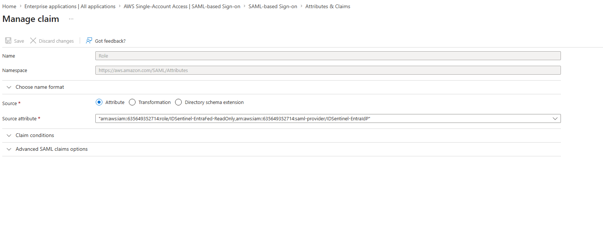

---


---

#### Break 3 — Stale IdP Metadata (Signature Validation Failure)

Federation metadata XML uploaded to AWS modified to corrupt the X509Certificate
value — simulating a certificate rotation where the SP metadata was not
updated. Login fails after the assertion is posted — Entra authentication
completed successfully but AWS rejects the assertion because the certificate
used to sign it no longer matches the certificate registered in the AWS IdP
metadata. Original Entra federation metadata XML re-uploaded to the AWS
`IDSentinel-EntraIdP` Identity Provider. Signature validation passes and
login confirmed working.

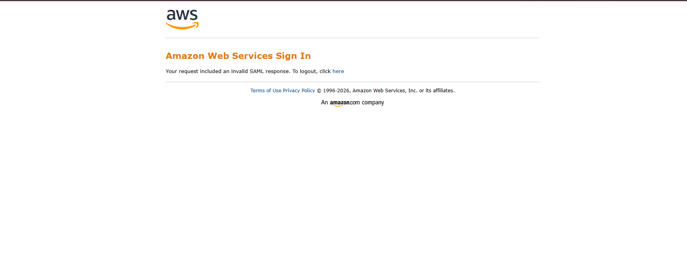

---

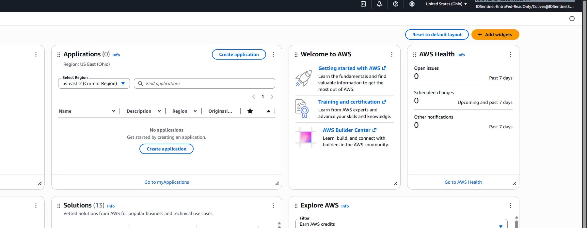

---

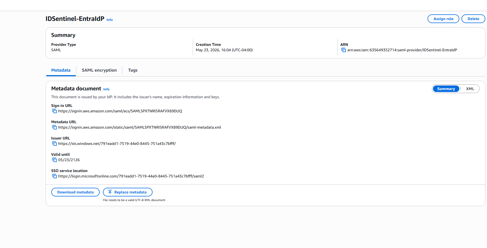

---

## ✅ Outcome

- IAM user accounts for console access eliminated — zero static credentials in use
- All AWS console access federated through Entra ID via SAML 2.0
- Offboarding handled automatically — disabling the Entra account removes AWS access with no manual key revocation
- Federated role assumption confirmed via SAML Tracer assertion validation and AWS Console session
- Least-privilege enforced — ReadOnlyAccess only, write access explicitly denied and tested
- Three SAML failure modes reproduced, diagnosed with SAML Tracer, and resolved
- SSO troubleshooting runbook produced for production use

## 📊 Implementation Results

| Metric | Value |
|--------|-------|
| IAM users created | 0 — federated access only |
| Static credentials issued | 0 |
| IAM Identity Providers created | 1 (IDSentinel-EntraIdP) |
| Federated IAM roles created | 1 (IDSentinel-EntraFed-ReadOnly) |
| SAML attribute claims configured | 2 (Role, RoleSessionName) |
| Least-privilege violations tested | 1 (iam:CreateUser — AccessDenied confirmed) |
| SAML breaks reproduced | 3 of 3 |
| Mean diagnosis time per break | Under 5 minutes with SAML Tracer |
| SOC 2 evidence items produced | 5 |

---

## 📁 Files

| File | Description |
|------|-------------|
| `scripts/validate-saml-federation.ps1` | PowerShell — validates IdP, role trust policy, and permission config via AWS CLI |
| `runbooks/saml-sso-break-fix-runbook.md` | SAML SSO troubleshooting runbook — three failure modes with SAML Tracer diagnosis steps |
| `diagrams/saml-federation-architecture.png` | Architecture diagram — Entra ID to AWS SAML federation flow |
| `evidence/SOC2-EVIDENCE.md` | SOC 2 control mapping and evidence checklist |
| `screenshots/` | Implementation evidence organized by stage |

---

## 🔗 References

- [AWS: Enabling SAML 2.0 federated users to access the AWS Management Console](https://docs.aws.amazon.com/IAM/latest/UserGuide/id_roles_providers_enable-console-saml.html)
- [Microsoft: Tutorial — Entra SSO integration with AWS Single Account Access](https://learn.microsoft.com/en-us/entra/identity/saas-apps/amazon-web-service-tutorial)
- [AWS: Creating a role for SAML 2.0 federation](https://docs.aws.amazon.com/IAM/latest/UserGuide/id_roles_create_for-idp_saml.html)
- [AWS: SAML troubleshooting](https://docs.aws.amazon.com/IAM/latest/UserGuide/troubleshoot_saml.html)
- [SAML Tracer Chrome Extension](https://chromewebstore.google.com/detail/saml-tracer/mpdajninpobndbfcldcmbpnnbhibjmch)