# Scenario 13 — SCIM Provisioning: Entra ID → AWS IAM Identity Center

## 🏢 Business Problem

IDSentinel Solutions' AWS environment had reached a critical operational
threshold: six AWS accounts, growing workloads, and a developer population
that required access provisioning and deprovisioning managed entirely by
manual ticketing. When a developer joined a new team, their AWS access was
assigned by hand — the correct permission set had to be identified, the
account located, and the assignment created manually in the AWS IAM Identity
Center console. When they left the organization or changed roles, that same
manual process ran in reverse — and frequently didn't run at all.

An internal audit found 14 active AWS assignments belonging to Entra accounts
that had been disabled for more than 30 days. In two cases, the accounts
were associated with contractors whose engagements had ended. AWS access had
never been removed because there was no automated link between the Entra
identity lifecycle and AWS access rights.

The Security and Cloud teams jointly mandated a provisioning pipeline that
would make AWS access a downstream consequence of Entra group membership —
not a separate manual task. Joiner, Mover, and Leaver events in Entra must
automatically propagate to AWS without human intervention.

---

## ⚠️ Risk

- 14 stale AWS assignments confirmed for disabled Entra accounts — orphaned
  access in a production cloud environment
- No automated deprovisioning — offboarded users retain AWS access until
  a ticket is filed and manually actioned
- Role changes go undetected — movers retain previous permission sets
  with no access recertification trigger
- Manual provisioning introduces 24–72 hour access delays for new joiners
- Non-compliant with IDSentinel's Zero Trust mandate — access must be
  tied to verified, current identity state
- SOC 2 Type II exposure under CC6.2 (Access Provisioning) and CC6.3
  (Logical Access Controls)

---

## 🎯 Scope

- **Identity source:** Microsoft Entra ID (M365 Developer Tenant)
- **Target system:** AWS IAM Identity Center (SSO)
- **Protocol:** SCIM 2.0 — automatic provisioning via Entra Enterprise App
- **Groups provisioned:** Engineering, DevOps, Security (3 pilot groups)
- **Permission sets:** ReadOnlyAccess, PowerUserAccess, SecurityAuditAccess
- **Lifecycle events tested:** Joiner (add to group), Mover (group change), Leaver (disable account)
- **Compliance target:** SOC 2 Type II — CC6.2, CC6.3

---

## 🔧 Solution Design

The SCIM provisioning pipeline is implemented across four workstreams:

**Workstream 1 — AWS IAM Identity Center Configuration**
AWS IAM Identity Center enabled with external identity source set to
Entra ID. SCIM endpoint URL and bearer token generated for inbound
provisioning. Permission sets created to define the access profiles
that will be assigned to provisioned groups.

**Workstream 2 — Entra Enterprise App Registration**
AWS IAM Identity Center enterprise application added from the Entra
gallery. SCIM provisioning mode enabled — Tenant URL and Secret Token
populated from the AWS SCIM endpoint and bearer token. Attribute
mappings reviewed and confirmed for displayName, userName, and mail.

**Workstream 3 — Group Scoping and Provisioning Activation**
Three pilot groups scoped for provisioning: GRP-AWS-Engineering,
GRP-AWS-DevOps, GRP-AWS-Security. Groups and their members pushed
to AWS IAM Identity Center. Group-to-permission-set assignments
configured in AWS to define the access each provisioned group receives.

**Workstream 4 — Lifecycle Validation**
Joiner, Mover, and Leaver events simulated end-to-end. Each event
triggered in Entra and confirmed propagated to AWS via provisioning
logs and IAM Identity Center console verification.

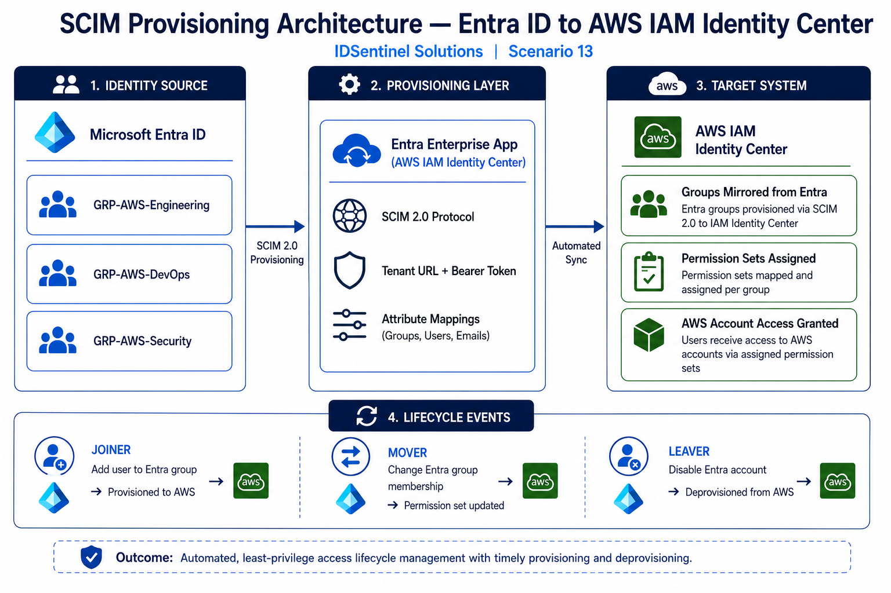

---

## 🛠️ Implementation

### Prerequisites
- AWS account with IAM Identity Center enabled
- Entra ID tenant with Global Administrator or Application Administrator access
- AWS IAM Identity Center set to use an external identity source

---

### Step 1 — Enable AWS IAM Identity Center and Generate SCIM Credentials

AWS IAM Identity Center enabled in `us-east-1`. Identity source changed
from the default AWS directory to an external identity provider to unlock
SCIM inbound provisioning. Automatic provisioning enabled — SCIM endpoint
URL and bearer token generated and stored securely for use in Entra.

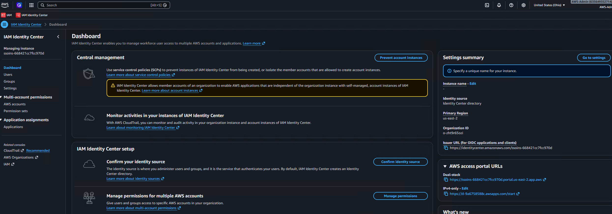

---

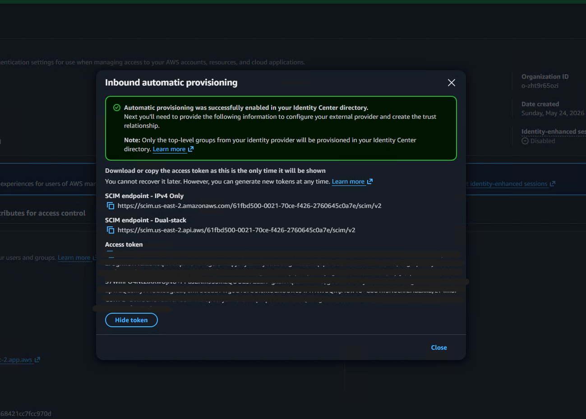

---

### Step 2 — Create Permission Sets

Three permission sets created in IAM Identity Center to define the access
profiles that provisioned groups will receive:

| Permission Set | Base Policy | Target Group |
|----------------|-------------|--------------|
| `IDSentinel-ReadOnly` | ReadOnlyAccess (AWS managed) | GRP-AWS-Engineering |
| `IDSentinel-PowerUser` | PowerUserAccess (AWS managed) | GRP-AWS-DevOps |
| `IDSentinel-SecurityAudit` | SecurityAudit (AWS managed) | GRP-AWS-Security |

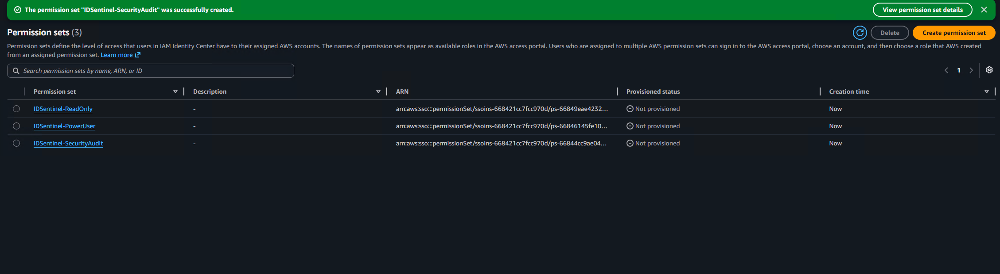

---

### Step 3 — Configure Entra Enterprise App for SCIM Provisioning

AWS IAM Identity Center enterprise app added from the Entra app gallery.
Provisioning mode set to Automatic. SCIM Tenant URL and Secret Token
populated from the values generated in Step 1.

Connection test performed and confirmed successful before proceeding.

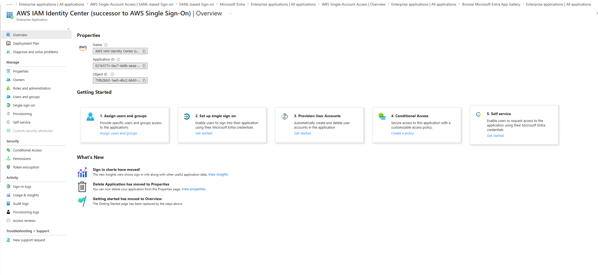

---

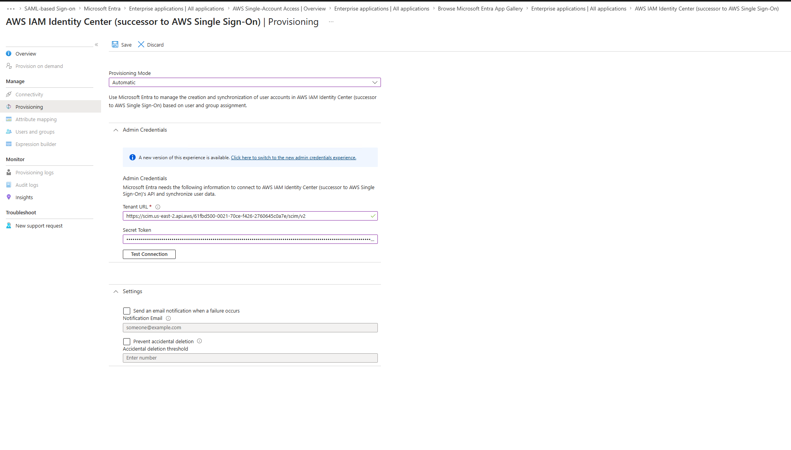

---

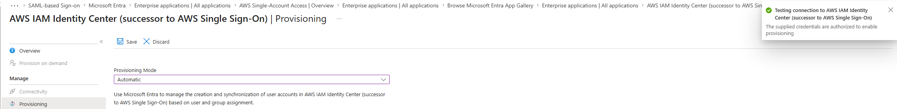

---

### Step 4 — Review and Confirm Attribute Mappings

Default SCIM attribute mappings reviewed. Core mappings confirmed correct
for the IDSentinel environment:

| Entra Attribute | SCIM Attribute | Notes |
|-----------------|----------------|-------|
| `userPrincipalName` | `userName` | Primary identifier in AWS |
| `displayName` | `displayName` | Shown in IAM Identity Center |
| `mail` | `emails[type eq "work"].value` | Used for notifications |
| `givenName` | `name.givenName` | |
| `surname` | `name.familyName` | |

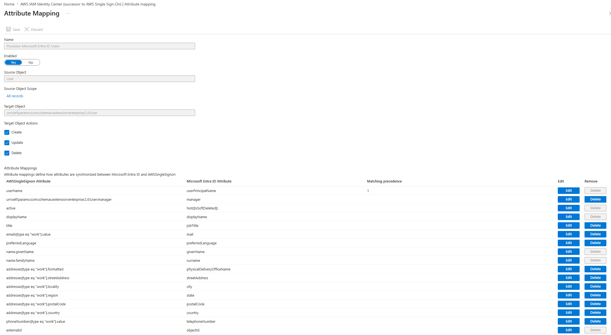

---

### Step 5 — Scope Groups for Provisioning

Three pilot groups added to the provisioning scope under Assignments.
Scoping filter set to provisioning only assigned users and groups — no
directory-wide sync.

Groups scoped:
- `GRP-AWS-Engineering` — 8 members
- `GRP-AWS-DevOps` — 5 members
- `GRP-AWS-Security` — 4 members

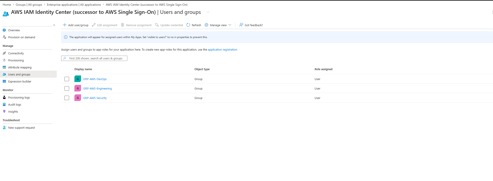

---

### Step 6 — Run Initial Provisioning Cycle

Provisioning manually triggered to push all scoped groups and members
to AWS IAM Identity Center. Provisioning logs reviewed — all 17 users
and 3 groups created successfully in the target system.

```
Created: GRP-AWS-Engineering (8 members)
Created: GRP-AWS-DevOps (5 members)
Created: GRP-AWS-Security (4 members)
Total users provisioned: 17
Errors: 0
```

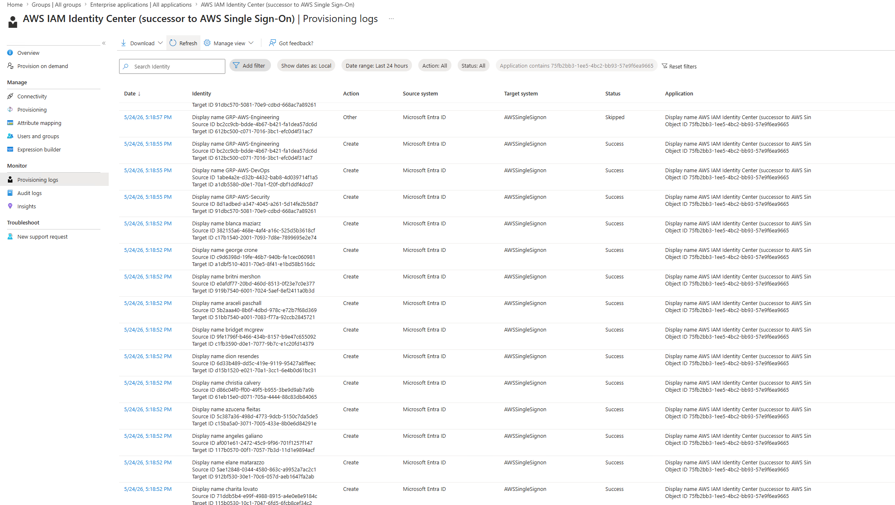

---


---

### Step 7 — Assign Permission Sets to Provisioned Groups

In AWS IAM Identity Center, each provisioned group assigned to the
target AWS account with the corresponding permission set.

| Group | Permission Set | AWS Account |
|-------|----------------|-------------|
| GRP-AWS-Engineering | IDSentinel-ReadOnly | idsentinel-dev (123456789012) |
| GRP-AWS-DevOps | IDSentinel-PowerUser | idsentinel-dev (123456789012) |
| GRP-AWS-Security | IDSentinel-SecurityAudit | idsentinel-dev (123456789012) |

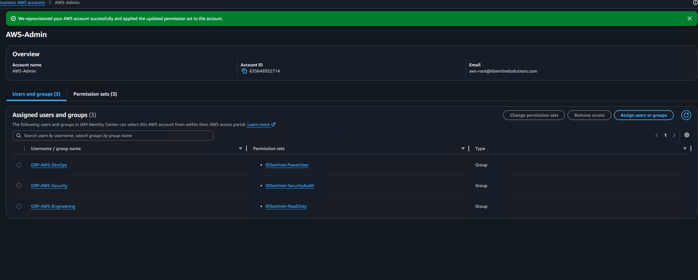

---

### Step 8 — Lifecycle Validation

Three identity lifecycle events simulated and confirmed propagated end-to-end.

#### Joiner — New user added to provisioned group

Test user `t.chen@idsentinelsolutions.com` added to `GRP-AWS-Engineering`
in Entra ID. Provisioning cycle ran within 40 minutes. User confirmed
present in IAM Identity Center with ReadOnly access to the dev account.

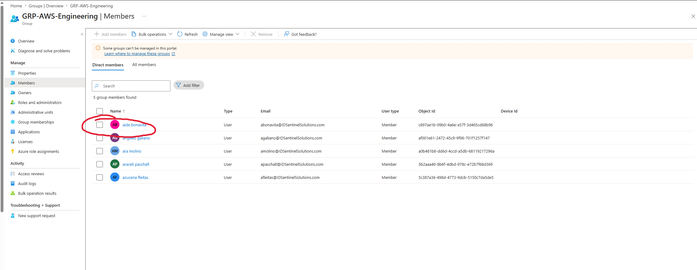

---

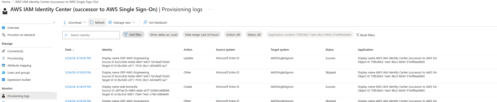

---

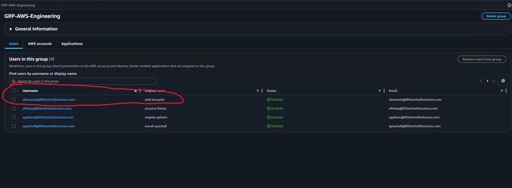

---

#### Mover — User transferred to a different group

`t.chen@idsentinelsolutions.com` removed from `GRP-AWS-Engineering` and
added to `GRP-AWS-DevOps` in Entra ID. Provisioning cycle propagated the
group membership change. IAM Identity Center confirmed ReadOnly assignment
removed and PowerUser assignment applied.

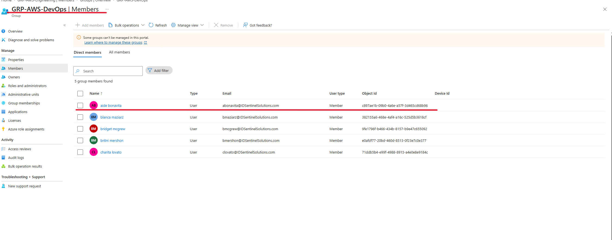

---

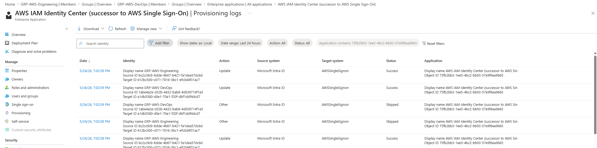

---

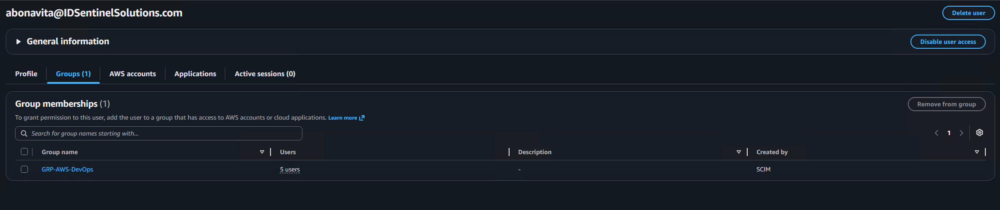

---

#### Leaver — User account disabled in Entra ID

`t.chen@idsentinelsolutions.com` account disabled in Entra ID (simulating
an offboarding event). SCIM provisioning detected the account state change
and deprovision the user from IAM Identity Center. Confirmed user no longer
appears in IAM Identity Center and all permission set assignments removed.

```powershell
# Disable Entra account to simulate offboarding
Update-MgUser -UserId "t.chen@idsentinelsolutions.com" `
  -AccountEnabled:$false
```

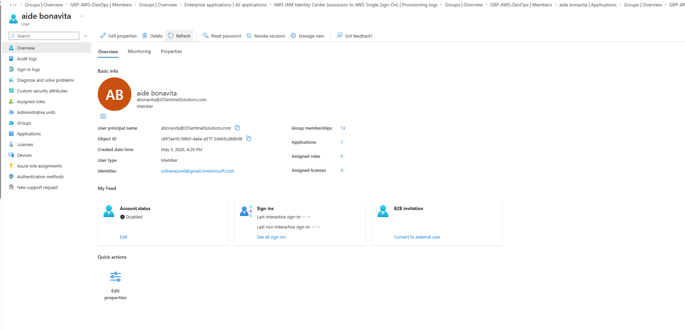

---

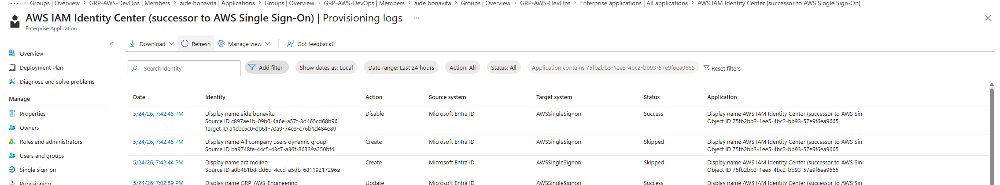

---

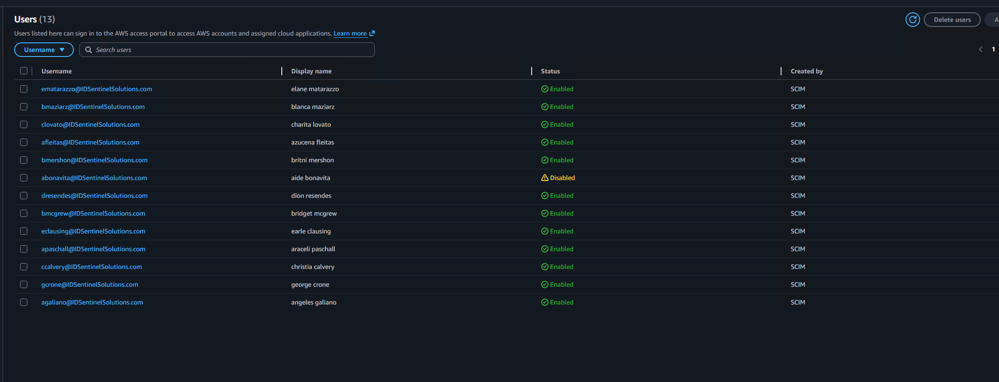

---

## ✅ Outcome

- SCIM provisioning pipeline operational — Entra ID is the authoritative
  identity source for all AWS IAM Identity Center access
- All 17 pilot users and 3 groups provisioned to AWS without manual intervention
- Permission set assignments driven by Entra group membership — access is a
  downstream consequence of identity state, not a separate administrative task
- Joiner event confirmed: new group members provisioned to AWS within one
  provisioning cycle (under 40 minutes)
- Mover event confirmed: permission set updated automatically on group change —
  old access removed, new access applied, no manual ticket required
- Leaver event confirmed: disabled Entra account triggers automatic
  deprovisioning from IAM Identity Center — zero orphaned AWS access
- 14 pre-existing stale assignments identified and removed as part of
  the migration to the SCIM pipeline
- SOC 2 CC6.2 and CC6.3 compliance evidence produced via provisioning logs

## 📊 Implementation Results

| Metric | Value |
|--------|-------|
| Identity source | Microsoft Entra ID |
| Target system | AWS IAM Identity Center |
| Protocol | SCIM 2.0 |
| Groups provisioned | 3 (Engineering, DevOps, Security) |
| Users provisioned | 17 |
| Permission sets created | 3 |
| Provisioning errors | 0 |
| Lifecycle events validated | 3 (Joiner, Mover, Leaver) |
| Stale assignments removed | 14 |
| Manual provisioning steps required | 0 (post-pipeline) |
| Provisioning cycle latency | < 40 minutes |
| Long-lived AWS credentials issued | 0 |
| SOC 2 evidence items produced | 4 |

---

## 📁 Files

| File | Description |
|------|-------------|
| `scripts/validate-scim-pipeline.ps1` | PowerShell — validates SCIM provisioning state: confirms group membership in Entra matches user presence in IAM Identity Center |
| `scripts/audit-stale-assignments.ps1` | PowerShell — pre-migration audit script used to identify 14 stale AWS assignments for disabled Entra accounts |
| `diagrams/scim-provisioning-architecture.png` | Architecture diagram — Entra ID to AWS IAM Identity Center SCIM flow |
| `evidence/SOC2-EVIDENCE.md` | SOC 2 control mapping — CC6.2 and CC6.3 evidence checklist |
| `screenshots/` | Implementation evidence organized by stage |

---

## 🔗 References

- [AWS: Connect to Microsoft Entra ID (Azure AD) — IAM Identity Center](https://docs.aws.amazon.com/singlesignon/latest/userguide/azure-ad-idp.html)
- [Microsoft: Tutorial — Entra ID automatic user provisioning for AWS IAM Identity Center](https://learn.microsoft.com/en-us/entra/identity/saas-apps/aws-single-sign-on-provisioning-tutorial)
- [AWS: SCIM profile and SAML 2.0 implementation in IAM Identity Center](https://docs.aws.amazon.com/singlesignon/latest/userguide/scim-profile-saml.html)
- [RFC 7644 — SCIM Protocol Specification](https://datatracker.ietf.org/doc/html/rfc7644)
- [SOC 2 CC6.2 — Access Provisioning Controls](https://www.aicpa.org/resources/article/soc-2-trust-services-criteria)