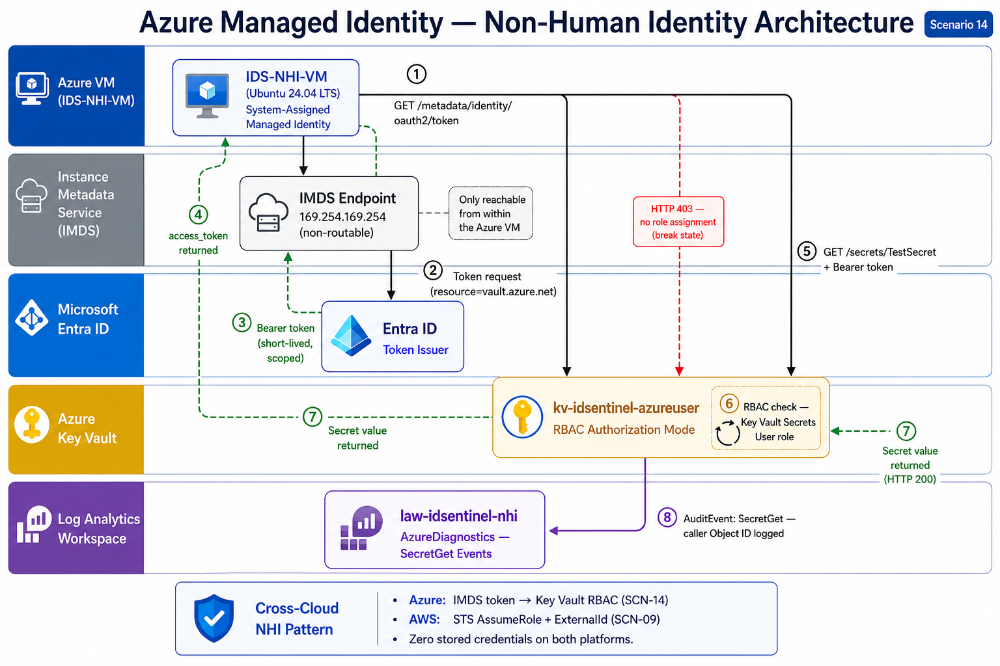
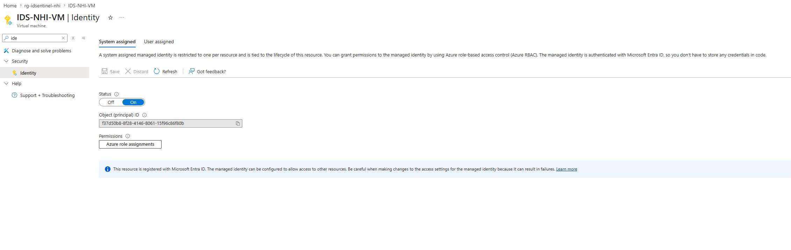
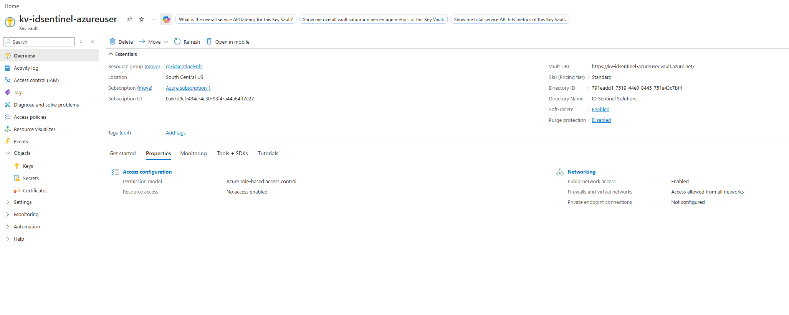
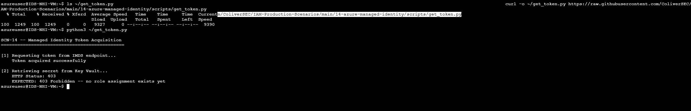
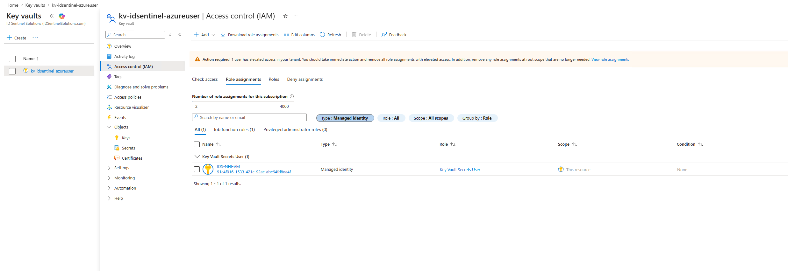
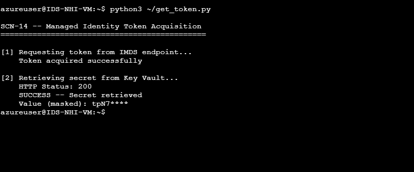
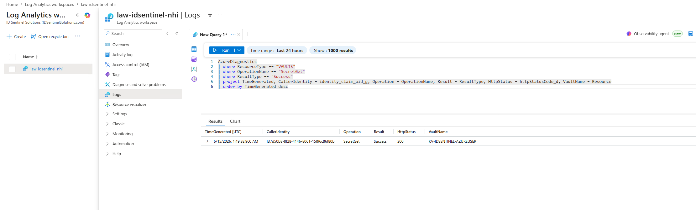
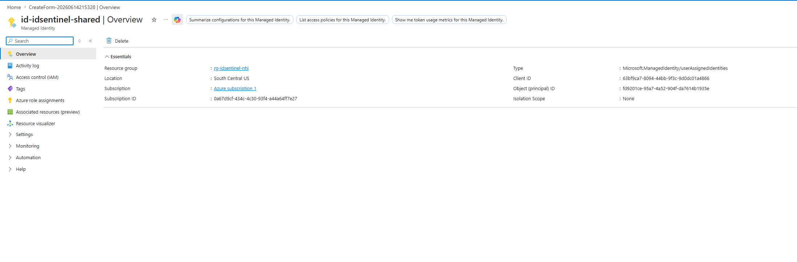
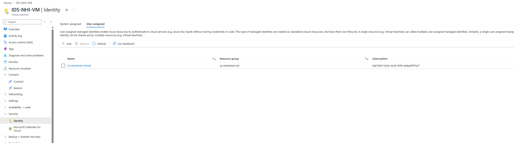

# Scenario 14 — Securing Non-Human Identities: Azure Managed Identity

## 🏢 Business Problem

IDSentinel Solutions operated Azure workloads using service principal client secrets stored in application configuration files and environment variables. These static credentials were manually rotated on an ad hoc basis, had no expiration enforcement, and were shared across multiple pipeline stages. When a developer left the organization, there was no reliable process to determine which workloads held copies of credentials they had originally provisioned. The security team had no audit trail showing which workload accessed which secret and when.

This was the same class of problem documented in Scenario 09 — AWS IAM Least Privilege, where AWS workloads relied on long-lived access keys rather than role assumption. Scenario 14 extends the non-human identity governance narrative to Azure, using the platform-native credential elimination mechanism: Managed Identity.

---

## ⚠️ Risk

Static client secrets in Azure workloads decoupled the credential from the workload that used it. A secret provisioned for a VM could be copied into a pipeline variable, stored in a configuration file, or retained by a developer after their departure — remaining valid in Entra ID with no workload binding and no expiration enforcement. Any process or individual holding a copy of the secret could authenticate as the service principal without additional verification.

There was no resource-scoped authorization boundary. A single secret granted access to every resource the principal had been assigned to, regardless of which workload legitimately needed it. Key Vault access was governed by legacy vault-level access policies, which could not restrict access to individual secrets within a vault and did not produce per-operation audit events consumable by the SIEM.

From a compliance standpoint, SOC 2 CC6.1 requires logical access controls that restrict access based on least privilege. Shared static credentials with no workload binding, no expiration policy, and no per-operation audit trail were not defensible against that control.

---

## 🎯 Scope

| Component | Detail |
|---|---|
| Cloud Platform | Microsoft Azure |
| Workload VM | IDS-NHI-VM (Ubuntu Server 24.04 LTS, South Central US) |
| Identity Mechanism | Azure Managed Identity — System-Assigned and User-Assigned |
| Target Resource | Azure Key Vault — kv-idsentinel-azureuser (RBAC authorization mode) |
| Authentication Protocol | OAuth 2.0 bearer token via Instance Metadata Service (IMDS) |
| Authorization Model | Azure RBAC — Key Vault Secrets User role |
| Audit Destination | Key Vault diagnostic logs forwarded to Log Analytics (law-idsentinel-nhi) |
| Compliance Target | SOC 2 CC6.1, CC6.3, CC6.6 |
| Cross-Cloud Reference | Scenario 09 — AWS IAM Least Privilege (STS role assumption pattern) |

---

## 🔧 Solution Design

The non-human identity remediation is implemented across three workstreams:

**Workstream 1 — Managed Identity Configuration**
System-assigned Managed Identity is enabled on IDS-NHI-VM. Azure creates and manages a corresponding Entra ID service principal, named identically to the VM, with no associated credentials. The identity's lifecycle is tied directly to the VM — when the VM is deprovisioned, the identity is deleted automatically with no IAM team intervention required. A user-assigned managed identity is provisioned as a second demonstration to document the decision criteria for each type: system-assigned for single-resource workloads whose identity should retire with the resource, and user-assigned for shared identities that must span multiple resources or survive resource replacement.

**Workstream 2 — Key Vault RBAC Authorization**
An Azure Key Vault is provisioned with the Azure role-based access control permission model selected at creation. RBAC mode is chosen over legacy access policies for three reasons: role assignments can be scoped to individual secrets rather than the vault as a whole, the model integrates with Privileged Identity Management for just-in-time access patterns, and all data-plane operations produce audit events in the Azure Monitor activity log. The Key Vault Secrets User built-in role is assigned to the VM's managed identity principal, scoped to the vault. This role grants read access to secret values only — it does not grant the ability to create, delete, or manage secrets, and does not extend to keys or certificates stored in the same vault.

**Workstream 3 — Audit Trail and Lifecycle Validation**
Key Vault diagnostic settings are configured to forward AuditEvent logs to a Log Analytics workspace. The audit log captures each secret retrieval event with the managed identity Object ID as the caller, the operation type, the HTTP status code, and a timestamp. This log record closes the audit gap that existed under the static credential model, where there was no way to attribute a Key Vault access event to a specific workload. Break/fix evidence is captured before and after the role assignment to demonstrate that the authorization boundary is enforced at the platform layer independently of the workload code.

---

## 🔨 Implementation

### Managed Identity Enablement

System-assigned Managed Identity was enabled on IDS-NHI-VM through the Azure portal Identity blade. Enabling the identity created a corresponding service principal object in Entra ID with no credentials attached. The principal's Object ID was recorded for use in the role assignment and for correlating audit log entries back to the workload.

---

### Key Vault Provisioning

Azure Key Vault kv-idsentinel-azureuser was provisioned with the Azure role-based access control permission model selected at creation. This authorization model cannot be changed after vault creation without reprovisioning the vault. A test secret was added to the vault to serve as the target resource for the managed identity retrieval validation.

---

### Break/Fix — Access Denied Before Role Assignment

Before any role assignment was made, a Python script was executed on IDS-NHI-VM via the Azure Serial Console. The script called the IMDS endpoint to acquire a bearer token scoped to Key Vault, then attempted to retrieve the secret using that token. The request returned a 403 Forbidden response from Key Vault.

This break state confirms that token acquisition via IMDS succeeded — the managed identity authenticated correctly to Entra ID — but the authorization check at the vault failed because no role assignment existed for the principal. Authentication and authorization are independent controls. A valid Entra ID token does not confer access to a resource without a corresponding RBAC assignment on that resource.

---

### Role Assignment

The Key Vault Secrets User role was assigned to the VM's managed identity principal in the Key Vault Access Control (IAM) blade. The assignment was scoped to the vault level. The built-in role grants Get and List operations on secret values only, with no write, delete, or management permissions and no access to keys or certificates in the same vault.

---

### Validation — Credential-Free Secret Retrieval

After role assignment propagation, the same Python script was executed a second time on IDS-NHI-VM. The script called the IMDS endpoint, received a scoped bearer token, and presented it to Key Vault. The secret value was returned successfully. No client ID, client secret, certificate, or stored credential appeared anywhere in the script. The only authentication material was the short-lived token acquired at runtime from the IMDS endpoint — a token that is scoped to the target resource and never written to disk.

---

### Audit Trail Validation

Key Vault diagnostic settings were configured to forward AuditEvent logs to Log Analytics workspace law-idsentinel-nhi. A KQL query against the AzureDiagnostics table confirmed the secret retrieval event, including the managed identity Object ID as the caller identity, the operation type (SecretGet), the HTTP status code (200), and the timestamp. This log entry provides the principal-level attribution that was missing under the static credential model.

---

### System-Assigned vs. User-Assigned Managed Identity

A user-assigned managed identity (id-idsentinel-shared) was provisioned as a standalone Azure resource to document the lifecycle and use case distinction between the two identity types. The user-assigned identity was assigned to IDS-NHI-VM to demonstrate that a single VM can carry both identity types simultaneously. The key difference documented is that a user-assigned identity persists independently of any single resource — it can be assigned to multiple VMs simultaneously and survives VM deletion. This makes it the correct pattern when the same identity must span multiple resources in a scale set, or when an identity must survive a resource replacement such as a blue-green deployment where the replacement VM needs to inherit existing role assignments without a manual reassignment step.

---

---

## ✅ Outcome

Azure workloads at IDSentinel Solutions no longer require stored credentials to access Key Vault secrets. The managed identity token acquisition and secret retrieval flow was validated end-to-end on IDS-NHI-VM, with break/fix evidence confirming that the authorization boundary is enforced at the vault RBAC layer independently of the workload code. Key Vault audit logs now provide a workload-attributable access trail for every secret retrieval event.

| Result | Detail |
|---|---|
| Stored credentials eliminated | No client secrets, certificates, or access keys in workload configuration |
| Identity lifecycle automated | System-assigned identity deleted automatically on VM deprovisioning — no manual IAM cleanup |
| Authorization scoped to least privilege | Key Vault Secrets User role grants read-only access to secret values only |
| Audit trail established | Per-operation log entries with managed identity Object ID, operation type, and HTTP result code |
| Break/fix evidence captured | 403 before role assignment, 200 after — authorization boundary confirmed at platform layer |
| Cross-cloud NHI pattern complete | Azure managed identity (SCN-14) paired with AWS STS role assumption + ExternalId (SCN-09) |

---

## 🛡️ Control Coverage

| Control | Framework | How This Scenario Addresses It |
|---|---|---|
| CC6.1 — Logical Access Controls | SOC 2 | Managed identity eliminates shared static credentials; RBAC enforces least privilege scoped to the vault |
| CC6.3 — Access Removal | SOC 2 | System-assigned identity deleted automatically on VM deprovisioning; no orphaned principal risk |
| CC6.6 — Logical Access Boundaries | SOC 2 | IMDS endpoint is non-routable and reachable only from within the VM; token is scoped to the target resource |
| CC6.8 — Unauthorized Access Prevention | SOC 2 | No extractable credential exists; 403 break/fix evidence demonstrates platform-enforced access boundary |
| AC-2 — Account Management | NIST 800-53 | Managed identity lifecycle tied to resource lifecycle; no separate deprovisioning process required |
| AC-6 — Least Privilege | NIST 800-53 | Key Vault Secrets User role scoped to read operations only; no write or management permissions granted |

---

## 📁 Files

| File | Description |
|---|---|
| `scripts/get_token.py` | IMDS token acquisition and Key Vault secret retrieval via Python — no stored credentials |
| `scripts/New-KeyVaultRoleAssignment.ps1` | Role assignment automation via Az PowerShell |
| `scripts/Validate-ManagedIdentityAccess.ps1` | End-to-end configuration validation script |
| `scripts/query-audit-log.kql` | KQL query for Log Analytics — surfaces managed identity secret access events |
| `screenshots/SCREENSHOTS.md` | Screenshot index with filenames, capture stage, and evidence purpose |
| `diagrams/DIAGRAMS.md` | Diagram index — IMDS token acquisition flow and cross-cloud NHI architecture |

---

## 🔗 References

- [Azure Managed Identity Overview — Microsoft Learn](https://learn.microsoft.com/en-us/entra/identity/managed-identities-azure-resources/overview)
- [Instance Metadata Service (IMDS) — Microsoft Learn](https://learn.microsoft.com/en-us/azure/virtual-machines/instance-metadata-service)
- [Azure Key Vault RBAC vs. Access Policies — Microsoft Learn](https://learn.microsoft.com/en-us/azure/key-vault/general/rbac-guide)
- [Key Vault Built-in Roles for Data Plane Operations — Microsoft Learn](https://learn.microsoft.com/en-us/azure/key-vault/general/rbac-guide#azure-built-in-roles-for-key-vault-data-plane-operations)
- [System-assigned vs. User-assigned Managed Identity — Microsoft Learn](https://learn.microsoft.com/en-us/entra/identity/managed-identities-azure-resources/managed-identity-best-practice-recommendations)
- [SOC 2 CC6 Logical and Physical Access Controls — AICPA](https://www.aicpa-cima.com/resources/landing/system-and-organization-controls-soc-suite-of-services)
- [Scenario 09 — AWS IAM Least Privilege (Cross-cloud NHI reference)](../09-aws-iam-least-privilege/README.md)