# Scenario 15 — AI Agent Identity Governance

**IDSentinel Solutions — Production Case Study**

---

## 🏢 Business Problem

IDSentinel Solutions deployed an internal AI assistant to automate identity
reporting tasks — user profile lookups, group membership queries, and access
summary generation. The assistant was initially granted broad delegated
permissions using an admin account token stored as an environment variable.
There was no audit trail of what the agent called, no mechanism to scope its
access to the minimum required, and no decommission procedure if the agent
needed to be retired or compromised.

The security team flagged this as a governance gap: an autonomous agent with
broad API access and no identity controls is indistinguishable from a
compromised service account. SOC 2 CC6.1 requires logical access controls for
all access to organization data — the existing deployment had none.

---

## ⚠️ Risk

- Overprivileged agent — admin-scoped token granted access to all Graph API
  resources, far beyond what the agent required to perform its function
- No audit trail — API calls made by the agent were not distinguishable in
  logs from human admin activity; attribution to the agent was impossible
- Static credential exposure — access token stored as environment variable,
  extractable from the host and rotated only manually on a best-effort basis
- No decommission path — no process existed to revoke agent access on
  retirement, compromise, or ownership change
- SOC 2 exposure — CC6.1, CC6.3, and CC6.8 controls could not be evidenced
  for AI-driven API access under the existing deployment model

---

## 🎯 Scope

- **Agent identity:** Entra ID app registration — `IDS-AIAgent-GraphReporter`
- **Auth flow:** OAuth2 client credentials (application identity, no delegated
  user context)
- **API permissions:** Four scoped Graph API application permissions with
  documented justification and explicit denial of all others
- **Agent implementation:** Python agent using Anthropic API for tool
  selection, governed bearer token for Graph API execution
- **Audit pipeline:** Splunk HEC log ingest + Entra service principal
  sign-in logs — agent API activity surfaced in dedicated dashboard
- **Decommission:** Secret revocation, app registration disable, 401
  confirmation, sign-in log evidence — full sequence validated in lab
- **Compliance target:** SOC 2 Type II — CC6.1, CC6.3, CC6.6, CC6.8

---

## 🔧 Solution Design

The governing principle was to treat the AI agent the same way any
non-human identity is treated: register it as a named principal, grant
only the permissions it needs to perform its function, capture a complete
audit trail of what it does, and define a clean lifecycle end state.

Implementation was structured across five phases:

**Phase 1 — App Registration and Permission Scoping**
Register `IDS-AIAgent-GraphReporter` in Entra ID with four application
permissions. Document a justification for every permission granted and a
denial rationale for every permission not granted. Generate a client secret
with a 90-day expiration, recorded in Bitwarden with owner and rotation date.

**Phase 2 — OAuth2 Token Acquisition and JWT Validation**
Implement client credentials token acquisition in Python. Decode the returned
JWT and confirm `appid`, `roles`, and `tid` claims match expectations. Document
the break/fix encountered on the `/.default` scope omission.

**Phase 3 — Agent Tool Implementation**
Implement three tool functions using the governed bearer token. Integrate the
Anthropic API to receive a natural language prompt, return a structured tool
selection, and execute against Graph API. Agent holds no token in memory
beyond the function call — re-acquires on expiration.

**Phase 4 — Splunk Audit Pipeline**
Log every agent API call to Splunk HEC with: timestamp, `app_id`, operation,
Graph endpoint, HTTP status, and response time. Forward Entra service principal
sign-in logs as a second audit source. Build a Splunk dashboard — "AI Agent
API Activity" — with panels for calls per hour, operations by tool, error rate,
and top endpoints.

**Phase 5 — Decommission Validation**
Exercise the full decommission sequence: revoke the client secret, confirm 401
on token acquisition, disable the app registration, confirm the final failed
auth event in the Entra sign-in log. Registration is disabled rather than
deleted to preserve the audit trail.

**Permission justification (documented at registration):**

| Permission | Type | Justification |
|---|---|---|
| User.Read.All | Application | Agent reads user profile attributes for identity reports |
| Group.Read.All | Application | Agent queries group membership for access summary generation |
| IdentityRiskyUser.Read.All | Application | Agent surfaces risky user status for security reporting |
| AuditLog.Read.All | Application | Agent reads sign-in log data for anomaly summary |

Permissions explicitly not granted: `Directory.ReadWrite.All`,
`User.ReadWrite.All`, `RoleManagement.ReadWrite.Directory`, `Mail.*`,
`Files.*` — each documented with denial rationale at registration.

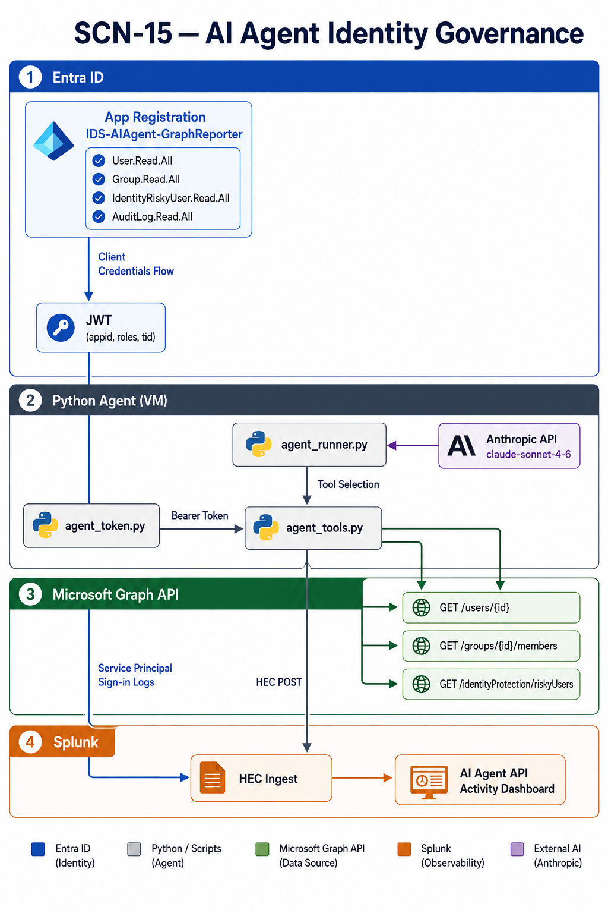

---

## 🛠️ Implementation

### Prerequisites

- Microsoft Entra ID tenant with app registration permissions
- Microsoft.Graph PowerShell module (host PC)
- Python 3 with `msal` and `requests` libraries (host PC)
- Anthropic API key (host PC — stored in Bitwarden, not in code)
- Splunk Enterprise with HEC enabled and an index configured for agent events
- Bitwarden for client secret storage and rotation tracking

---

### Phase 1 — App Registration and Permission Scoping

#### Step 1 — Create the App Registration

A new app registration was created in Entra ID named
`IDS-AIAgent-GraphReporter`. Application permissions (not delegated) were
selected to reflect that no human user context exists during agent execution.
Admin consent was granted for the four scoped permissions only.

The `Register-AgentAppRegistration.ps1` script automates the registration,
permission assignment, and admin consent grant via Microsoft.Graph PowerShell.

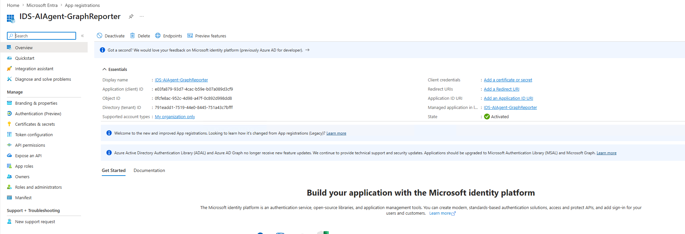

---

#### Step 2 — Configure API Permissions

Four application permissions were granted with admin consent. Each was
documented with a business justification in the app registration notes.
The permissions panel was screenshot as SOC 2 CC6.1 evidence confirming
least-privilege configuration at time of deployment.

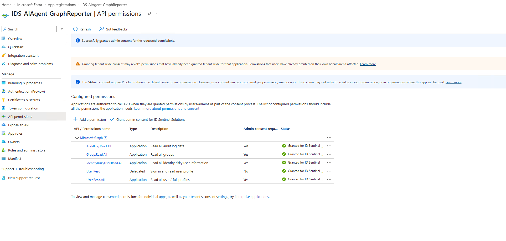

---

#### Step 3 — Generate Client Secret

A client secret was generated with a 90-day expiration. The secret was
recorded in Bitwarden with: owner (Cleveland Oliver), creation date,
expiration date (90 days), and associated scenario (SCN-15). The secret
was never stored in code or environment variables.

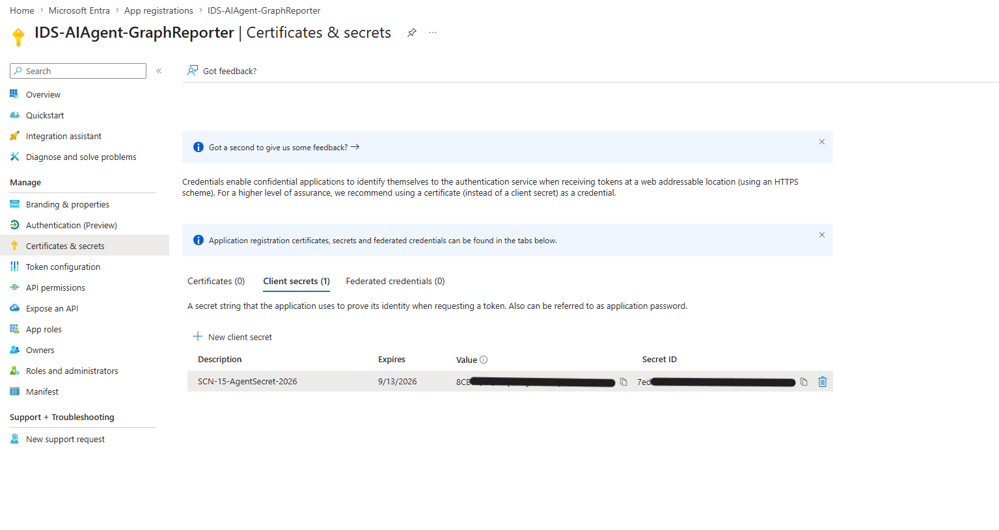

---

### Phase 2 — OAuth2 Token Acquisition and JWT Validation

#### Step 4 — Acquire Token via Client Credentials Flow

The `agent_token.py` module acquired a token from the tenant token endpoint
using the client credentials flow. The request targeted
`https://graph.microsoft.com/.default` as the scope.

**Break/fix:** Initial token acquisition returned a 401 on Graph API calls
because the `/.default` suffix was omitted from the resource URI. Corrected
the scope parameter and re-acquired — 200 returned on all subsequent calls.

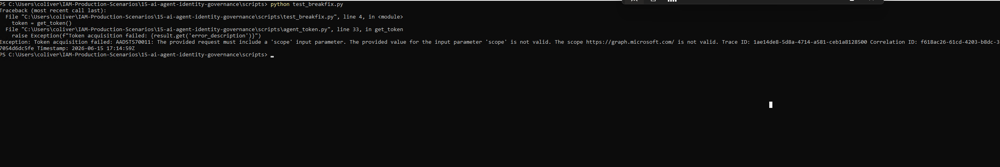

---

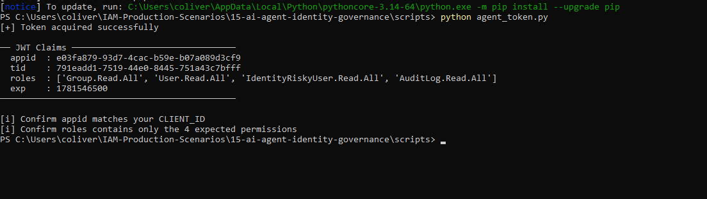

---

#### Step 5 — Decode and Validate JWT Claims

The returned JWT was decoded and inspected to confirm:
- `appid` claim matched the `IDS-AIAgent-GraphReporter` client ID
- `roles` array contained only the four scoped permission names
- `tid` claim matched the IDSentinel tenant ID

No unexpected permissions appeared in the token payload. Screenshot of the
decoded claims panel captured as evidence of permission boundary enforcement.

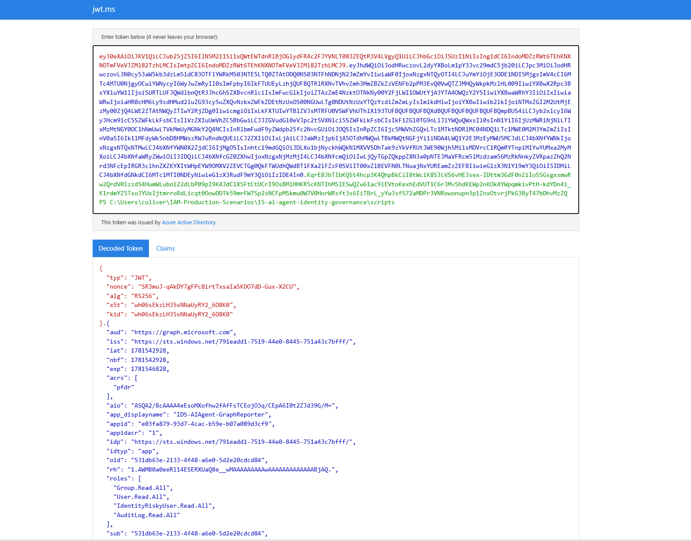

---

### Phase 3 — Agent Tool Implementation

#### Step 6 — Implement Governed Tool Functions

Three tool functions were implemented in `agent_tools.py`, each making a
single targeted Graph API call using the governed bearer token:
- `get_user_profile` — `GET /v1.0/users/{id}`
- `get_group_members` — `GET /v1.0/groups/{id}/members`
- `list_risky_users` — `GET /v1.0/identityProtection/riskyUsers`

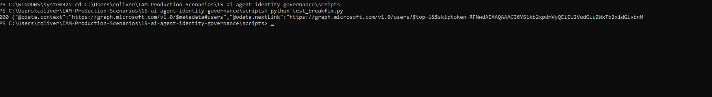

---

#### Step 7 — Integrate LLM Tool Selection

The `agent_runner.py` module passed a natural language prompt and tool
definitions to the Anthropic API (claude-sonnet-4-6). The model returned a
structured tool selection. The agent executed the selected tool with the
governed bearer token and returned the result. The token was not held in
memory beyond the function call — re-acquired on expiration via the token
cache in `agent_token.py`.

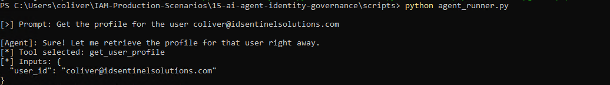

---

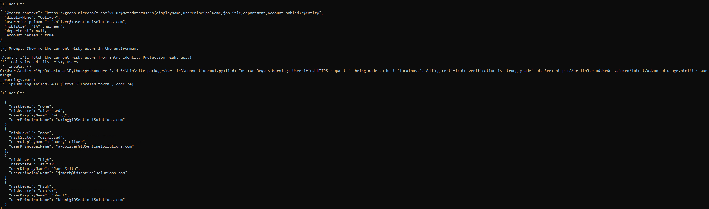

---

### Phase 4 — Splunk Audit Pipeline

#### Step 8 — Configure HEC Ingest and Build Dashboard

Agent API calls were logged to Splunk via HEC. Each event included:
timestamp, `app_id`, operation (tool name), Graph endpoint called, HTTP
status, and response time. A Splunk dashboard — "AI Agent API Activity" —
was created with panels for: calls per hour, operations by tool, error rate,
and top called endpoints.

Entra service principal sign-in logs were forwarded as a second audit source,
showing the same `app_id` performing token acquisitions with correlated
timestamps.

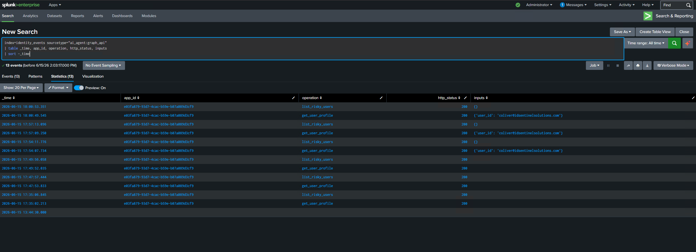

---

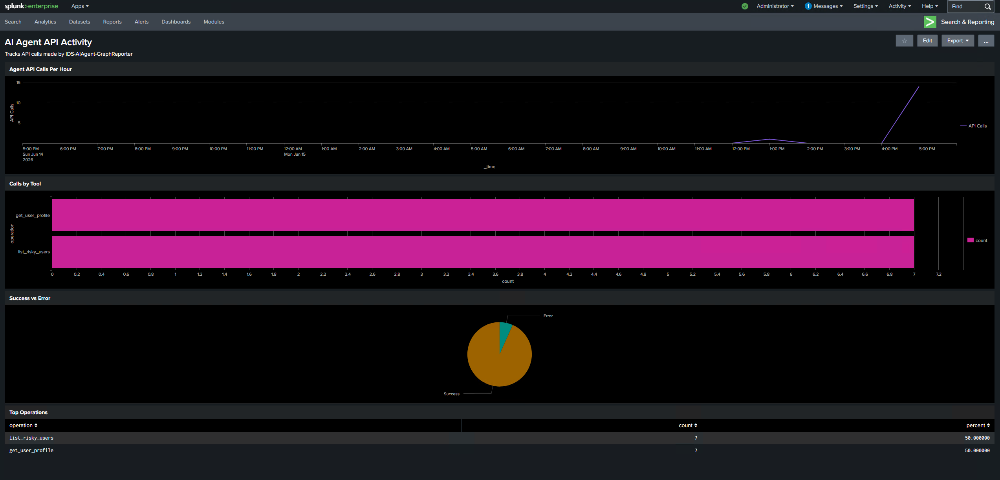

---

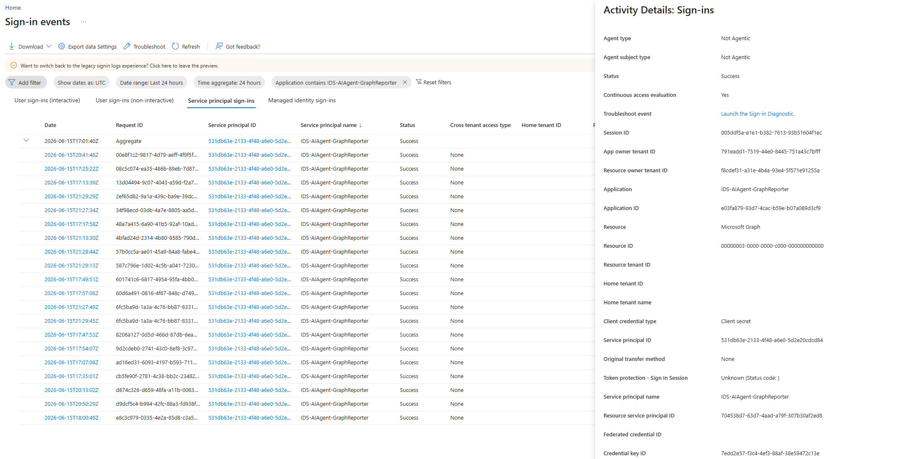

---

### Phase 5 — Decommission Validation

#### Step 9 — Exercise Full Decommission Sequence

The `Invoke-AgentDecommission.ps1` runbook was executed to validate the
full decommission path:

**Step 1 — Revoke client secret:** Deleted from the app registration
Certificates and Secrets panel. Panel confirmed empty after deletion.

**Step 2 — Confirm 401 on token acquisition:** `agent_token.py` returned
`401 invalid_client` immediately after secret deletion. No cached token
survived beyond its expiration window.

**Step 3 — Disable app registration:** App registration status set to
Disabled. Token issuance blocked. Registration retained to preserve audit
trail — deletion was explicitly not performed.

**Step 4 — Confirm sign-in log entry:** Entra service principal sign-in log
filtered to `IDS-AIAgent-GraphReporter` — final failed authentication event
confirmed with error code `invalid_client` and timestamp.

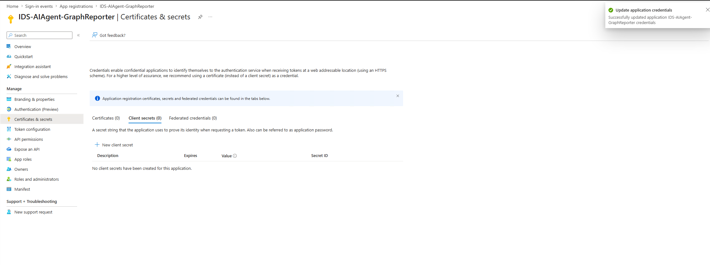

---

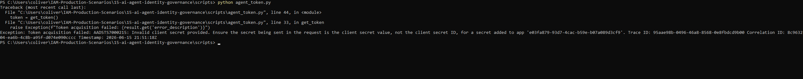

---

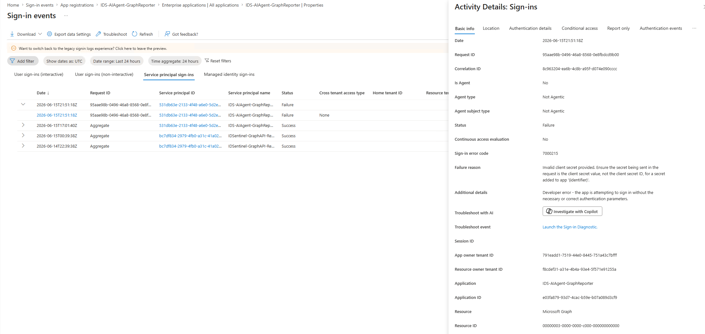

---

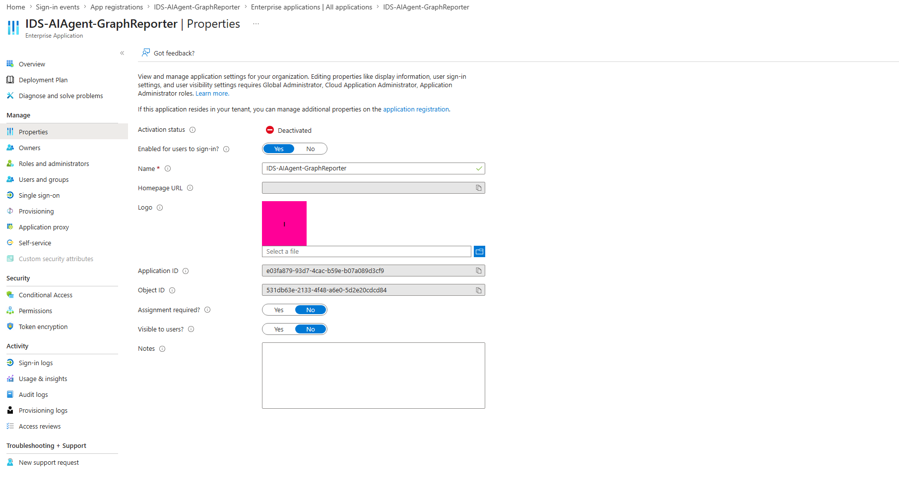

---

## 📊 Outcome

| Metric | Value |
|---|---|
| App registrations created | 1 (`IDS-AIAgent-GraphReporter`) |
| Application permissions granted | 4 (User.Read.All, Group.Read.All, IdentityRiskyUser.Read.All, AuditLog.Read.All) |
| Application permissions explicitly denied | All write, mail, files, and role management permissions |
| OAuth2 flow | Client credentials — application identity, no delegated user context |
| Token lifetime | 3,600 seconds; re-acquired on expiration via token cache |
| Client secret rotation schedule | 90 days; expiration tracked in Bitwarden |
| Agent tools implemented | 3 (get_user_profile, get_group_members, list_risky_users) |
| Splunk log sources | 2 (HEC agent events + Entra service principal sign-in logs) |
| Decommission steps validated | 4 (revoke secret, confirm 401, disable registration, confirm sign-in log) |
| Long-lived admin credentials used | 0 |
| SOC 2 evidence generated | Yes — CC6.1, CC6.3, CC6.6, CC6.8 |

---

## 🗂️ SOC 2 Compliance Mapping

| SOC 2 Control | Requirement | Evidence Produced |
|---|---|---|
| CC6.1 — Logical Access Controls | Access to org data requires logical access controls | App registration screenshot showing four scoped permissions only; admin consent confirmation; no admin credential in execution path |
| CC6.3 — Access Removal | Access removed when no longer required | Decommission sequence: secret revocation, 401 confirmation, disabled registration, sign-in log final auth event |
| CC6.6 — Logical Access Boundaries | Logical boundaries enforced at platform layer | JWT decoded claims confirming roles scoped to four permissions; no delegated context; no user escalation path |
| CC6.8 — Unauthorized Access Prevention | Prevent unauthorized access to org resources | 401 on revoked secret confirmed by both Splunk HEC log and Entra sign-in log; no residual standing access |

---

## ⚠️ Non-Human Identity Notes

This scenario surfaces two production considerations relevant to AI agent
identity governance that are not present in static service account patterns:

**1. Application vs. delegated permissions for agentic workloads**
An AI agent operating without a logged-in user must use application
permissions, not delegated. Delegated permissions inherit the user's access
context, which introduces privilege escalation risk if the agent is invoked
by a high-privilege user. Application permissions enforce a fixed, documented
scope regardless of who invokes the agent.

**2. Decommission path is not optional**
Static service accounts are often decommissioned when someone notices they
are no longer used. AI agents — which may run on a schedule, in response to
events, or on-demand — can persist in an active state indefinitely without
a defined retirement trigger. The decommission runbook and validated 401
confirmation are the control that closes this gap.

---

## 📁 Files

| File | Description |
|---|---|
| `scripts/Register-AgentAppRegistration.ps1` | Creates the Entra app registration and configures API permissions via Microsoft.Graph PowerShell |
| `scripts/agent_token.py` | Client credentials flow, token cache, and re-acquisition on expiry |
| `scripts/agent_tools.py` | Tool implementations — get_user_profile, get_group_members, list_risky_users |
| `scripts/agent_runner.py` | LLM agent runner — prompt to tool selection to governed Graph API execution to Splunk HEC log |
| `scripts/Validate-AgentPermissions.ps1` | Validates app registration permissions; flags unexpected scopes as drift |
| `scripts/Invoke-AgentDecommission.ps1` | Decommission runbook automation — revokes secret, disables registration, confirms 401 |
| `scripts/agent-audit.spl` | Splunk SPL queries for AI Agent API Activity dashboard |
| `screenshots/` | Screenshot index with filenames, capture stage, and evidence purpose |
| `diagrams/` | Diagram index |
| `evidence/soc2-control-mapping.md` | SOC 2 CC6.1, CC6.3, CC6.6, CC6.8 evidence mapping |
| `runbooks/agent-decommission-runbook.md` | Step-by-step decommission procedure with validation checkpoints |

---

## 🔗 References

- [Microsoft: OAuth 2.0 client credentials flow](https://learn.microsoft.com/en-us/entra/identity-platform/v2-oauth2-client-creds-grant-flow)
- [Microsoft: App registration API permissions](https://learn.microsoft.com/en-us/entra/identity-platform/quickstart-configure-app-access-web-apis)
- [Microsoft: Application vs. delegated permissions](https://learn.microsoft.com/en-us/entra/identity-platform/permissions-consent-overview)
- [Microsoft Graph: Permission reference](https://learn.microsoft.com/en-us/graph/permissions-reference)
- [NIST SP 800-53: AC-6 Least Privilege](https://csrc.nist.gov/Projects/risk-management/sp800-53-controls/release-search#!/controls?version=5.1&family=AC)
- [Anthropic: Tool use documentation](https://docs.anthropic.com/en/docs/build-with-claude/tool-use)