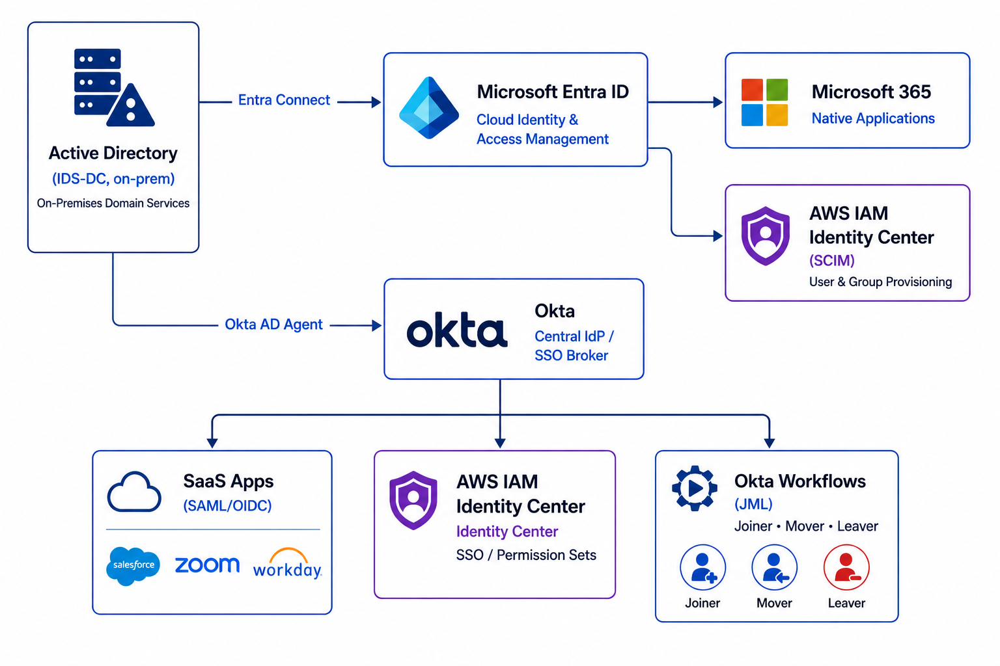

# 🛡️ IAM Production Scenarios

Real-world Identity and Access Management scenarios simulated in a homelab environment — built to mirror the production problems IAM Engineers face daily.

Each scenario includes a business problem, solution design, implementation evidence, and documented outcome — structured as production case studies, not how-to guides.

---

## 🏗️ Lab Architecture

---

## 🏢 Lab Environment

| Component | Detail |
|-----------|--------|
| On-Prem | Windows Server 2019 (Active Directory DS) |
| Cloud Identity | Microsoft Entra ID (M365 Developer Tenant) |
| CIAM Platform | Auth0 (Okta Customer Identity Cloud) |
| Workforce IAM | Okta (Integrator Free Plan) |
| SIEM | Splunk Enterprise 10.2.3 |
| Domain | IDSentinelSolutions.com (hybrid — Entra Connect synced) |
| Azure | IDS-NHI-VM, Key Vault (kv-idsentinel-azureuser), Log Analytics (law-idsentinel-nhi) |
| Tools | PowerShell, Terraform, Postman, Python, SAML Tracer, SPL, AWS CLI |

---

## 📁 Scenarios

| # | Scenario | Problem Solved | Key Skills |
|---|----------|----------------|------------|
| 01 | [MFA Bypass via Legacy Auth](./01-mfa-bypass-legacy-auth/) | Legacy protocols bypassing MFA controls org-wide | Conditional Access, Sign-in Logs, What-If, Block Legacy Auth |
| 02 | [App Migration: Legacy IdP → Okta](./02-app-migration-okta/) | M&A requires migrating subsidiary apps off Entra SSO onto Okta within 60 days | Okta AD Agent, SAML 2.0, IdP Migration, SAML Tracer, Cutover Planning, SOC 2 |
| 03 | [Orphaned Access Audit](./03-orphaned-access-audit/) | Audit found stale users retaining access post-offboarding | Graph API, PowerShell, Access Governance |
| 04 | [Zero Trust Rollout](./04-zero-trust-rollout/) | Executive mandate to implement Zero Trust for 1,000-person org | CA Policies, PIM, Compliant Devices, Terraform |
| 05 | [Okta Workflows JML Automation](./05-okta-workflows-jml/) | Acquired workforce in Okta has no automated access lifecycle — joiners, movers, and leavers require manual admin work with no audit trail | Okta Workflows, JML Lifecycle, Audit Log Tables, Hybrid AD Identity Patterns, SOC 2 |
| 06 | [OAuth2 API Integration](./06-oauth2-api-integration/) | Need automated reporting on identity risk posture | Graph API, OAuth2, Python, Postman |
| 07 | [Identity Risk Response Playbook](./07-identity-risk-response-playbook/) | No standardized process for responding to Identity Protection alerts | Entra Identity Protection, Graph API, NIST IR, SOC 2 |
| 08 | [CIAM Login Platform with Auth0](./08-scenario-ciam-b2c/) | Customer-facing app needs secure, branded login with social federation and API protection | Auth0, OIDC, OAuth2, JWT, Google Federation, MFA |
| 09 | [AWS IAM Least Privilege Implementation](./09-aws-iam-least-privilege/) | Overprivileged AWS roles increase risk of lateral movement and privilege escalation | AWS IAM, Least Privilege, IAM Policies, CloudTrail |
| 10 | [Identity Threat Detection Pipeline](./10-identity-threat-detection/) | No centralized SOC visibility into identity threats — MFA fatigue, impossible travel, after-hours PIM, and legacy auth spikes going undetected | Splunk, SPL, Graph API, HEC, Python, MITRE ATT&CK, SOC 2 |
| 11 | [Entra ID Access Reviews](./11-entra-access-reviews/) | No formal access recertification process — privileged group membership never reviewed, SOC 2 CC6.2 and CC6.3 exposure | Entra ID Governance, Access Reviews, PowerShell, Graph API, SOC 2 |
| 12 | [Entra ID + AWS SAML Federation](./12-entra-aws-saml-federation/) | AWS console access granted via IAM users with long-lived static credentials — violating Zero Trust mandate | SAML 2.0, Entra ID, AWS IAM, Federation, SAML Tracer, SOC 2 |
| 13 | [SCIM Provisioning: Entra ID → AWS IAM Identity Center](./13-scim-provisioning-entra-aws/) | Manual AWS access provisioning creating 24-72hr delays and orphaned access for offboarded users | SCIM 2.0, Entra ID, AWS IAM Identity Center, JML Lifecycle, PowerShell, SOC 2 |
| 14 | [Securing Non-Human Identities: Azure Managed Identity](./14-azure-managed-identity/) | Azure workloads using stored service principal secrets with no credential binding, no rotation enforcement, and no per-operation audit trail | Azure Managed Identity, IMDS, Key Vault RBAC, Python, Log Analytics, SOC 2 |
| 15 | [AI Agent Identity Governance](./15-ai-agent-identity-governance/) | Internal AI assistant granted broad admin-scoped token with no audit trail, no least-privilege scoping, and no decommission procedure — indistinguishable from a compromised service account | Entra App Registration, OAuth2 Client Credentials, Graph API, JWT Validation, Splunk HEC, LLM Tool Use, SOC 2 |

---

## 🔍 How Each Scenario Is Structured

Every scenario folder follows this format:

- **README.md** — Business problem, constraints, solution design, outcome metrics
- **scripts/** — PowerShell, Python, or Terraform used
- **screenshots/** — Evidence of implementation at each stage
- **diagrams/** — Architecture or flow diagrams (draw.io)
- **postman/** — API collections where applicable
- **runbooks/** — SOC runbooks and operational procedures (where applicable)
- **evidence/** — SOC 2 control mapping and audit evidence exports

---

## 🧰 Skills Demonstrated

| Skill Area | Scenarios |
|------------|-----------|
| Conditional Access & MFA | 01, 04 |
| Identity Governance & Access Reviews | 03, 11 |
| Privileged Access Management (PIM) | 04, 10 |
| Zero Trust Architecture | 04 |
| PowerShell & Graph API Automation | 03, 04, 06, 07, 10, 11, 13 |
| OAuth2 / OIDC / JWT | 06, 08, 15 |
| CIAM & Customer Identity | 08 |
| Social Identity Federation | 08 |
| API Protection with Bearer Tokens | 06, 08, 15 |
| Terraform / Policy-as-Code | 04 |
| Identity Lifecycle / JML | 03, 05, 13 |
| Okta Workflows — JML Automation | 05 |
| Incident Response (P1/P2 Runbooks) | 07 |
| SIEM Integration & Log Pipeline | 10, 15 |
| Threat Detection & SPL | 10, 15 |
| MITRE ATT&CK Mapping | 07, 10 |
| SOC 2 Audit Evidence | 03, 05, 07, 10, 11, 12, 13, 14, 15 |
| AWS IAM & Role Assumption | 09 |
| SAML / SSO Federation | 02, 12 |
| SAML Troubleshooting & Break/Fix | 02, 12 |
| IdP Migration & Controlled Cutover | 02 |
| Okta — AD Agent, App Federation, SSO | 02 |
| Okta — Workflows, Lifecycle Automation | 05 |
| SCIM Provisioning | 13 |
| AWS IAM Identity Center | 12, 13 |
| Hybrid Identity (AD + Entra + Okta) | 02, 05, 11, 13 |
| Non-Human Identity (NHI) | 09, 14, 15 |
| Azure Managed Identity & IMDS | 14 |
| Azure Key Vault RBAC | 14 |
| Workload Identity & Zero Stored Credentials | 09, 14, 15 |
| AI Agent Identity & Governance | 15 |
| LLM Tool Use / Anthropic API Integration | 15 |

---

## 🔗 Related Repos

| Repo | Purpose |
|------|---------|
| [Enterprise IAM Lab](https://github.com/ColiverSEC/Enterprise-IAM-Lab) | Foundational IAM concepts, protocol references, how-to guides |
| [M365 Security Lab](https://github.com/ColiverSEC/Microsoft-365-Security-Lab) | Microsoft Purview, Defender, Intune |